# Lecturas

### **Lecturas minimas:**

- **Libro:** Géron, A. (2019). Hands-On Machine Learning with Scikit-Learn, Keras, and TensorFlow (2nd Ed.). O’Reilly Media: Capitulo 1: The Machine Learning Landscape
- **Libro:** Brownlee, J. (2020). Machine Learning Mastery with Python. Machine Learning Mastery: [“Master Machine Learning Algorithms”](http://machinelearningmastery.com/), capítulos 3 a 7. (Master Machine Learning Algorithms Discover How They Work and Implement Them From Scratch) (Capítulo 3 – Algorithms Learn a Mapping From Input to Output Capítulo 4 – Parametric and Nonparametric Machine Learning Algorithms Capítulo 5 – Supervised, Unsupervised and Semi-Supervised Learning Capítulo 6 – The Bias-Variance Trade-Off Capítulo 7 – Overfitting and Underfitting)
- **Mini curso:** Kaggle Intro to Machine Learning: [https://www.kaggle.com/learn/intro-to-machine-learning](https://www.kaggle.com/learn/intro-to-machine-learning)
- **Mini curso:** Kaggle Data Cleaning: [https://www.kaggle.com/learn/data-cleaning](https://www.kaggle.com/learn/data-cleaning)

### **Lecturas totales:**

Google:

- **Articulo:** [Good Data Analysis](https://developers.google.com/machine-learning/guides/good-data-analysis)
- **Curso:** [Machine Learning Crash Course](https://developers.google.com/machine-learning/crash-course/linear-regression)
- **Diccionario:** [Machine Learning Glossary](https://developers.google.com/machine-learning/glossary)

Kaggle:

- **Mini curso** [Pandas](https://www.kaggle.com/learn/pandas)
- **Mini curso** [Data Visualization](https://www.kaggle.com/learn/data-visualization)
- **Mini curso** [Feature engineering](https://www.kaggle.com/learn/feature-engineering)
- **Mini curso** [Intermediate Machine Learning](https://www.kaggle.com/learn/intermediate-machine-learning)
- **Mini curso** [Time Series](https://www.kaggle.com/learn/time-series)

### **Herramientas:**

- Pandas Documentation: [https://pandas.pydata.org/docs/](https://pandas.pydata.org/docs/)
- Matplotlib Documentation: [https://matplotlib.org/stable/contents.html](https://matplotlib.org/stable/contents.html)
- Seaborn Documentation: [https://seaborn.pydata.org/](https://seaborn.pydata.org/)
- Scikit-learn User Guide: [https://scikit-learn.org/stable/user_guide.html](https://scikit-learn.org/stable/user_guide.html)
- Jupyter notebooks: [https://docs.jupyter.org/en/latest/](https://docs.jupyter.org/en/latest/)

# Resumen Hands-On Machine Learning

**Capitulo 1: The Machine Learning Landscape**

**What Is Machine Learning?**

Machine Learning is the science (and art) of programming computers so they can

learn from data.

A computer program is said to learn from experience E with respect to some task T

and some performance measure P, if its performance on T, as measured by P,

improves with experience E.

Training set - the examples that the system uses to learn

Training instance (or sample) - each training example

Training data - the task T is to flag spam for new emails, the experience E

Accuracy - The performance measure P needs to be defined for example, the ratio of correctly classified emails

**Why Use Machine Learning?**

The Traditional approach:

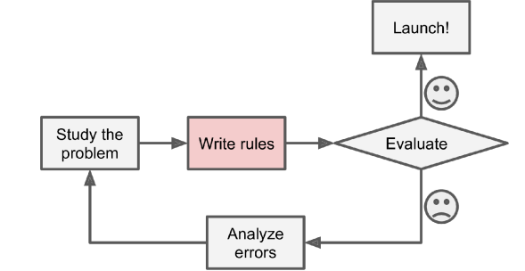

the machine learning approach:

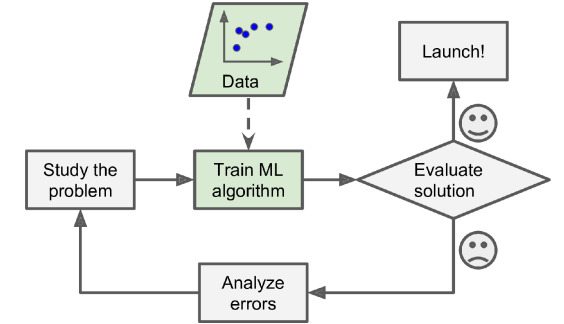

Automatically adapting to change:

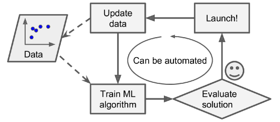

Machine Learning can help humans learn

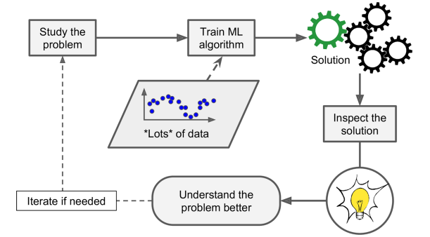

Data Mining - Applying ML techniques to dig into large amounts of data can help discover patterns that were not immediately apparent.

To summarize, Machine Learning is great for:

- Problems for which existing solutions require a lot of fine-tuning or long lists of rules: one Machine Learning algorithm can often simplify code and perform better than the traditional approach.
- Complex problems for which using a traditional approach yields no good solution: the best Machine Learning techniques can perhaps find a solution.
- Fluctuating environments: a Machine Learning system can adapt to new data.
- Getting insights about complex problems and large amounts of data.

**Examples of Applications**

- Analyzing images of products on a production line to automatically classify them
- Detecting tumors in brain scans
- Automatically classifying news articles
- Automatically flagging offensive comments on discussion forums
- Summarizing long documents automatically
- Creating a chatbot or a personal assistant

**Types of Machine Learning Systems**

- Whether or not they are trained with human supervision (supervised, unsuper‐ vised, semisupervised, and Reinforcement Learning)
- Whether or not they can learn incrementally on the fly (online versus batch learning)
- Whether they work by simply comparing new data points to known data points, or instead by detecting patterns in the training data and building a predictive model, much like scientists do (instance-based versus model-based learning)

These criteria are not exclusive; you can combine them in any way.

**Supervised/Unsupervised Learning**

**Supervised learning**

The training set you feed to the algorithm includes the desired solutions, called labels

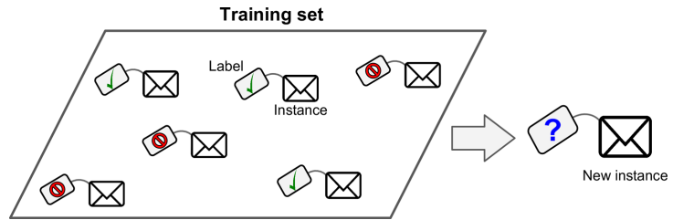

Another typical task is to predict a target numeric value, such as the price of a car, given a set of features (mileage, age, brand, etc.) called predictors. This sort of task is called **regression**. To train the system, you need to give it many examples of cars, including both their predictors and their labels (i.e., their prices).

**Regression example**:

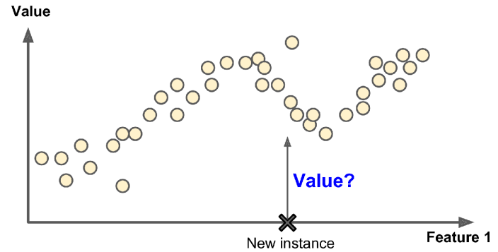

**Unsupervised learning**

In unsupervised learning, the training data is unlabeled

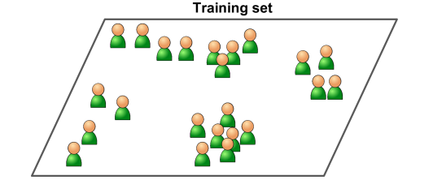

**Clustering**

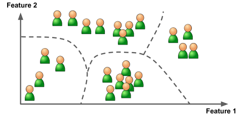


For example, say you have a lot of data about your blog’s visitors. You may want to run a clustering algorithm to try to detect groups of similar visitors. At no point do you tell the algorithm which group a visitor belongs to: it finds those connections without your help. For example, it might notice that 40% of your visitors are males who love comic books and generally read your blog in the evening, while 20% are young sci-fi lovers who visit during the weekends. If you use a **hierarchical clustering** algorithm, it may also subdivide each group into smaller groups. This may help you target your posts for each group.

A related task is **dimensionality reduction**, in which the goal is to simplify the data without losing too much information. One way to do this is to merge several correlated features into one. For example, a car’s mileage may be strongly correlated with its age, so the dimensionality reduction algorithm will merge them into one feature that represents the car’s wear and tear. This is called **feature extraction**.

It is often a good idea to try to reduce the dimension of your train‐ ing data using a dimensionality reduction algorithm before you feed it to another Machine Learning algorithm (such as a supervised learning algorithm). It will run much faster, the data will take up less disk and memory space, and in some cases it may also perform better.

Another important unsupervised task is **anomaly detection**—for example, detecting unusual credit card transactions to prevent fraud, catching manufacturing defects, or automatically removing outliers from a dataset before feeding it to another learning algorithm.

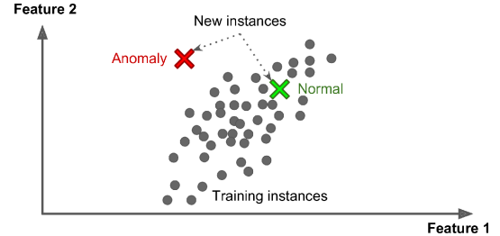


Finally, another common unsupervised task is association rule learning, in which the goal is to dig into large amounts of data and discover interesting relations between attributes.

**Semisupervised learning**

Since labeling data is usually time-consuming and costly, you will often have plenty of unlabeled instances, and few labeled instances. Some algorithms can deal with data that’s partially labeled. This is called semisupervised learning.

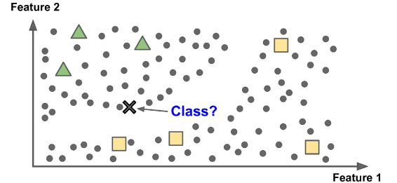


Semisupervised learning with two classes (triangles and squares): the unla‐ beled examples (circles) help classify a new instance (the cross) into the triangle class rather than the square class, even though it is closer to the labeled squares.

**Reinforcement Learning**

Reinforcement Learning is a very different beast. The learning system, called an agent in this context, can observe the environment, select and perform actions, and get rewards in return (or penalties in the form of negative rewards).

It must then learn by itself what is the best strategy, called a policy, to get the most reward over time. A policy defines what action the agent should choose when it is in a given situation.

**Batch and Online Learning**

Another criterion used to classify Machine Learning systems is whether or not the system can learn incrementally from a stream of incoming data.

**Batch learning**

In batch learning, the system is incapable of learning incrementally: it must be trained using all the available data. This will generally take a lot of time and computing resources, so it is typically done offline. First the system is trained, and then it is launched into production and runs without learning anymore; it just applies what it has learned. This is called offline learning.

**Online learning**

In online learning, you train the system incrementally by feeding it data instances sequentially, either individually or in small groups called mini-batches. Each learning step is fast and cheap, so the system can learn about new data on the fly, as it arrives.

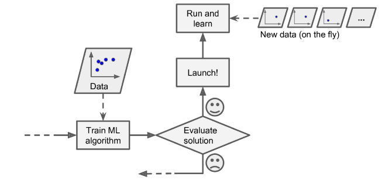


Online learning is great for systems that receive data as a continuous flow (e.g., stock prices) and need to adapt to change rapidly or autonomously.

Online learning algorithms can also be used to train systems on huge datasets that

cannot fit in one machine’s main memory (this is called out-of-core learning).

Out-of-core learning is usually done offline (i.e., not on the live system), so online learning can be a confusing name. Think of it as incremental learning.

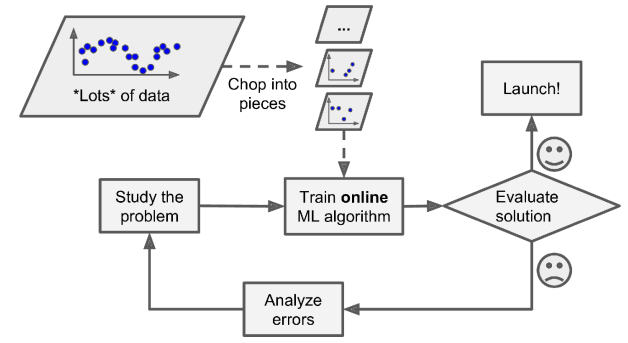

**Instance-Based Versus Model-Based Learning**

One more way to categorize Machine Learning systems is by how they generalize. Most Machine Learning tasks are about making predictions. This means that given a number of training examples, the system needs to be able to make good predictions for (generalize to) examples it has never seen before. Having a good performance measure on the training data is good, but insufficient; the true goal is to perform well on new instances.

**Instance-based learning**

The system learns the examples by heart, then generalizes to new cases by using a similarity measure to compare them to the learned examples (or a subset of them).

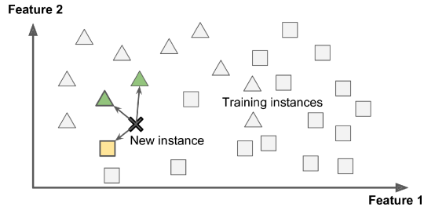


**Model-based learning**

Another way to generalize from a set of examples is to build a model of these exam‐ ples and then use that model to make predictions. This is called model-based learning.

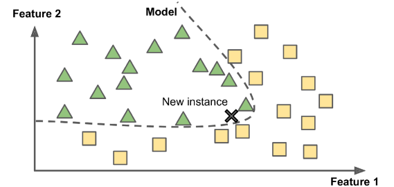


**Training and running a linear model using Scikit-Learn**

```python
import matplotlib.pyplot as plt
import numpy as np
import pandas as pd
import sklearn.linear_model

# Load the data
oecd_bli = pd.read_csv("oecd_bli_2015.csv", thousands=',')
gdp_per_capita = pd.read_csv("gdp_per_capita.csv", thousands=',', delimiter='\t',
                             encoding='latin1')

# Prepare the data
country_stats = prepare_country_stats(oecd_bli, gdp_per_capita)
X = np.c_[country_stats["GDP per capita"]]
y = np.c_[country_stats["Life satisfaction"]]

# Visualize the data
country_stats.plot(kind='scatter', x="GDP per capita", y='Life satisfaction')
plt.show()

# Select a linear model
model = sklearn.linear_model.LinearRegression()

# Train the model
model.fit(X, y)

# Make a prediction for Cyprus
X_new = [[22587]]  # Cyprus's GDP per capita
print(model.predict(X_new))  # outputs [[5.96242338]]
```

**Main Challenges of Machine Learning**

Examples of bad data:

- Insufficient Quantity of Training Data
- Nonrepresentative Training Data
- Poor-Quality Data
- Irrelevant Features
- Overfitting the Training Data
- Underfitting the Training Data

**Stepping back**

- Machine Learning is about making machines get better at some task by learning from data, instead of having to explicitly code rules.
- There are many different types of ML systems: supervised or not, batch or online, instance-based or model-based.
- In an ML project you gather data in a training set, and you feed the training set to a learning algorithm. If the algorithm is model-based, it tunes some parameters to fit the model to the training set (i.e., to make good predictions on the training set itself), and then hopefully it will be able to make good predictions on new cases as well. If the algorithm is instance-based, it just learns the examples by heart and generalizes to new instances by using a similarity measure to compare them to the learned instances.
- The system will not perform well if your training set is too small, or if the data is not representative, is noisy, or is polluted with irrelevant features (garbage in, garbage out). Lastly, your model needs to be neither too simple (in which case it will underfit) nor too complex (in which case it will overfit).

**Testing and Validating**

A better option is to split your data into two sets: the training set and the test set. As these names imply, you train your model using the training set, and you test it using the test set. The error rate on new cases is called the generalization error (or out-ofsample error), and by evaluating your model on the test set, you get an estimate of this error. This value tells you how well your model will perform on instances it has never seen before.

It is common to use 80% of the data for training and hold out 20% for testing.

**Hyperparameter Tuning and Model Selection**

Evaluating a model is simple enough: just use a test set.

A common solution to this problem is called holdout validation: you simply hold out part of the training set to evaluate several candidate models and select the best one. The new held-out set is called the validation set (or sometimes the development set, or dev set). More specifically, you train multiple models with various hyperparameters on the reduced training set (i.e., the full training set minus the validation set), and you select the model that performs best on the validation set. After this holdout vali‐ dation process, you train the best model on the full training set (including the validation set), and this gives you the final model. Lastly, you evaluate this final model on the test set to get an estimate of the generalization error.

**Data Mismatch**

In some cases, it’s easy to get a large amount of data for training, but this data probably won’t be perfectly representative of the data that will be used in production.

The most important rule to remember is that the validation set and the test set must be as representative as possible of the data you expect to use in production.

**No Free Lunch Theorem**

A model is a simplified version of the observations. The simplifications are meant to discard the superfluous details that are unlikely to generalize to new instances. To decide what data to discard and what data to keep, you must make assumptions. For example, a linear model makes the assumption that the data is fundamentally linear and that the distance between the instances and the straight line is just noise, which can safely be ignored.

# Resumen Master Machine Learning Algorithms

## **Capítulo 3 – Algorithms Learn a Mapping From Input to Output**

### **3.1 - Learning a function**

Machine learning algorithms are described as learning a target function (f) that best maps input variables (X) to an output variable (Y ). This is a general learning task where we would like to make predictions in the future (Y ) given new examples of input variables (X).

Y = f(X)

There is also error (e) that is independent of the input data (X).

Y = f(X) + **e**

This error is called irreducible error because no matter how good we get at estimating the target function (f), we cannot reduce this error.

### **3.2 - Learning a Function To Make Predictions**

The most common type of machine learning is to learn the mapping Y = f(X) to make predictions of Y for new X. This is called predictive modeling or predictive analytics and our goal is to make the most accurate predictions possible.

We could learn the mapping of Y = f(X) to learn more about the relationship in the data and this is called statistical inference.

When we learn a function (f) we are estimating its form from the data that we have available. As such, this estimate will have error.

### **3.3 - Techniques For Learning a Function**

Machine learning algorithms are techniques for estimating the target function (f) to predict the output variable (Y ) given input variables (X).

Different machine learning algorithms make different assumptions about the shape and structure of the function and how best to optimize a representation to approximate it. This is why it is so important to try a suite of different algorithms on a machine learning problem.

## **Capítulo 4 – Parametric and Nonparametric Machine Learning Algorithms**

## **4.1 - Parametric Machine Learning Algorithms**

Assumptions can greatly simplify the learning process, but can also limit what can be learned.

Algorithms that simplify the function to a known form are called parametric machine learning algorithms.

A learning model that summarizes data with a set of parameters of fixed size (independent of the number of training examples) is called a parametric model. No matter how much data you throw at a parametric model, it won’t change its mind about how many parameters it needs.

### **The algorithms involve two steps:**

1. Select a form for the function.

2. Learn the coefficients for the function from the training data.

B0 + B1 × X1 + B2 × X2 = 0

B0, B1, B2 - coefficients of the line that control de intercept and slope

X1, X2 - input variable

Now, all we need to do is estimate the coefficients of the line equation and we have a predictive model for the problem.

Often the assumed functional form is a linear combination of the input variables and as such parametric machine learning algorithms are often also called l**inear machine learning algorithms**.

### **Benefits of Parametric Machine Learning Algorithms:**

- **Simpler**: These methods are easier to understand and interpret results.
- **Speed**: Parametric models are very fast to learn from data.
- **Less Data**: They do not require as much training data and can work well even if the fit to the data is not perfect.

### **Limitations of Parametric Machine Learning Algorithms:**

- **Constrained**: By choosing a functional form these methods are highly constrained to the specified form.
- **Limited Complexity**: The methods are more suited to simpler problems.
- **Poor Fit**: In practice the methods are unlikely to match the underlying mapping function.

## **4.2 - Nonparametric Machine Learning Algorithms**

Algorithms that do not make strong assumptions about the form of the mapping function are called nonparametric machine learning algorithms. By not making assumptions, they are free to learn any functional form from the training data.

Nonparametric methods are good when you have a lot of data and no prior knowledge, and when you don’t want to worry too much about choosing just the right features.

An easy to understand nonparametric model is the k-nearest neighbors algorithm that makes predictions based on the k most similar training patterns for a new data instance. The method does not assume anything about the form of the mapping function other than patterns that are close are likely to have a similar output variable.

### **Benefits of Nonparametric Machine Learning Algorithms:**

- **Flexibility**: Capable of fitting a large number of functional forms.
- **Power**: No assumptions (or weak assumptions) about the fundamental function.
- **Performance**: Can result in higher performance models for prediction.

### **Limitations of Nonparametric Machine Learning Algorithms:**

- **More data**: Require a lot more training data to estimate the mapping function.
- **Slower**: A lot slower to train as they often have far more parameters to train.
- **Overfitting**: More of a risk to overfit the training data and it is harder to explain why specific predictions are made.

## **4.3 - Summary**

Parametric methods make large assumptions about the mapping of the input variables to the output variable and in turn are faster to train, require less data but may not be as powerful.

Nonparametric methods make few or no assumptions about the target function and in turn require a lot more data, are slower to train and have a higher model complexity but can result in more powerful models.

## **Capítulo 5 – Supervised, Unsupervised and Semi-Supervised Learning**

### **5.1 - Supervised Machine Learning**

The goal is to approximate the mapping function so well that when you have new input data (X) that you can predict the output variables (Y ) for that data. It is called supervised learning because the process of an algorithm learning from the training dataset can be thought of as a teacher supervising the learning process.

- **Classification**: A classification problem is when the output variable is a category, such as red or blue or disease and no disease.
- **Regression**: A regression problem is when the output variable is a real value, such as dollars or weight.

### **5.2 - Unsupervised Machine Learning**

Unsupervised learning is where you only have input data (X) and no corresponding output variables. The goal for unsupervised learning is to model the underlying structure or distribution in the data in order to learn more about the data.

- **Clustering**: A clustering problem is where you want to discover the inherent groupings in the data, such as grouping customers by purchasing behavior.
- **Association**: An association rule learning problem is where you want to discover rules that describe large portions of your data, such as people that buy A also tend to buy B.

### **5.3 - Semi-Supervised Machine Learning**

You can use unsupervised learning techniques to discover and learn the structure in the input variables. You can also use supervised learning techniques to make best guess predictions for the unlabeled data, feed that data back into the supervised learning algorithm as training data and use the model to make predictions on new unseen data.

## **5.4 - Summary**

- **Supervised**: All data is labeled and the algorithms learn to predict the output from the input data.
- **Unsupervised**: All data is unlabeled and the algorithms learn to inherent structure from the input data.
- **Semi-supervised**: Some data is labeled but most of it is unlabeled and a mixture of supervised and unsupervised techniques can be used.

## **Capítulo 6 – The Bias-Variance Trade-Off**

### **6.1 - Overview of Bias and Variance**

The prediction error for any machine learning algorithm can be broken down into three parts:

- Bias Error
- Variance Error
- Irreducible Error

### **6.2 - Bias Error**

Bias are the simplifying assumptions made by a model to make the target function easier to learn.

Generally parametric algorithms have a high bias making them fast to learn and easier to understand but generally less flexible.

- **Low Bias**: Suggests more assumptions about the form of the target function (Decision Trees, k-Nearest Neighbors and Support Vector Machines)
- **High-Bias**: Suggests less assumptions about the form of the target function (Linear Regression, Linear Discriminant Analysis and Logistic Regression)

### **6.3 - Variance Error**

Variance is the amount that the estimate of the target function will change if different training data was used.

The target function is estimated from the training data by a machine learning algorithm, so we should expect the algorithm to have some variance.

- **Low Variance**: Suggests small changes to the estimate of the target function with changes to the training dataset (Linear Regression, Linear Discriminant Analysis and Logistic Regression)
- **High Variance**: Suggests large changes to the estimate of the target function with changes to the training dataset (Decision Trees, k-Nearest Neighbors and Support Vector Machines)

Generally nonparametric machine learning algorithms that have a lot of flexibility have a high bias.

### **6.4 - Bias-Variance Trade-Off**

The goal of any supervised machine learning algorithm is to achieve low bias and low variance.

- Parametric or linear machine learning algorithms → high bias and low variance
- Nonparametric or nonlinear machine learning algorithm → low bias and high variance

The parameterization of machine learning algorithms is often a battle to balance out bias and variance.

There is no escaping the relationship between bias and variance in machine learning.

- Increasing the bias will decrease the variance.
- Increasing the variance will decrease the bias.

## **Capítulo 7 – Overfitting and Underfitting**

### **7.1 - Generalization in Machine Learning**

In machine learning we describe the learning of the target function from training data as inductive learning.

**Induction** refers to learning general concepts from specific examples which is exactly the problem that supervised machine learning problems aim to solve.

This is **different from deductio**n that is the other way around and seeks to learn specific concepts from general rules.

### **7.2 Statistical Fit**

In statistics a fit refers to how well you approximate a target function.

Statistics often describe the goodness of fit which refers to measures used to estimate how well the approximation of the function matches the target function.

### **7.3 - Overfitting in Machine Learning**

Overfitting refers to a model that models the training data too well. This means that the noise or random fluctuations in the training data is picked up and learned as concepts by the model. The problem is that these concepts do not apply to new data and negatively impact the models ability to generalize.

Overfitting is more likely with nonparametric and nonlinear models that have more flexibility when learning a target function

### **7.4 - Underfitting in Machine Learning**

Underfitting refers to a model that can neither model the training data not generalize to new data. The remedy is to move on and try alternate machine learning algorithms. Nevertheless, it does provide a good contrast to the problem of the concept of overfitting.

### **7.5 - A Good Fit in Machine Learning**

Ideally, you want to select a model at the sweet spot between underfitting and overfitting. This is the goal, but is very difficult to do in practice. To understand this goal, we can look at the performance of a machine learning algorithm over time as it is learning training data.

Over time, as the algorithm learns, the error for the model on the training data goes down and so does the error on the test dataset.

If we train for too long, the performance on the training dataset may continue to decrease because the model is overfitting and learning the irrelevant detail and noise in the training dataset. At the same time the error for the test set starts to rise again as the model’s ability to generalize decreases.

The sweet spot is the point just before the error on the test dataset starts to increase where the model has good skill on both the training dataset and the unseen test dataset.

There are two additional techniques you can use to help find the sweet spot in practice: resampling methods and a validation dataset.

## **7.6 - How To Limit Overfitting**

Both overfitting and underfitting can lead to poor model performance. But by far the most common problem in applied machine learning is overfitting. Overfitting is such a problem because the evaluation of machine learning algorithms on training data is different from the evaluation we actually care the most about, namely how well the algorithm performs on unseen data.

1. Use a resampling technique to estimate model accuracy.

2. Hold back a validation dataset