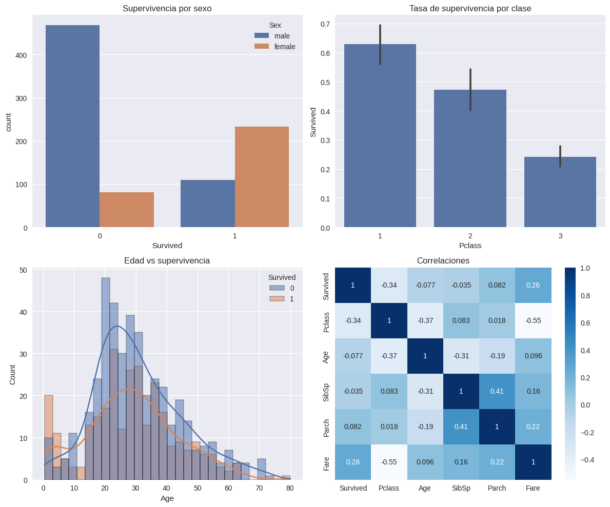

# **Práctica 1: EDA del Titanic en Google Colab**

- [Consigna](https://juanfkurucz.com/ucu-ia/ut1/01-eda-titanic/)
- [Datos](https://www.kaggle.com/competitions/titanic/overview)
- [Google Colab](https://colab.research.google.com/drive/16ZFcKmfPNSr-9MtpVxozs2gcMer9bgJ2?usp=sharing)

## ¿De qué trata exactamente este dataset? ¿Cuál es el objetivo de la competencia de Kaggle?

- Contiene información de pasajeros que viajaban en el Titanic (1912), incluyendo características como edad, sexo, clase de ticket, tarifa, número de familiares a bordo, puerto de embarque, etc.
- El objetivo será predecir quién sobrevivió y quién no usando los datos disponibles.

## ¿Qué columnas/atributos contiene el dataset? ¿Qué representa cada una? ¿Cuál es la variable objetivo?

- PassengerId – ID del pasajero
- Pclass – Clase del ticket (1ª, 2ª o 3ª)
- Name – Nombre
- Sex – Género
- Age – Edad
- SibSp – Número de hermanos/esposos a bordo
- Parch – Número de padres/hijos a bordo
- Ticket – Número del ticket
- Fare – Tarifa pagada
- Cabin – Cabina (si se conoce)
- Embarked – Puerto de embarque (C = Cherbourg, Q = Queenstown, S = Southampton)
- Survived – Variable objetivo (solo en el train.csv)

## EDA visual con seaborn/ matplotlib

## ¿Qué factores crees que más influyeron en la supervivencia?

- Basado en lo que se sabe del accidente y en análisis previos de este dataset:
- Sexo → Las mujeres tuvieron mucha mayor tasa de supervivencia (política de “mujeres y niños primero”).
- Edad → Niños pequeños tenían más prioridad en los botes salvavidas.
- Clase de ticket (Pclass) → Los pasajeros de 1ª clase estaban más cerca de la cubierta y tenían más acceso a botes; los de 3ª estaban en zonas bajas y con más dificultad para evacuar.
- Familiares a bordo (SibSp + Parch) → Podría influir tanto positiva como negativamente: tener familia podía ayudar a recibir apoyo, pero también retrasar la evacuación.
- Puerto de embarque (Embarked) → Podría reflejar diferencias socioeconómicas o de ubicación dentro del barco.

## ¿Qué desafíos de calidad de datos esperas encontrar?

- Valores faltantes (falta de valores dentro de atributos como “Age”, “Cabin”, entre otros)
- Datos inconsistentes (los nombres pueden llegar a necesitar una limpiez

## ¿Qué variables podrían estar correlacionadas?

- Pclass ↔ Fare → Directa: a mayor clase, tarifa más alta.
- Sex ↔ Title (extraído de Name) → Alta relación, y también con Age.
- Pclass ↔ Survived → Negativa: menor clase, menor supervivencia.
- Sex ↔ Survived → Fuerte: mujeres con más supervivencia.

Luego del análisis en Google Colab:

## ¿Qué variables parecen más relacionadas con Survived?

- Sex → Muy fuerte: mujeres sobreviven mucho más que hombres.
- Pclass → A menor número (mejor clase), mayor supervivencia.
- Age → Niños pequeños tienen tasas más altas de supervivencia.
- Fare → Tarifa más alta, generalmente mayor probabilidad de sobrevivir (correlaciona con Pclass).
- Embarked → Los que embarcaron en Cherbourg (C) tienden a sobrevivir más que los de Southampton (S).
- FamilySize (si se crea a partir de SibSp + Parch) → Familias pequeñas (2–4 personas) sobreviven más que personas solas o familias grandes.

## ¿Dónde hay más valores faltantes? ¿Cómo los imputarías?

- Distribución habitual de missing values:
    - Cabin → ~77% faltantes (demasiados; conviene transformarla en indicador HasCabin en lugar de imputar).
    - Age → ~20% faltantes (imputar usando mediana, o por título del pasajero —Mr., Mrs., Miss, etc.— para mayor precisión).
    - Embarked → 2 registros faltantes (imputar con la moda —probablemente S).
    - Fare → 1 registro faltante en test.csv (imputar con mediana filtrando por Pclass y Embarked).

## ¿Qué hipótesis probarías a continuación?

- H1: Las mujeres tienen mayor probabilidad de sobrevivir que los hombres.
- H2: Los pasajeros de 1ª clase tienen mayor probabilidad de sobrevivir que los de 2ª o 3ª.
- H3: La edad influye de forma no lineal: niños pequeños sobreviven más que adultos jóvenes o mayores.
- H4: Un tamaño de familia moderado aumenta la probabilidad de supervivencia frente a viajar solo o con familia muy grande.
- H5: El puerto de embarque está asociado a la supervivencia debido a factores socioeconómicos.