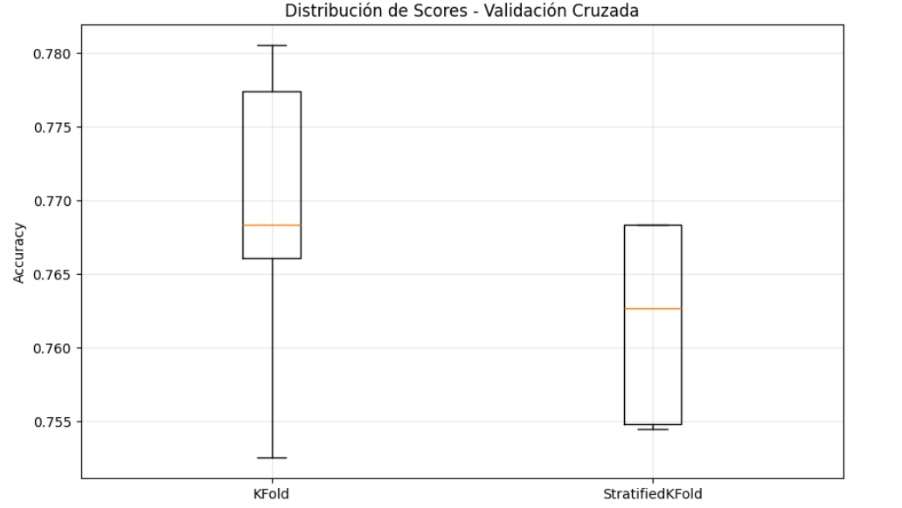
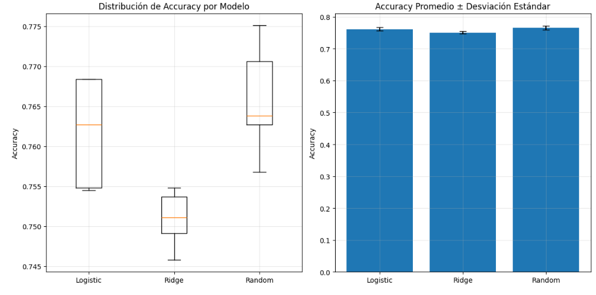
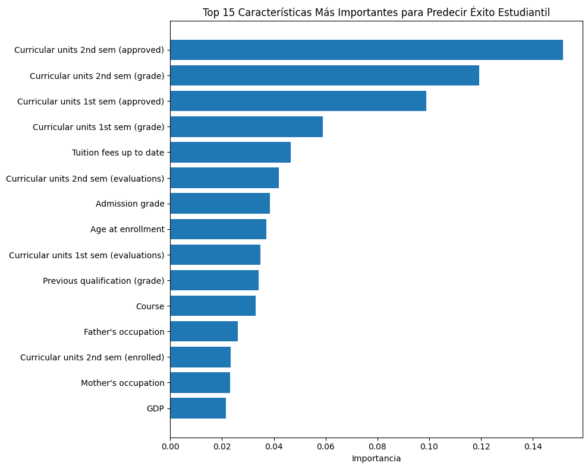
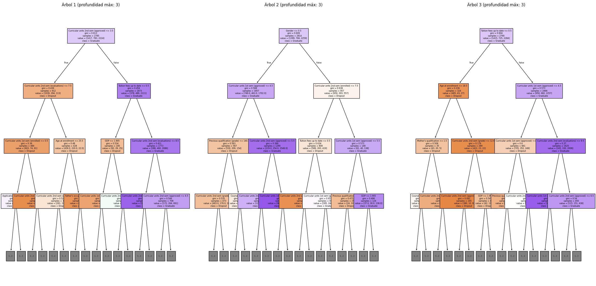

# **Práctica 5: Validación y Selección de Modelos**

- [Consigna](https://juanfkurucz.com/ucu-ia/ut1/05-validacion-seleccion-modelos/)
- [Google Colab](https://colab.research.google.com/drive/1nn2vaW-PfJkMZOWpS8qGhQc6LWbnKCbT?usp=sharing)

# Dataset: Predicción de Éxito Estudiantil

## **Setup Inicial**

- 🔗 **RidgeClassifier**: [Documentación](https://scikit-learn.org/stable/modules/generated/sklearn.linear_model.RidgeClassifier.html) - Clasificador con regularización L2
- 🔗 **RandomForestClassifier**: [Documentación](https://scikit-learn.org/stable/modules/generated/sklearn.ensemble.RandomForestClassifier.html) - Ensemble de árboles de decisión
- 🔗 **cross_val_score**: [Documentación](https://scikit-learn.org/stable/modules/generated/sklearn.model_selection.cross_val_score.html) - Para validación cruzada automática
- 🔗 **StratifiedKFold**: [Documentación](https://scikit-learn.org/stable/modules/generated/sklearn.model_selection.StratifiedKFold.html) - KFold que mantiene proporción de clases
- 🔗 **StandardScaler**: [Documentación](https://scikit-learn.org/stable/modules/generated/sklearn.preprocessing.StandardScaler.html) - Estandariza características (media=0, std=1)

## **Carga y Exploración de los Datos de Estudiantes**

https://archive.ics.uci.edu/dataset/697/predict+students+dropout+and+academic+success

**Contexto de negocio:**

- **Problema**: Predecir abandono estudiantil y éxito académico en educación superior
- **Objetivo**: Identificar estudiantes en riesgo para implementar estrategias de apoyo
- **Variables**: 36 características (demográficas, académicas, socioeconómicas)
- **Valor**: Reducir tasas de abandono, mejorar retención estudiantil

**📖 Investigación previa:** Antes de continuar, explora el dataset en: [Student Dropout and Academic Success](https://archive.ics.uci.edu/dataset/697/predict+students+dropout+and+academic+success)

**Preguntas para investigar:** - ¿Cuántas muestras y características tiene el dataset? - ¿Qué tipos de variables incluye? (demográficas, académicas, socioeconómicas) - ¿Las clases están balanceadas o desbalanceadas? - ¿Qué significan las 3 categorías objetivo?

```python
Dataset: Student Dropout and Academic Success
Estudiantes: 4424, Características: 36
Objetivo: Predecir 1 variable(s)

Variable objetivo: Target

Distribución de resultados académicos:

Primeras características:
['Marital Status', 'Application mode', 'Application order', 'Course', 'Daytime/evening attendance', 'Previous qualification', 'Previous qualification (grade)', 'Nacionality', "Mother's qualification", "Father's qualification"] ...

Age at enrollment:
  Promedio: 23.3 años
  Rango: 17-70 años
```

**Tipos de variables incluidas**

El dataset mezcla distintas dimensiones:

- **Demográficas:**
    - Estado civil, nacionalidad, edad al momento de inscribirse, género (si estuviera).
- **Académicas:**
    - Modalidad (diurno/nocturno), curso, calificación previa, orden de aplicación, asistencia.
    - Notas de exámenes parciales y finales, rendimiento acumulado.
- **Socioeconómicas / familiares:**
    - Nivel educativo de madre y padre, ocupación de los padres, becas, ayudas financieras, etc.

**Balance de clases**

El *target* está **desbalanceado**:

- La mayoría de los estudiantes terminan en la categoría **“Graduate”** (egresados).
- Una parte significativa son **“Dropout”** (deserción).
- Una minoría queda como **“Enrolled”** (todavía cursando al final del período).

*(La distribución exacta es algo así como ~50% graduados, ~30% desertores, ~20% aún inscritos; depende de la fuente original UCI.)*

**Significado de las 3 categorías objetivo (`Target`)**

1. **Graduate** → el estudiante completó la carrera con éxito.
2. **Dropout** → el estudiante abandonó antes de terminar.
3. **Enrolled** → el estudiante sigue inscrito en el sistema (no abandonó ni se graduó al final del período observado).

# Cross-Validation - Validación Robusta

## **Preparación de datos para la validación**

```python
Datos preparados para validación:
X shape: (4424, 36)
y shape: (4424,)
Clases únicas: [np.int64(0), np.int64(1), np.int64(2)]
Mapeo: {0: 'Dropout', 1: 'Enrolled', 2: 'Graduate'}
```

# Cross-Validation - Validación Robusta

## **Implementación de Validación Cruzada**

- 🔗 [Documentación KFold](https://scikit-learn.org/stable/modules/generated/sklearn.model_selection.KFold.html)
- 🔗 [Documentación StratifiedKFold](https://scikit-learn.org/stable/modules/generated/sklearn.model_selection.StratifiedKFold.html)
- 🔗 [Documentación cross_val_score](https://scikit-learn.org/stable/modules/generated/sklearn.model_selection.cross_val_score.html)
- 💭 ¿Cuál método mantiene la proporción de clases en cada fold?
- 📊 ¿Cuál parámetro especifica el tipo de validación cruzada en `cross_val_score`?

```python
🔬 VALIDACIÓN CRUZADA: ¿Qué tan estable es nuestro modelo?
Pipeline creado para validación cruzada

KFOLD RESULTS:
   Scores individuales: [0.75254237 0.76610169 0.76836158 0.77740113 0.78054299]
   Media: 0.7690
   Desviación estándar: 0.0098
   Resultado: 0.7690 ± 0.0098

STRATIFIED KFOLD RESULTS:
   Scores individuales: [0.76836158 0.76836158 0.76271186 0.75480226 0.75452489]
   Media: 0.7618
   Desviación estándar: 0.0061
   Resultado: 0.7618 ± 0.0061

COMPARACIÓN DE ESTABILIDAD:
   StratifiedKFold es MÁS ESTABLE (menor variabilidad)
 
```



**Resultados obtenidos**

- **KFold**
    - Media ≈ **0.7690**
    - Desvío estándar ≈ **0.0098**
    - 📈 Tiene un **score promedio más alto**, pero con mayor dispersión (más inestable).
    - El boxplot lo muestra con una caja más alta y bigotes más largos → los resultados fluctúan bastante según cómo se dividen los datos.
- **StratifiedKFold**
    - Media ≈ **0.7618**
    - Desvío estándar ≈ **0.0061**
    - 📉 El **score promedio es un poco más bajo**, pero mucho más **consistente** entre pliegues.
    - El boxplot lo muestra con caja y bigotes más pequeños → menos variabilidad, más estabilidad.

**Interpretación**

- **KFold normal** puede dar resultados más altos, pero **es más sensible a la forma en que se dividen los datos**.
- **StratifiedKFold**, al mantener la proporción de clases en cada pliegue, asegura una evaluación **más representativa y estable**, aunque el promedio sea un poco menor.

**Conclusión:**

Si lo más importante es la **estabilidad y confiabilidad de la evaluación**, **StratifiedKFold** es mejor.

Si buscas un **score máximo posible** (aunque más variable), **KFold** puede parecer más atractivo.

# 🏆 Parte 3: Comparación de Modelos - ¡El Torneo!

## 🥊 **Paso 5: Competencia de Múltiples Modelos**

- 🔗 [Documentación RidgeClassifier](https://scikit-learn.org/stable/modules/generated/sklearn.linear_model.RidgeClassifier.html)
- 🔗 [Documentación RandomForestClassifier](https://scikit-learn.org/stable/modules/generated/sklearn.ensemble.RandomForestClassifier.html)
- 💭 Random Forest no necesita escalado, ¿por qué no incluir StandardScaler?
- 📊 ¿Cuál métrica es mejor para clasificación: 'accuracy', 'precision', o 'f1'?
- 🔍 Los métodos `.mean()` y `.std()` funcionan con arrays de numpy

```python
🏆 TORNEO: ¿Cuál modelo funciona mejor para diagnóstico médico?
Modelos en competencia: ['Logistic Regression', 'Ridge Classifier', 'Random Forest']

EVALUANDO MODELOS CON 5-FOLD CV...
   Evaluando Logistic Regression...
   Logistic Regression: 0.7618 ± 0.0061
      Scores: ['0.768', '0.768', '0.763', '0.755', '0.755']
   Evaluando Ridge Classifier...
   Ridge Classifier: 0.7509 ± 0.0032
      Scores: ['0.755', '0.746', '0.754', '0.749', '0.751']
   Evaluando Random Forest...
   Random Forest: 0.7658 ± 0.0064
      Scores: ['0.775', '0.764', '0.771', '0.763', '0.757']

RESULTADOS FINALES:
GANADOR: Random Forest
Score: 0.7658

ANÁLISIS DE ESTABILIDAD:
   Logistic Regression: MUY ESTABLE (std: 0.0061)
   Ridge Classifier: MUY ESTABLE (std: 0.0032)
   Random Forest: MUY ESTABLE (std: 0.0064)
/tmp/ipython-input-2400318206.py:79: MatplotlibDeprecationWarning: The 'labels' parameter of boxplot() has been renamed 'tick_labels' since Matplotlib 3.9; support for the old name will be dropped in 3.11.
  plt.boxplot([results[name] for name in models.keys()],
```



**Interpretación de los resultados**

1. **Rendimiento promedio (Accuracy):**
    - **Random Forest** obtuvo el mejor score promedio (`0.7658`) → lo posiciona como **ganador**.
    - **Logistic Regression** quedó muy cerca (`0.7618`), con apenas -0.004 de diferencia.
    - **Ridge Classifier** fue el más bajo (`0.7509`).
2. **Estabilidad (Desviación Estándar):**
    - Los tres modelos fueron **muy estables**, con std < 0.01.
    - **Ridge Classifier** tuvo la menor desviación (`0.0032`), lo que indica que su rendimiento cambia menos entre folds, aunque su accuracy sea menor.
    - Random Forest y Logistic son igualmente estables (`0.0061 – 0.0064`), con pequeñas variaciones entre folds.
3. **Boxplot (izquierda):**
    - Muestra la distribución de accuracy en los 5 folds.
    - Random Forest tiene la mediana más alta y valores superiores consistentes.
    - Logistic Regression tiene un rango similar, con algo más de dispersión hacia abajo.
    - Ridge está siempre por debajo, sin alcanzar los niveles de los otros dos.
4. **Barras con error bars (derecha):**
    - Refuerza la idea: todos muy parejos, pero Random Forest saca una ventaja leve en promedio.
    - La diferencia no es enorme, pero sí consistente.

**Conclusión**

- **Random Forest** es el modelo con **mejor rendimiento global** en este dataset (diagnóstico médico).
- **Logistic Regression** es una alternativa muy cercana, más simple e interpretable.
- **Ridge Classifier** es el más débil, aunque con la mayor estabilidad.

### **📚 BONUS: ¿Qué significan las métricas de validación?**

- 🔍 [Guía completa de cross-validation](https://scikit-learn.org/stable/modules/cross_validation.html)
- 📊 Un modelo estable tiene baja o alta variabilidad?
- 🩺 En medicina, ¿prefieres un modelo consistente o uno que varía mucho?

**Cross-Validation:** Técnica que divide los datos en **k partes (folds)** para entrenar y evaluar múltiples veces.

**Accuracy promedio:** La **estimación** de rendimiento esperado en datos nuevos.

**Desviación estándar:** Indica qué tan **estable o variable** es el modelo entre diferentes divisiones de datos.

 Un modelo **estable** tiene **baja variabilidad**.

**StratifiedKFold:** Mantiene la **proporción** de clases en cada fold, especialmente importante en datasets desbalanceados.

# 🚀 BONUS: Optimización de Hiperparámetros

## **GridSearchCV vs RandomizedSearchCV**

- 🔗 **GridSearchCV**: [Documentación](https://scikit-learn.org/stable/modules/generated/sklearn.model_selection.GridSearchCV.html) - Búsqueda exhaustiva de hiperparámetros
- 🔗 **RandomizedSearchCV**: [Documentación](https://scikit-learn.org/stable/modules/generated/sklearn.model_selection.RandomizedSearchCV.html) - Búsqueda aleatoria más eficiente
- 💭 **GridSearchCV** prueba todas las combinaciones posibles
- 💭 **RandomizedSearchCV** es más rápido para espacios grandes de búsqueda
- 💭 **n_jobs=-1** usa todos los procesadores disponibles

```python
Optimizando hiperparámetros para: Random Forest

Método 1: GridSearchCV (búsqueda exhaustiva)
Fitting 5 folds for each of 36 candidates, totalling 180 fits
Mejores parámetros (Grid): {'classifier__max_depth': None, 'classifier__min_samples_split': 5, 'classifier__n_estimators': 100}
Mejor score (Grid): 0.7783

Método 2: RandomizedSearchCV (búsqueda aleatoria)
Fitting 5 folds for each of 20 candidates, totalling 100 fits
Mejores parámetros (Random): {'classifier__n_estimators': 100, 'classifier__min_samples_split': 5, 'classifier__max_depth': 30}
Mejor score (Random): 0.7783

Comparación de eficiencia:
GridSearch probó: 36 combinaciones
RandomSearch probó: 20 combinaciones

Modelo final optimizado: 0.7783 ± 0.0067
```

La salida muestra cómo se comportaron los dos métodos de búsqueda de hiperparámetros al optimizar un **Random Forest**:

**Método 1: GridSearchCV (búsqueda exhaustiva)**

- Probó **todas las combinaciones posibles** de los hiperparámetros definidos (36 en total).
- El mejor conjunto fue:
    - `n_estimators = 100`
    - `max_depth = None` (árboles sin límite de profundidad)
    - `min_samples_split = 5` (cada nodo debe tener al menos 5 muestras para dividirse).
- Score medio en validación cruzada: **0.7783**.

**Método 2: RandomizedSearchCV (búsqueda aleatoria)**

- Probó solo **20 combinaciones aleatorias** de los mismos hiperparámetros.
- El mejor conjunto fue ligeramente distinto:
    - `n_estimators = 100`
    - `max_depth = 30`
    - `min_samples_split = 5`.
- Score medio en validación cruzada: **0.7783** (idéntico al obtenido por GridSearch).

**Comparación de eficiencia**

- GridSearch necesitó evaluar **36 combinaciones × 5 folds = 180 entrenamientos**.
- RandomizedSearch usó **20 combinaciones × 5 folds = 100 entrenamientos**.
- **Ambos llegaron al mismo rendimiento final**, pero RandomizedSearch lo hizo con **menos cálculos** (más eficiente).

**Conclusión**

- El rendimiento máximo alcanzado con ambos métodos fue **~77.8% de accuracy**.
- La diferencia en los hiperparámetros óptimos (`max_depth=None` vs `max_depth=30`) no afectó el resultado en este caso.
- Para espacios pequeños de búsqueda, **GridSearch garantiza la mejor combinación exacta**.
- Para espacios grandes, **RandomizedSearch puede encontrar resultados igual de buenos con menos coste computacional**.

### **¿Cuándo usar cada método?**

**Guía de decisión**

- **GridSearchCV** cuando tienes **pocos hiperparámetros** y **suficiente tiempo de cómputo**.
- **RandomizedSearchCV** cuando tienes **muchos hiperparámetros** o **tiempo limitado**.
- **Pipeline + SearchCV** siempre previene **data leakage automáticamente**.
- **cross_val_score** en el resultado final valida que la optimización no causó **overfitting**.

# 🔍 BONUS 2: Explicabilidad del Modelo

## **¿Por qué el modelo toma esas decisiones?**

- 🔗 **Feature Importance**: [Documentación](https://scikit-learn.org/stable/modules/ensemble.html#feature-importance-evaluation) - Qué características son más importantes
- 🔗 **plot_tree**: [Documentación](https://scikit-learn.org/stable/modules/generated/sklearn.tree.plot_tree.html) - Visualización gráfica de árboles individuales
- 🔗 **export_text**: [Documentación](https://scikit-learn.org/stable/modules/generated/sklearn.tree.export_text.html) - Representación en texto de árboles
- 💭 **Feature Importance** se basa en cuánto reduce cada característica la impureza
- 💭 **Cada árbol** en Random Forest es diferente debido a bootstrap + random feature selection
- 💭 **max_depth=3** limita la visualización para que sea legible
- 💭 **Diversidad** entre árboles es lo que hace potente al Random Forest

```python
Usando el modelo ganador para explicabilidad
Componentes del pipeline: ['classifier']

TOP 10 CARACTERÍSTICAS MÁS IMPORTANTES:
Curricular units 2nd sem (approved): 0.1516
Curricular units 2nd sem (grade): 0.1193
Curricular units 1st sem (approved): 0.0987
Curricular units 1st sem (grade): 0.0589
Tuition fees up to date: 0.0466
Curricular units 2nd sem (evaluations): 0.0419
Admission grade: 0.0385
Age at enrollment: 0.0372
Curricular units 1st sem (evaluations): 0.0349
Previous qualification (grade): 0.0343
```



```python
IMPORTANCIA POR CATEGORÍAS:
Factores académicos: 0.6443
Factores demográficos: 0.0499
Factores económicos: 0.0769

INTERPRETACIÓN PARA INTERVENCIONES:
La característica más importante es: Curricular units 2nd sem (approved)
Esto sugiere que para reducir abandono estudiantil debemos enfocarnos en:
1. Monitorear y mejorar: Curricular units 2nd sem (approved)
2. Monitorear y mejorar: Curricular units 2nd sem (grade)
3. Monitorear y mejorar: Curricular units 1st sem (approved)

ANÁLISIS DE ESTUDIANTE INDIVIDUAL (ejemplo):
Estudiante #0:
Predicción: Dropout
Probabilidades:
  Dropout: 0.737
  Enrolled: 0.082
  Graduate: 0.181

Top 5 características que influyen en esta predicción:
Curricular units 2nd sem (approved): 0.00 (importancia: 0.1516)
Curricular units 2nd sem (grade): 0.00 (importancia: 0.1193)
Curricular units 1st sem (approved): 0.00 (importancia: 0.0987)
Curricular units 1st sem (grade): 0.00 (importancia: 0.0589)
Tuition fees up to date: 1.00 (importancia: 0.0466)

VISUALIZACIÓN DE ÁRBOLES DEL RANDOM FOREST:
Mostrando 3 árboles de 100 totales
```



```python
ESTADÍSTICAS DE LOS ÁRBOLES:
Profundidad promedio (primeros 5 árboles): 21.2
Número promedio de nodos (primeros 5): 1139.0

EJEMPLO DE REGLAS DE DECISIÓN (Árbol 1, simplificado):
|--- Curricular units 2nd sem (approved) <= 3.50
|   |--- Curricular units 2nd sem (evaluations) <= 7.50
|   |   |--- Curricular units 1st sem (enrolled) <= 0.50
|   |   |   |--- truncated branch of depth 10
|   |   |--- Curricular units 1st sem (enrolled) >  0.50
|   |   |   |--- truncated branch of depth 10
|   |--- Curricular units 2nd sem (evaluations) >  7.50
|   |   |--- Age at enrollment <= 25.50
|   |   |   |--- truncated branch of depth 16
|   |   |--- Age at enrollment >  25.50
|   |  ...

DIVERSIDAD EN EL RANDOM FOREST:
El poder del Random Forest viene de la diversidad de sus árboles:
- Cada árbol ve una muestra diferente de datos (bootstrap)
- Cada split considera solo un subconjunto aleatorio de características
- La predicción final es el voto mayoritario de todos los árboles
Usando datos sin escalar para árboles individuales

Predicciones de árboles individuales para el Estudiante #0:
  Árbol 1: 2.0
  Árbol 2: 0.0
  Árbol 3: 0.0
  Árbol 4: 0.0
  Árbol 5: 0.0
Predicción final (voto mayoritario): 0.0
```

### **Análisis de explicabilidad**

**Importancia global de características**

- El modelo identificó que las variables académicas tienen **el mayor peso (64%)** en las predicciones, muy por encima de factores demográficos (5%) y económicos (7%).
- Entre ellas destacan:
    - **Curricular units 2nd sem (approved)** → la más influyente, indica cuántas materias aprobó en el segundo semestre.
    - **Curricular units 2nd sem (grade)** y **1st sem (approved)** también son claves.
- **Interpretación práctica:** el éxito académico temprano (primer y segundo semestre) es determinante para evitar la deserción.

**Intervenciones sugeridas**

1. **Monitorear aprobaciones del 2° semestre**: si un estudiante reprueba muchas, está en riesgo.
2. **Acompañar en notas (grades)** desde el 1° y 2° semestre → tutorías, apoyo docente.
3. **Controlar cumplimiento de pagos (tuition fees)**, aunque su importancia es menor, puede anticipar problemas financieros que lleven al abandono.

**Análisis individual (ejemplo Estudiante #0)**

- **Predicción:** Dropout (abandono).
- **Probabilidades:** Dropout 73.7% vs Graduate 18.1% vs Enrolled 8.2%.
- **Razones de la predicción:**
    - No aprobó ni rindió materias en 1er y 2do semestre → el modelo lo ve como altísimo riesgo.
    - A pesar de tener las cuotas pagas (tuition fees up to date = 1), pesa mucho más lo académico.
- Esto es útil para **accionar sobre un estudiante en particular** → identificarlo como “crítico” y aplicar medidas preventivas.

**Explicación de los árboles**

- Cada árbol genera reglas de decisión del tipo *“Si aprobó ≤ 3 materias y rindió ≤ 7 evaluaciones, entonces riesgo de abandono alto”*.
- El bosque combina **100 árboles**, cada uno con reglas diferentes.
- **Profundidad promedio ~21** y más de 1000 nodos → árboles complejos, pero el bosque compensa esto con diversidad.

**Diversidad en el Random Forest**

- **Bootstrap:** cada árbol ve una muestra distinta de estudiantes.
- **Subconjuntos aleatorios de características:** en cada split no se consideran todas las variables.
- **Mayoría de votos:** cada árbol da su predicción, y el resultado final es el voto mayoritario.

Ejemplo Estudiante #0:

- Árbol 1 → “Graduate”
- Árboles 2,3,4,5 → “Dropout”
- Mayoría = Dropout → predicción final confiable.

**En resumen**

El modelo muestra que **el rendimiento académico inicial es el factor decisivo para anticipar abandono**, más que edad o situación económica.

La explicabilidad permite:

- Confiar en que el modelo no es “caja negra”.
- Diseñar intervenciones focalizadas en lo académico.
- Explicar a directivos y docentes **por qué** un alumno aparece en riesgo.

### 📌 **¿Por qué es importante la explicabilidad?**

- **Confianza:** Los educadores necesitan **entender** por qué el modelo predice abandono.
- **Intervenciones:** Knowing las características importantes permite crear **acciones/intervenciones específicas**.
- **Bias detection:** La explicabilidad ayuda a detectar **sesgos** en el modelo.
- **Regulaciones:** Muchos contextos requieren modelos **explicables/transparentes** por ley.
- **Mejora continua:** Entender el modelo ayuda a **mejorar y ajustar** futuras versiones.

# **Preguntas de Reflexión**

1. **¿Qué es data leakage y por qué es peligroso?**

**💡 PISTA:** Piensa en qué información "ve" el modelo antes de tiempo

- **Definición:** ocurre cuando el modelo accede a información en el entrenamiento que **no debería tener disponible en la vida real** (ejemplo: usar una variable futura o derivada del target).
- **Peligro:** hace que el modelo parezca tener una performance excelente en validación, pero **fracasa al aplicarse en datos reales**, porque estaba “haciendo trampa” al ver datos del futuro o del test.
1. **¿Cuándo usar KFold vs StratifiedKFold?**

**💡 PISTA:** ¿Qué pasa si una clase tiene muy pocas muestras?

- **KFold:** divide en K particiones iguales, **sin importar la distribución de clases**.
- **StratifiedKFold:** mantiene la **proporción de clases en cada fold** (estratificación).
- **Decisión:**
    - Usá **KFold** en regresión o cuando las clases están bien balanceadas.
    - Usá **StratifiedKFold** en clasificación con clases desbalanceadas (pocas muestras en una clase).
1. **¿Cómo interpretar "95.2% ± 2.1%" en cross-validation?**

**💡 PISTA:** ¿Qué significa cada número para el rendimiento del modelo?

- **95.2%:** media de accuracy en los distintos folds.
- **± 2.1%:** desviación estándar → mide **la variabilidad/estabilidad** del rendimiento entre folds.
- Interpretación: el modelo rinde alrededor de **95%**, con cierta variación (entre 93% y 97%, aprox.).
1. **¿Por qué Random Forest no necesita StandardScaler?**

**💡 PISTA:** 🔗 [Cómo funcionan los árboles de decisión](https://scikit-learn.org/stable/modules/tree.html)

- Los árboles de decisión (y ensembles como Random Forest) hacen **cortes basados en umbrales de las variables** (ej: `X > 5`).
- No dependen de la magnitud ni escala de las variables → da igual si una está en metros y otra en kilómetros.
- En cambio, modelos como regresión logística o SVM sí necesitan estandarización.
1. **En diagnóstico médico, ¿prefieres un modelo con 98% accuracy pero inestable, o 95% accuracy pero muy estable?**

**💡 PISTA:** 🩺 ¿Qué es más importante: máximo rendimiento o confiabilidad?

- En medicina, lo más importante es la **confiabilidad y reproducibilidad**.
- Un modelo inestable puede dar resultados muy distintos según el dataset → peligroso para decisiones clínicas.
- Por eso, mejor elegir **95% estable**, aunque no sea el máximo accuracy, porque **consistencia > rendimiento máximo**.

---

**📊 Practica con otros datasets:**

- 🏠 [California Housing](https://scikit-learn.org/stable/modules/generated/sklearn.datasets.fetch_california_housing.html) - Regresión con cross-validation
- 🍷 [Wine Quality](https://archive.ics.uci.edu/ml/datasets/wine+quality) - Clasificación multiclase
- 📧 [SMS Spam](https://archive.ics.uci.edu/ml/datasets/sms+spam+collection) - Texto + pipelines
- 🌸 [Iris Dataset](https://scikit-learn.org/stable/modules/generated/sklearn.datasets.load_iris.html) - Clasificación multiclase balanceada

**🤖 Aprende sobre técnicas de validación más avanzadas:**

- ⚖️ [LeaveOneOut](https://scikit-learn.org/stable/modules/generated/sklearn.model_selection.LeaveOneOut.html) - Para datasets pequeños
- 📊 [TimeSeriesSplit](https://scikit-learn.org/stable/modules/generated/sklearn.model_selection.TimeSeriesSplit.html) - Para datos temporales
- 🔍 [Learning Curves](https://scikit-learn.org/stable/modules/learning_curve.html) - Analizar overfitting vs underfitting

**📈 Explora métricas específicas para casos médicos:**

- 🩺 [ROC-AUC](https://scikit-learn.org/stable/modules/generated/sklearn.metrics.roc_auc_score.html) - Para problemas de diagnóstico
- 📊 [Precision-Recall curves](https://scikit-learn.org/stable/modules/generated/sklearn.metrics.precision_recall_curve.html) - Datasets desbalanceados
- ⚖️ [Balanced accuracy](https://scikit-learn.org/stable/modules/generated/sklearn.metrics.balanced_accuracy_score.html) - Clases desbalanceadas