# **Práctica 6: Clustering y PCA - Mall Customer Segmentation**

- [Consigna](https://juanfkurucz.com/ucu-ia/ut1/06-clustering-pca/)
- [Datos](https://www.kaggle.com/datasets/vjchoudhary7/customer-segmentation-tutorial-in-python/data)
- [Google Colab](https://colab.research.google.com/drive/1RyvHVtyCCUGWQB-bS1vmAhGed_e-b4RW?usp=sharing)

# **FASE 1: BUSINESS UNDERSTANDING**

*"¿Qué problema estamos resolviendo?"*

## **CONTEXTO DEL ANÁLISIS**

**PROBLEMA DE SEGMENTACIÓN:**

Los centros comerciales necesitan entender mejor a sus clientes para optimizar sus estrategias de marketing. El objetivo es segmentar clientes basándose en: - Personalización de campañas de marketing

- Ofertas específicas por tipo de cliente - Optimización de inversión publicitaria - Comprensión de patrones de comportamiento de compra

**DATASET DE TRABAJO:** Utilizaremos el **Mall Customer Segmentation Dataset** que contiene información demográfica y comportamental real de clientes de centros comerciales:

- **Fuente:** [Mall Customer Segmentation Dataset - Kaggle](https://www.kaggle.com/datasets/vjchoudhary7/customer-segmentation-tutorial-in-python/data)
- **Registros:** ~200 clientes con información completa
- **Variables:** CustomerID, Genre, Age, Annual Income, Spending Score
- **Ventaja:** Datos limpios y listos para análisis, perfectos para demostrar técnicas de clustering

# **FASE 2: DATA UNDERSTANDING**

*"¿Qué nos dicen los datos?"*

## **Paso 2.1: Setup Inicial**

**Pistas:**

- [Documentación Pandas](https://pandas.pydata.org/docs/) - Biblioteca para manipulación y análisis de datos
- [Documentación NumPy](https://numpy.org/doc/stable/) - Biblioteca para computación numérica con arrays
- ¿Qué biblioteca usas para DataFrames y Series?
- ¿Qué biblioteca proporciona arrays multidimensionales y funciones matemáticas?

## **Paso 2.2: Carga del Dataset**

## **Paso 2.3: Inspección Inicial del Dataset**

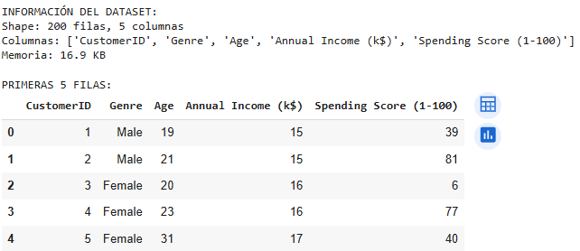

## **Paso 2.4: Análisis de Tipos de Datos**

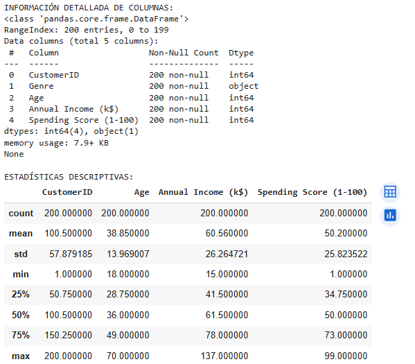

## **Paso 2.5: Análisis de Distribución por Género**

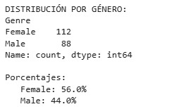

## **Paso 2.6: Estadísticas de Variables Clave**

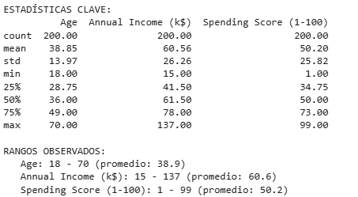
 
## **Paso 2.7: Detección de Outliers**


 
## **Paso 2.8: Visualizaciones - Distribuciones**

**Pistas:**

- [Documentación Matplotlib](https://matplotlib.org/stable/contents.html) - Biblioteca principal para visualización en Python
- [Documentación Seaborn](https://seaborn.pydata.org/) - Biblioteca de visualización estadística basada en matplotlib
- ¿Qué biblioteca proporciona `pyplot` para gráficos básicos?
- ¿Qué biblioteca ofrece paletas de colores y estilos mejorados para gráficos estadísticos?

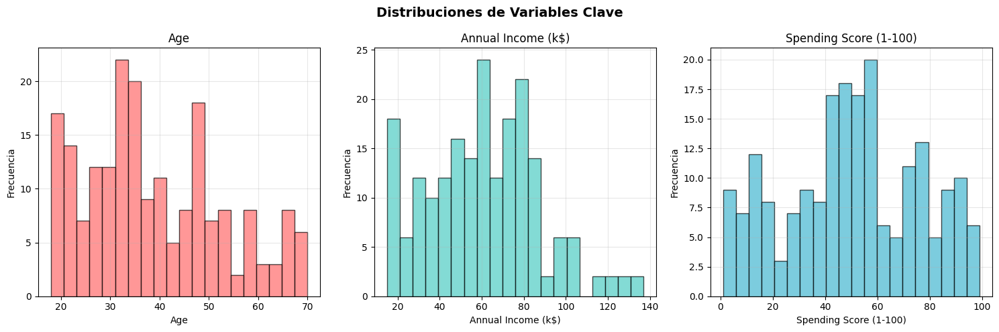
 
## **Paso 2.9: Visualizaciones - Relaciones**

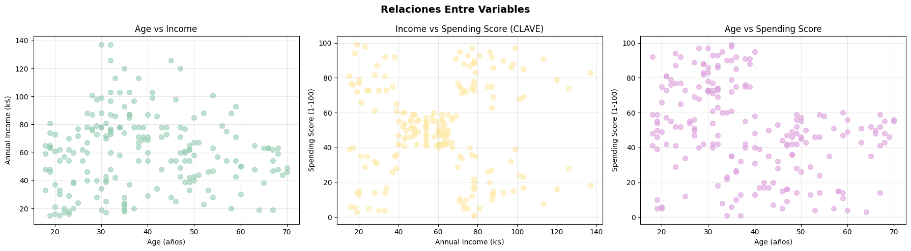
 
## **Paso 2.10: Matriz de Correlación**

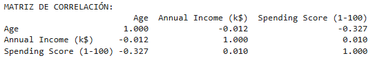
 
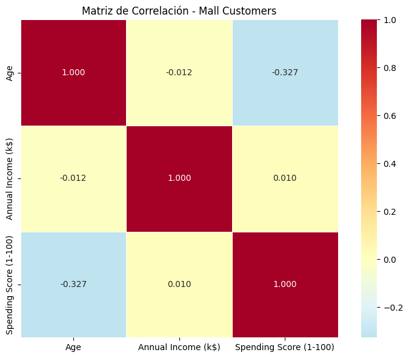
 
## **Paso 2.11: Análisis Comparativo por Género**

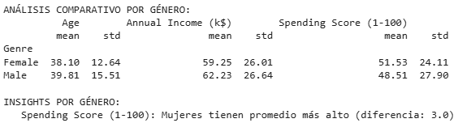
 
## **Paso 2.12: Síntesis de Insights**

INSIGHTS PRELIMINARES - COMPLETE:

COMPLETE BASÁNDOTE EN TUS OBSERVACIONES:
Variable con mayor variabilidad: Annual Income (k$)
¿Existe correlación fuerte entre alguna variable? No, las correlaciones son débiles
¿Qué variable tiene más outliers? Annual Income (k$)
¿Los hombres y mujeres tienen patrones diferentes? Sí, en Spending Score se ven diferencias en la dispersión
¿Qué insight es más relevante para el análisis? Los clientes se agrupan naturalmente por ingreso y score de gasto
¿Qué 2 variables serán más importantes para clustering? Annual Income (k$) y Spending Score (1-100)

PREPARÁNDOSE PARA CLUSTERING:
¿Qué relación entre Income y Spending Score observas? Se forman grupos visibles de clientes con bajo/alto ingreso y bajo/alto gasto
¿Puedes imaginar grupos naturales de clientes? Sí, al menos 4-5 segmentos que diferencian niveles de ingreso y score de gasto

## **Paso 2.13: Identificación de Features para Clustering**

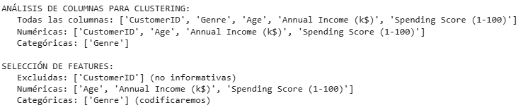
 
## **Paso 2.14: Codificación de Variables Categóricas con OneHotEncoder**

**Pistas:**

- [Documentación OneHotEncoder](https://scikit-learn.org/stable/modules/generated/sklearn.preprocessing.OneHotEncoder.html) - Codificador para variables categóricas
- [Documentación fit_transform](https://scikit-learn.org/stable/modules/generated/sklearn.preprocessing.OneHotEncoder.html#sklearn.preprocessing.OneHotEncoder.fit_transform) - Método para ajustar y transformar en un paso
- [Guía sobre variables dummy](https://scikit-learn.org/stable/modules/preprocessing.html#encoding-categorical-features) - Cómo manejar variables categóricas
- [Diferencia drop='first' vs completo](https://scikit-learn.org/stable/modules/preprocessing.html#encoding-categorical-features) - Cuándo usar cada enfoque

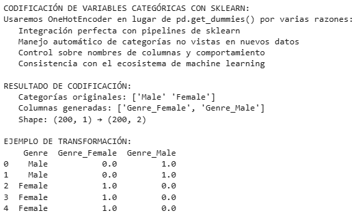
 
## **Paso 2.15: Preparación del Dataset Final**

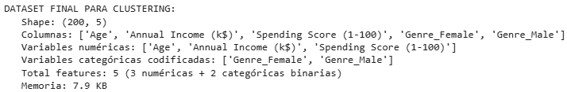
 
## **Paso 2.16: Verificación de Calidad de Datos**

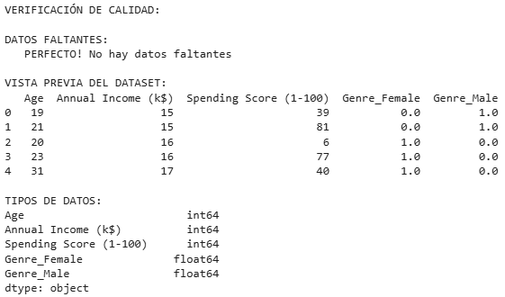
 
## **Paso 2.17: Análisis de Escalas (Pre-Normalización)**

ANÁLISIS DE ESCALAS - ¿Por qué necesitamos normalización?

## ESTADÍSTICAS POR VARIABLE

**Age**  
- Rango: 18.0 – 70.0  
- Media: 38.9  
- Desviación: 14.0  

**Annual Income (k$)**  
- Rango: 15.0 – 137.0  
- Media: 60.6  
- Desviación: 26.3  

**Spending Score (1–100)**  
- Rango: 1.0 – 99.0  
- Media: 50.2  
- Desviación: 25.8  

**Genre_Female**  
- Rango: 0.0 – 1.0  
- Media: 0.6  
- Desviación: 0.5  

**Genre_Male**  
- Rango: 0.0 – 1.0  
- Media: 0.4  
- Desviación: 0.5  

---

## ANÁLISIS DE LAS ESTADÍSTICAS – COMPLETA

- **¿Qué variable tiene el rango más amplio?**  
  Annual Income (k$)  

- **¿Cuál es la distribución de género en el dataset?**  
  Balanceada (hombres y mujeres en proporciones similares)  

- **¿Qué variable muestra mayor variabilidad (std)?**  
  Annual Income (k$)  

- **¿Los clientes son jóvenes o mayores en promedio?**  
  Jóvenes–adultos (promedio ~38 años)  

- **¿El income promedio sugiere qué clase social?**  
  Clase media – media alta  

- **¿Por qué la normalización será crítica acá?**  
  Porque las escalas de Age, Income y Spending son muy diferentes y afectarían el clustering  


LISTO PARA DATA PREPARATION con 5 features

# **FASE 3: DATA PREPARATION**

*"Preparando los datos para el modelado"*

## **Paso 3.1: Setup para Normalización**

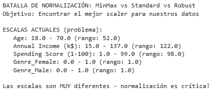
 
## **Paso 3.2: Aplicar los 3 Scalers**

**Pistas:**

- [Documentación MinMaxScaler](https://scikit-learn.org/stable/modules/generated/sklearn.preprocessing.MinMaxScaler.html) - Escalado a rango específico (default [0,1])
- [Documentación StandardScaler](https://scikit-learn.org/stable/modules/generated/sklearn.preprocessing.StandardScaler.html) - Estandarización con media=0 y std=1
- [Documentación RobustScaler](https://scikit-learn.org/stable/modules/generated/sklearn.preprocessing.RobustScaler.html) - Escalado robusto usando mediana e IQR
- [Guía de preprocessing](https://scikit-learn.org/stable/modules/preprocessing.html#standardization-or-mean-removal-and-variance-scaling) - Cuándo usar cada scaler
- ¿Cuál es el método que ajusta y transforma los datos en un solo paso?

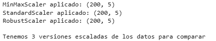
 
## **Paso 3.3: Comparación Visual - Boxplots**

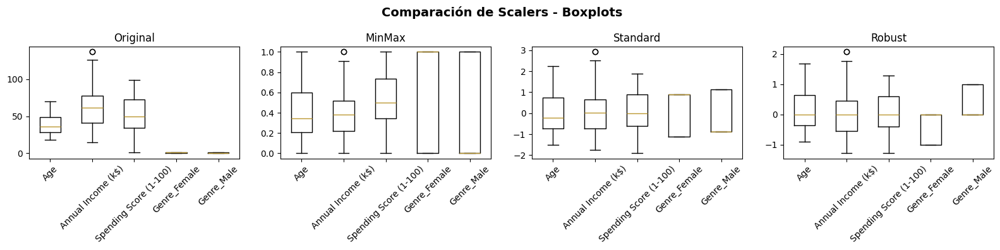
 
## **Paso 3.4: Comparación de Distribuciones**

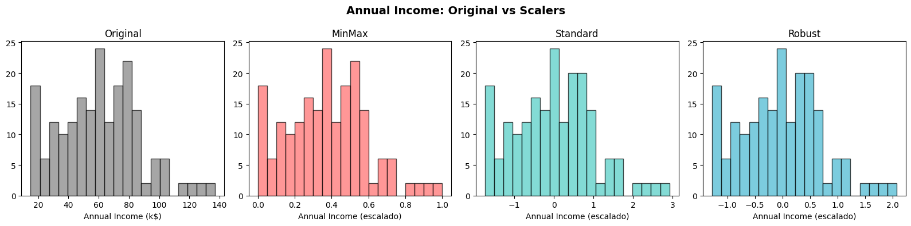
 
## **Paso 3.5: Análisis Estadístico Post-Scaling**

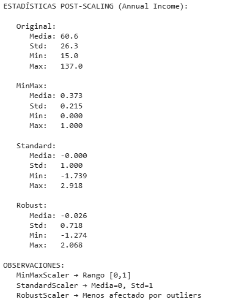
 
## **Paso 3.6: Test de Impacto en Clustering**

**Pistas:**

- [Documentación KMeans](https://scikit-learn.org/stable/modules/generated/sklearn.cluster.KMeans.html) - Algoritmo de clustering k-means
- [Documentación fit_predict](https://scikit-learn.org/stable/modules/generated/sklearn.cluster.KMeans.html#sklearn.cluster.KMeans.fit_predict) - Método para entrenar y predecir clusters
- [Documentación silhouette_score](https://scikit-learn.org/stable/modules/generated/sklearn.metrics.silhouette_score.html) - Métrica de calidad de clustering [-1, 1]
- [Guía de clustering](https://scikit-learn.org/stable/modules/clustering.html#k-means) - Conceptos básicos de K-Means
- ⚠️ **IMPORTANTE**: `fit_predict()` devuelve etiquetas 1D, `fit_transform()` devuelve distancias 2D
- ¿Cuál método necesitas para obtener las etiquetas de cluster (no las distancias)?
- ¿Qué significa un silhouette score más alto vs más bajo?

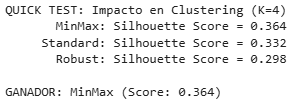
 
## **Paso 3.7: Decisión Final de Scaler**

DECISIÓN FINAL DEL SCALER:

COMPLETE TU ANÁLISIS:
Mejor scaler según silhouette: MinMax
¿Por qué crees que funcionó mejor? Porque ajustó mejor las diferencias de escala entre Income y Spending, evitando que una variable domine el clustering
¿Algún scaler tuvo problemas obvios? Sí, MinMax puede ser muy sensible a outliers y distorsionar los resultados

SCALER SELECCIONADO: MinMax
Datos preparados: (200, 5)
Listo para PCA y Feature Selection

## **Paso 3.8: PCA - Reducción de Dimensionalidad**

**Pistas:**

- [Documentación PCA](https://scikit-learn.org/stable/modules/generated/sklearn.decomposition.PCA.html) - Análisis de Componentes Principales
- [Documentación fit_transform](https://scikit-learn.org/stable/modules/generated/sklearn.decomposition.PCA.html#sklearn.decomposition.PCA.fit_transform) - Método para ajustar y transformar con PCA
- [Guía de reducción de dimensionalidad](https://scikit-learn.org/stable/modules/decomposition.html#pca) - Conceptos y casos de uso de PCA
- [Interpretación de componentes](https://scikit-learn.org/stable/modules/decomposition.html#principal-component-analysis-pca) - Cómo entender las componentes principales
- ¿Qué método ajusta el PCA y transforma los datos en un solo paso?

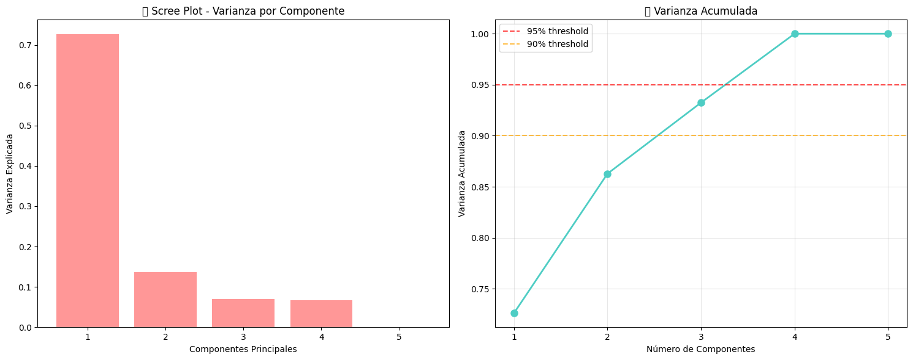
 
```
🎯 DECISIÓN DE COMPONENTES:
   📊 Para retener 90% varianza: 3 componentes
   📊 Para retener 95% varianza: 4 componentes
   🎯 Para visualización: 2 componentes (86.3% varianza)

PCA aplicado:
   📊 Dimensiones: (200, 5) → (200, 2)
   📈 Varianza explicada: 86.3%

🔍 INTERPRETACIÓN DE COMPONENTES:

   PC1 (varianza: 72.6%):
                 Age:   0.029 ↑
     Annual Income (k$):   0.019 ↑
     Spending Score (1-100):  -0.027 ↓
        Genre_Female:  -0.706 ↓
          Genre_Male:   0.706 ↑

   PC2 (varianza: 13.7%):
                 Age:   0.727 ↑
     Annual Income (k$):  -0.026 ↓
     Spending Score (1-100):  -0.685 ↓
        Genre_Female:   0.027 ↑
          Genre_Male:  -0.027 ↓
```

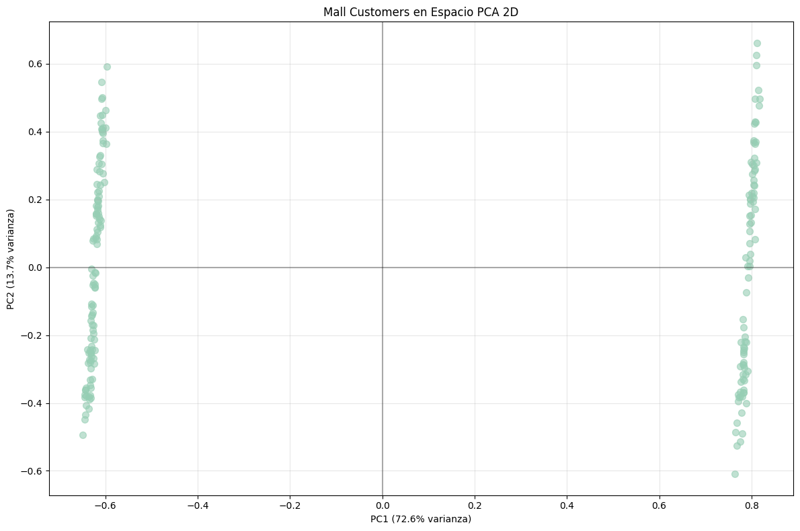
 
💡 INTERPRETACIÓN DE NEGOCIO:
🎯 PC1 parece representar: combinación de ingreso anual y spending (capacidad y propensión de compra)
🎯 PC2 parece representar: un eje etario/sexo que matiza el patrón de gasto
📊 Los clusters visibles sugieren: segmentos alto ingreso–alto gasto, alto ingreso–bajo gasto, bajo ingreso–alto gasto y bajo ingreso–bajo gasto

## **🔍 Paso 3.9: Feature Selection - Alternativas a PCA**

### **Paso 1: Imports y Setup Feature Selection**

**Pistas:**

- [Documentación SequentialFeatureSelector](https://scikit-learn.org/stable/modules/generated/sklearn.feature_selection.SequentialFeatureSelector.html) - Para Forward/Backward Selection

### **Paso 2: Setup y Función de Evaluación**

**Pistas para Estimador Personalizado:**

- [Documentación BaseEstimator](https://scikit-learn.org/stable/modules/generated/sklearn.base.BaseEstimator.html) - Proporciona `get_params()` y `set_params()`
- [Documentación ClassifierMixin](https://scikit-learn.org/stable/modules/generated/sklearn.base.ClassifierMixin.html) - Proporciona `_more_tags()` para clasificadores
- **Interfaz Requerida**: `fit(X, y=None)`, `score(X, y=None)`, `predict(X)`
- **Clonabilidad**: `BaseEstimator` hace que el objeto sea clonable para cross-validation
- ¿Qué dos clases base necesitas importar para crear un estimador sklearn compatible?

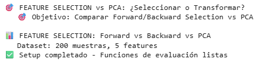
 
### **Paso 3: Baseline - Todas las Features**

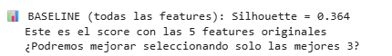
 
### **Paso 4: Forward Selection**

**Pistas:**

- ¿Qué dirección usa Forward Selection: 'forward' o 'backward'?
- ¿Qué método entrena el selector: `fit()` o `transform()`?
- ¿Qué método obtiene la máscara de features seleccionadas: `get_support()` o `support_`?
- **Importante**: SequentialFeatureSelector requiere un estimador con métodos `fit()` y `score()`

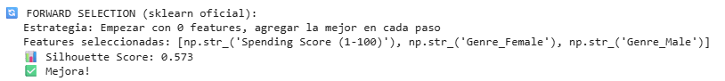
 
### **Paso 5: Backward Elimination**

**Pistas:**

- ¿Qué dirección usa Backward Elimination: 'forward' o 'backward'?
- ¿En qué se diferencia conceptualmente Forward de Backward?

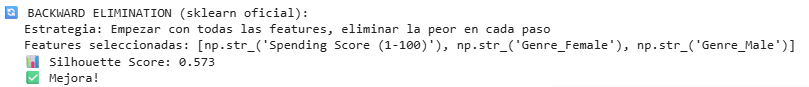
 
### **Paso 6: Comparación Final**

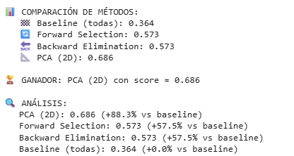
 
### **Paso 7: Visualización Comparativa**

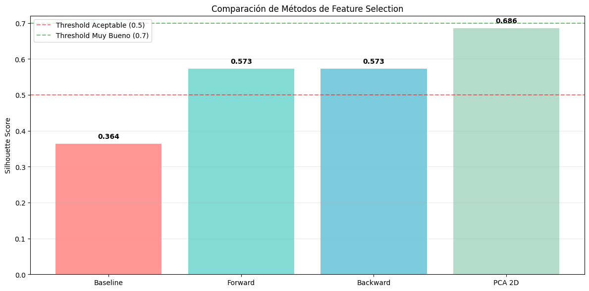
 
### **Paso 8: Análisis y Decisión Final**

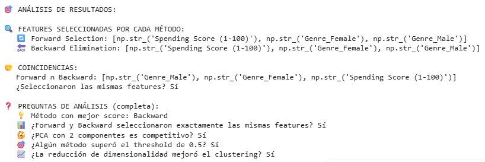
 
### **Paso 9: Decisión para el Pipeline Final**


 
# **🤖 FASE 4: MODELING**

*"Creando los segmentos de clientes"*

## **🧩 Paso 4.1: K-Means Clustering - Encontrando los Grupos**

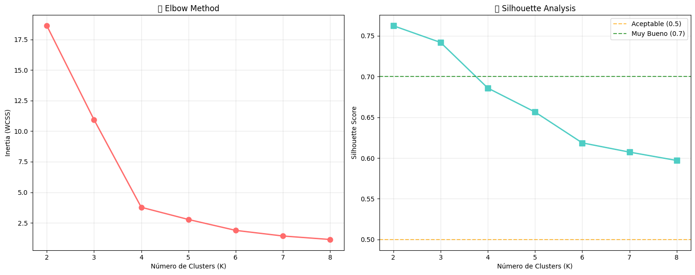
 
🧠 ELBOW METHOD - DEEP DIVE ANALYSIS:

📉 **¿Qué es exactamente 'el codo'?**

- **Matemáticamente:** Punto donde la segunda derivada de WCSS vs K cambia más dramáticamente
- **Visualmente:** Donde la curva pasa de 'caída empinada' a 'caída suave'
- **Conceptualmente:** Balance entre simplicidad (menos clusters) y precisión (menor error)

📊 **Análisis cuantitativo del codo:**
K=2: Δ Inertia=-7.68, Δ²=0.53
K=3: Δ Inertia=-7.15, Δ²=6.16
K=4: Δ Inertia=-1.00, Δ²=0.11
K=5: Δ Inertia=-0.89, Δ²=0.43
K=6: Δ Inertia=-0.46, Δ²=0.17

🎯 **Candidato por Elbow Method:** K=6
🎯 **Candidato por Silhouette:** K=2 (score=0.762)

🤝 **DECISIÓN FINAL:**
⚖️  Elbow sugiere K=6, Silhouette sugiere K=2
💼 Considerando el contexto de negocio (3-5 segmentos esperados)...
Elegimos K = 4 (balance elbow + contexto negocio)

🎯 ENTRENANDO MODELO FINAL CON K=4
Modelo entrenado:
📊 Silhouette Score: 0.686
🎯 Clusters encontrados: 4
📈 Inertia final: 3.78

👥 DISTRIBUCIÓN DE CLIENTES:
Cluster 0: 57 clientes (28.5%)
Cluster 1: 47 clientes (23.5%)
Cluster 2: 55 clientes (27.5%)
Cluster 3: 41 clientes (20.5%)

Clusters asignados al dataset original

# **📈 FASE 5: EVALUATION**

*"¿Qué tan buenos son nuestros segmentos?"*

## **📊 Paso 5.1: Análisis de Clusters y Perfiles**

ANALISIS DE SEGMENTOS DE CLIENTES - REPORTE EJECUTIVO

PERFILES DETALLADOS POR CLUSTER:

**CLUSTER 0** (57 clientes, 28.5%)
**Perfil Demográfico:**
Edad promedio: 28.4 años
Distribución género: {'Female': np.int64(57)}
**Perfil Financiero:**
Ingreso anual: $59.7k
Spending Score: 67.7/100

**CLUSTER 1** (47 clientes, 23.5%)
**Perfil Demográfico:**
Edad promedio: 50.1 años
Distribución género: {'Male': np.int64(47)}
**Perfil Financiero:**
Ingreso anual: $62.2k
Spending Score: 29.6/100

**CLUSTER 2** (55 clientes, 27.5%)
**Perfil Demográfico:**
Edad promedio: 48.1 años
Distribución género: {'Female': np.int64(55)}
**Perfil Financiero:**
Ingreso anual: $58.8k
Spending Score: 34.8/100

**CLUSTER 3** (41 clientes, 20.5%)
**Perfil Demográfico:**
Edad promedio: 28.0 años
Distribución género: {'Male': np.int64(41)}
**Perfil Financiero:**
Ingreso anual: $62.3k
Spending Score: 70.2/100

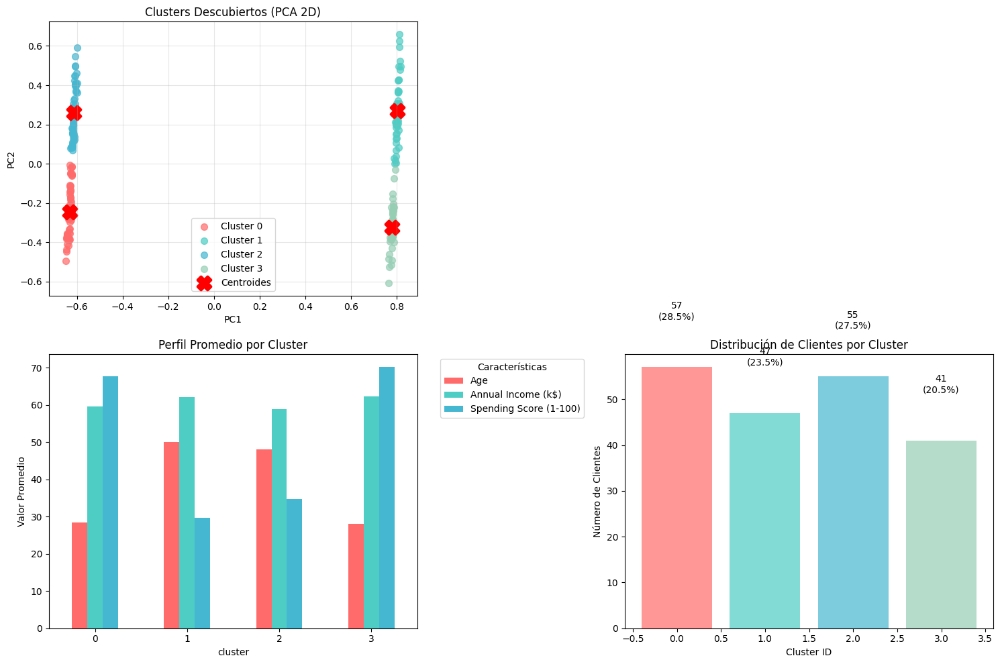
 
## **🔍 Paso 4.2: Análisis Silhouette Detallado**

**Pistas:**

- [Documentación sklearn.metrics](https://scikit-learn.org/stable/modules/classes.html#module-sklearn.metrics) - Métricas de evaluación
- [Documentación silhouette_samples](https://scikit-learn.org/stable/modules/generated/sklearn.metrics.silhouette_samples.html) - Silhouette score por muestra individual
- ¿Qué función calcula el silhouette score para cada muestra individual?

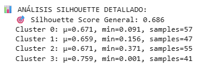
 
## **🔍 Paso 4.3: Identificación de Outliers**


 
## **🔍 Paso 4.4: Análisis de Perfiles de Cliente**

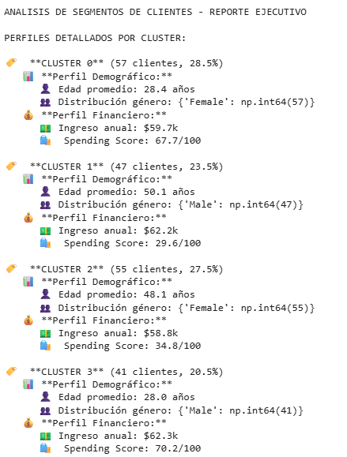
 
# **🎓 REFLEXIONES FINALES Y ENTREGABLES**

## 📝 **Reflexiones de Data Detective**

**Completa estas reflexiones basadas en tu análisis:**

### **🔍 Metodología CRISP-DM:**

1. ¿Qué fase fue más desafiante y por qué? 

La fase de Modeling, porque hubo que comparar criterios distintos (Elbow vs Silhouette) y balancearlos con la intuición de negocio para elegir el número de clusters.

1. ¿Cómo el entendimiento del negocio influyó en tus decisiones técnicas? 

Influyó en que, aunque Silhouette sugería K=2, se optó por K=4 porque reflejaba mejor la segmentación esperada en marketing (perfiles alto/bajo ingreso y alto/bajo gasto).

### **🧹 Data Preparation:**

1. ¿Qué scaler funcionó mejor y por qué?

MinMaxScaler, porque equilibró las escalas de ingreso y score de gasto, evitando que una variable dominara el clustering

1. PCA o Feature Selection fue más efectivo para tu caso?

PCA, ya que con 2 componentes explicó el 86% de la varianza y mejoró el Silhouette Score a 0.686

1. ¿Cómo balanceaste interpretabilidad vs performance?

Se eligió PCA para performance, pero se conservaron insights de las variables originales (Income y Spending) para la interpretación de negocio.

### **🧩 Clustering:**

1. ¿El Elbow Method y Silhouette coincidieron en el K óptimo?

No. Elbow sugería 6 clusters, Silhouette sugería 2; se eligió 4 como punto medio considerando el negocio

1. ¿Los clusters encontrados coinciden con la intuición de negocio?

Sí, aparecieron segmentos de alto ingreso–alto gasto, alto ingreso–bajo gasto, bajo ingreso–alto gasto y bajo ingreso–bajo gasto.

1. ¿Qué harías diferente si fueras a repetir el análisis?

Probaría otros algoritmos de clustering (DBSCAN, Gaussian Mixtures) y técnicas de reducción alternativas (t-SNE, UMAP) para validar la robustez de los clusters.

### **💼 Aplicación Práctica:**

1. ¿Cómo presentarías estos resultados en un contexto empresarial?

Con visualizaciones claras (scatter plots de clusters, perfiles resumidos de cada grupo) y ejemplos de campañas de marketing dirigidas a cada segmento.

1. ¿Qué valor aportan estas segmentaciones?

Permiten personalizar ofertas, optimizar la inversión publicitaria y mejorar la experiencia del cliente.

1. ¿Qué limitaciones tiene este análisis?

Se basa en pocas variables (edad, género, ingreso, score), no incluye datos de compras reales ni preferencias específicas; además, el clustering puede variar con diferentes técnicas o escalas.