# Apuntes

## ¿Qué es una red neuronal?

- Representan funciones:
    - valores discretos o enteros,
    - valores numéricos (reales),
    - vectores formados por los anteriores.
- Algoritmos de aprendizaje (entrenamiento).
    - Entrenamiento puede ser lento.
    - Evaluación rápida.
- No es interpretable.

## Metáfora biológica

Inspiradas en los sistemas nerviosos de los animales

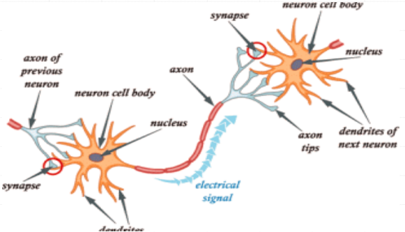

## Neuronas artificiales

- Abstracción matemática.
    - Unidades que adoptan un valor.
    - Conexiones o sinapsis con pesos.
    - Salida modificada por una función de activación.
- Binary Threshold Unit - McCulloch & Pitts (1943).
- Perceptrón - Frank Rosenblatt (1958)

## Perceptron

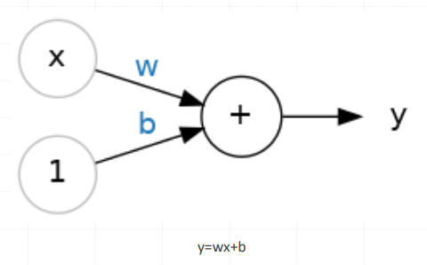
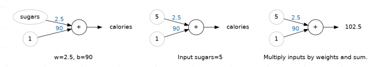
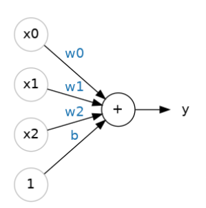
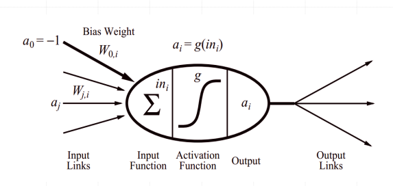

## Funciones de activación

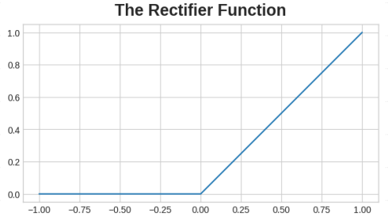
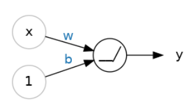
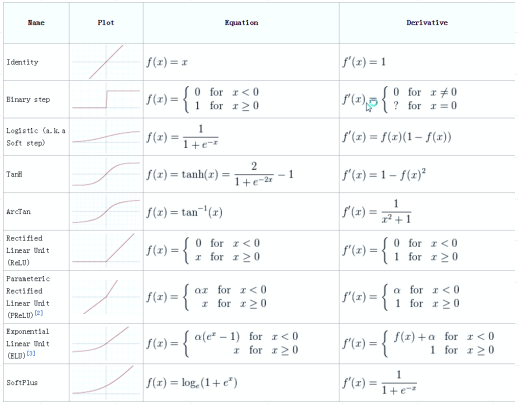

## Interpretación Geométrica

- w = [w0, w1, …, wn] x = [1, x1, x2, …, xn]
- w . x = 0 define un hiperplano en el espacio de entrada
- Separa los casos según su clase
- El perceptrón umbral es llamado “separador lineal”

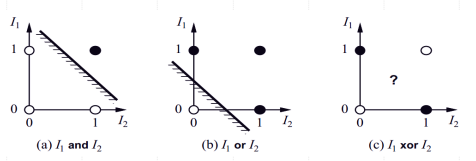

## Aprendizaje simple del perceptrón

Entrenamiento:

1. Datos → ejemplos con entradas (X) y salidas (Y).
2. Modelo → fórmula con pesos, inicializados aleatoriamente
3. Predice → calcula valores con pesos iniciales.
4. Error → compara predicción vs. valor real.
5. Ajusta → corrige pesos según el error.
6. Repite → predecir → medir → ajustar.
7. Final → pesos “aprendidos” que minimizan error.

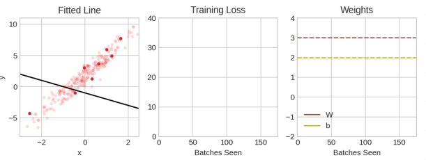

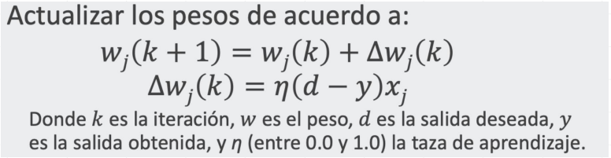

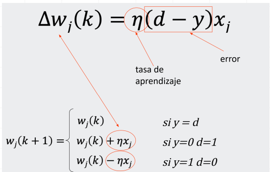

## Funciones Booleanas

## Limitaciones del perceptrón

- Minsky y Papert (1968)
- Existen problemas en los que no existe un hiperplano que separa los casos
- Es necesario múltiples capas de unidades

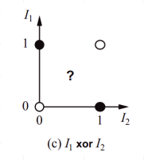

## ¿Qué es una red neuronal?

Una red neuronal es suma ponderada + giro no lineal, repetida en capas.

- Perceptrón: multiplica entradas por pesos (w), suma sesgo (b) → saca un número.
- Capa densa: muchas neuronas con las mismas entradas.
- MLP (feedforward): capas en cadena: entrada → ocultas → salida.

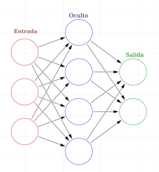

## Gradient Descent

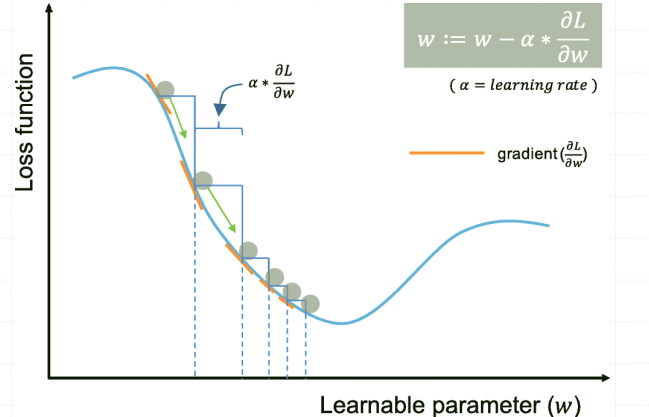

## Capas densas (Fully Connected / Linear)

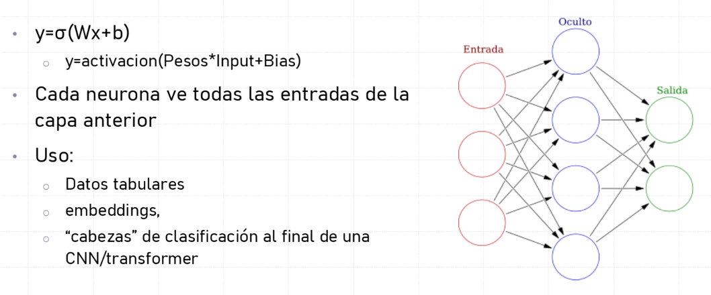

## Shapes: entrada/salida

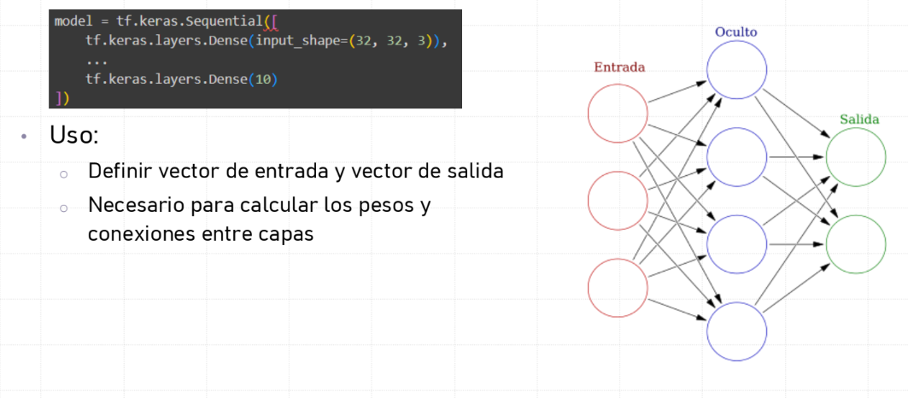

## Dropout

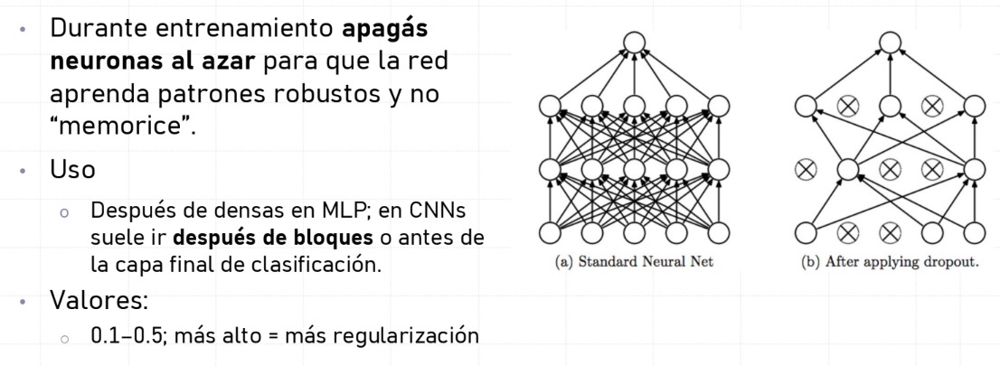

## BatchNorm

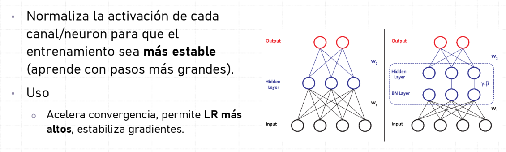

## Optimizadores - ¿Qué hace un optimizador?

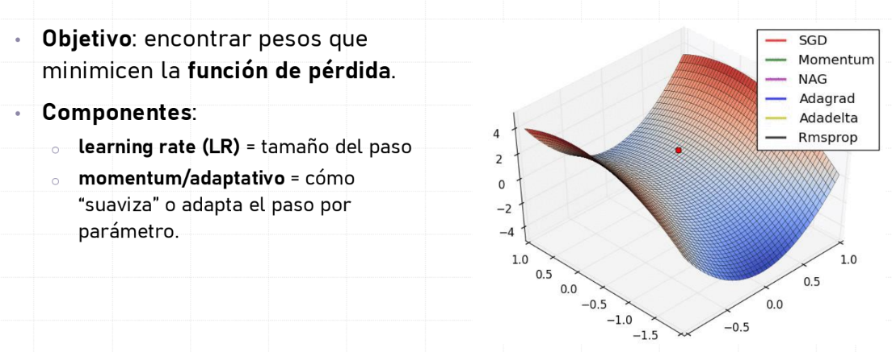

## Optimizadores - SGD

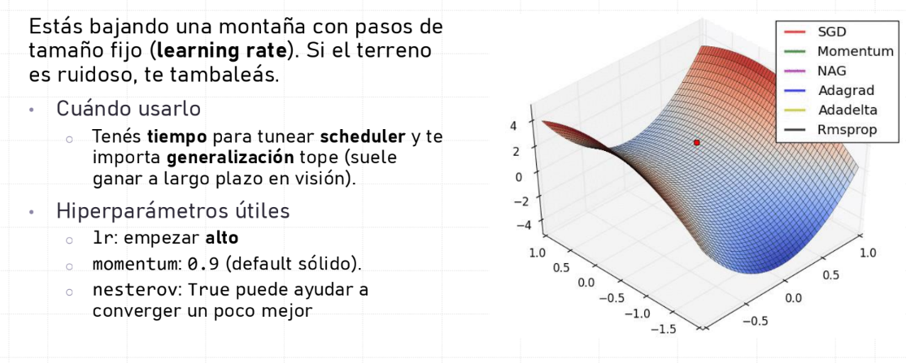

## Optimizadores - Adam

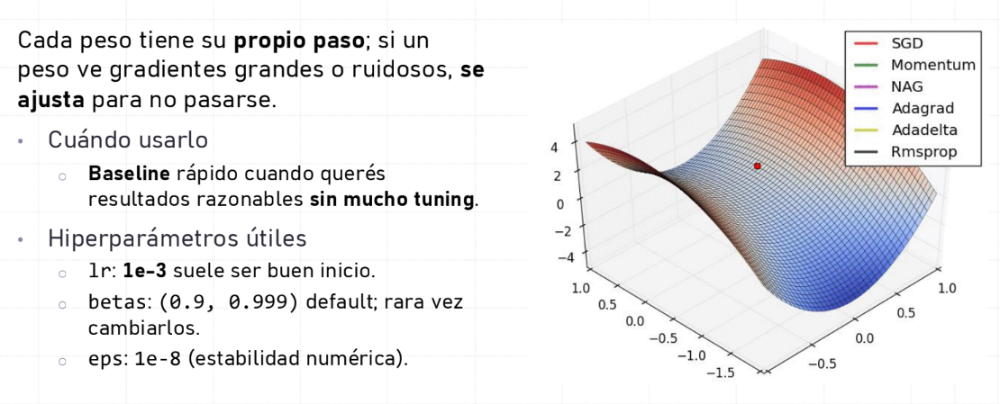

## Optimizadores - AdamW

## Callbacks- Early Stopping: parar a tiempo

Evita entrenar de más cuando validación ya no mejora → ahorra tiempo
y overfitting.

- Parámetros
o monitor (ej. val_loss o val_macro_f1)
o patience (p. ej. 5), mode (min o max).

## Callbacks- LR Schedulers

Subir/bajar el paso con intención

- StepLR: baja LR en escalones → simple, efectivo con SGD.
- Cosine Annealing: decae suavemente; evita saltos bruscos; muy común
con AdamW.
- OneCycle/Cyclical: sube-baja el LR dentro de un rango para salir de
mesetas.

## Callbacks- Checkpoints

Guardar siempre el mejor por validación (no el último).
Reproducibilidad: poder retomar entrenamientos cortados y/o finetunear
modelos entrenados.

## TensorBoard: ver es entender

