# **Práctica 7: De Perceptrón a Redes Neuronales **

- [Consigna](https://juanfkurucz.com/ucu-ia/ut2/07-mlp-activaciones/)
- [Google Colab](https://colab.research.google.com/drive/1ubhaRX7filwbMSQUu8Wl0gaFBTmuKQvQ?usp=sharing)

## **Objetivos de Aprendizaje**

- Descubrir las limitaciones del perceptrón simple (problema XOR)
- Resolver problemas reales con redes multicapa (sklearn MLP)
- Implementar redes neuronales profesionales (TensorFlow/PyTorch Lightning)
- Entender cuándo usar cada herramienta

---

# **PARTE 1: Conceptos Interactivos**

## **Actividad Interactiva: "Explorando el Perceptrón"**

## **Setup Súper Rápido**

---

## **Paso 1: Resolver AND**

**💡 PISTAS:**

- 🔗 [Función Perceptrón](https://en.wikipedia.org/wiki/Perceptron) → para AND: solo (1,1) debe activar
- 🔢 `bias = _______` → -0.7 permite que solo cuando w1*1 + w2*1 ≥ 0.7

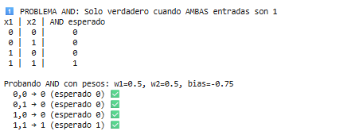

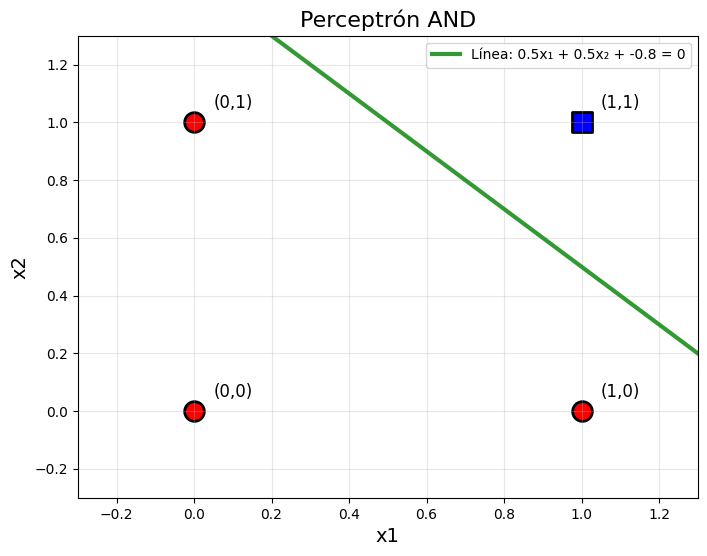

## Paso 2: Resolver OR

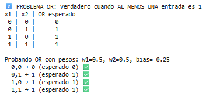
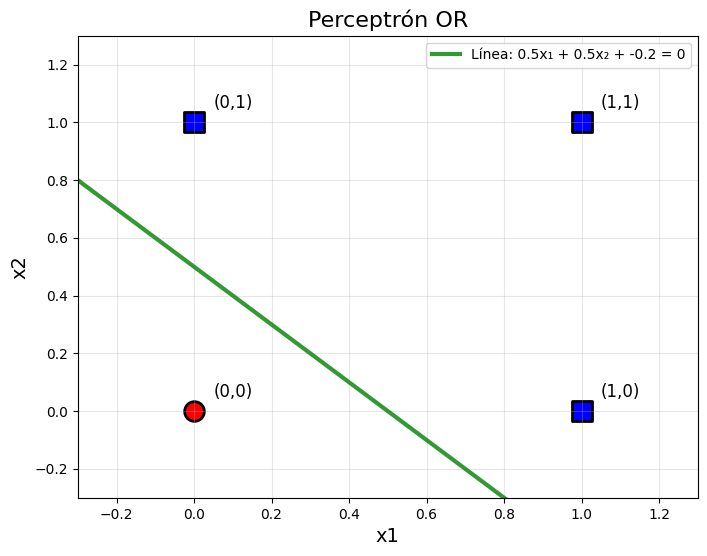

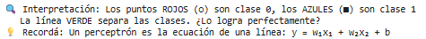

## **Paso 3: Resolver NOT**

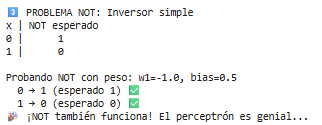

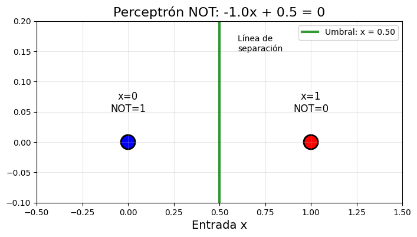

## **Paso 4: XOR**

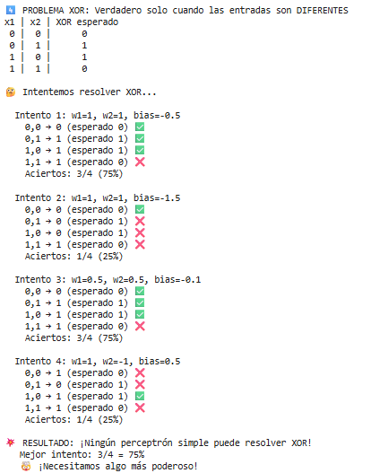

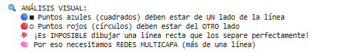

---

# **PARTE 2: Herramientas Reales**

## Actividad 1: Sklearn MLP

## Resolver XOR con MLP

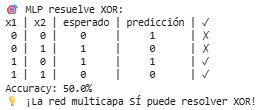

## **Visualizar la Arquitectura de Red MLP**

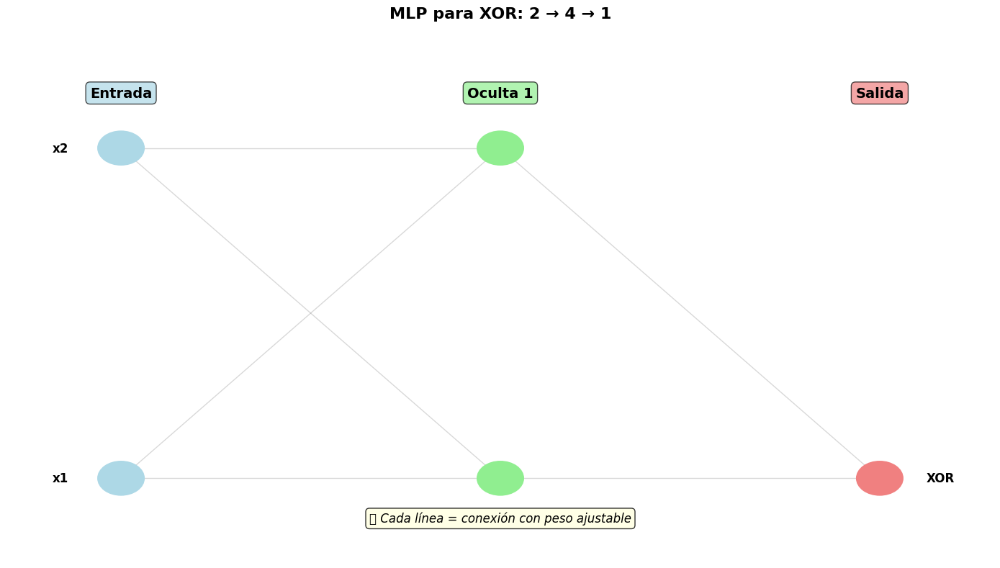

📊 Capa 1: 2 → 2 = 6 parámetros
📊 Capa 2: 2 → 1 = 3 parámetros
🎯 Total de parámetros: 9
🧠 ¿Por qué tantos parámetros? Cada conexión tiene un peso + bias por neurona

## **Visualizar Superficie de Decisión**

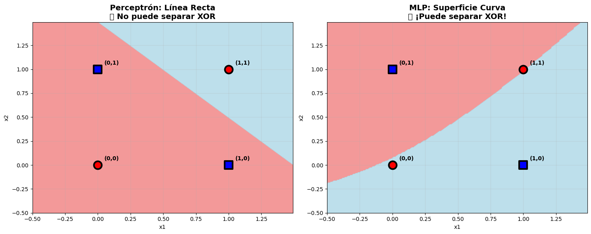

🔍 ANÁLISIS VISUAL:
🔴 Zonas ROJAS = predicción 0 (clase 0)
🔵 Zonas AZULES = predicción 1 (clase 1)
📏 Perceptrón: Solo puede crear línea recta → falla en XOR
🌊 MLP: Puede crear superficie curva → ¡resuelve XOR!

## **Dataset Real con MLP**

📊 Resultados MLP en dataset real:
Training Accuracy: 100.0%
Test Accuracy: 90.3%
Arquitectura: 20 → (64, 32) → 2

## **Actividad 2: TensorFlow - Red Profesional**

## **Red Neuronal con TensorFlow**

🎯 Resultados TensorFlow:
Training Accuracy: 99.9%
Test Accuracy: 92.7%
Parámetros totales: 3,457

## **Visualizar Entrenamiento**

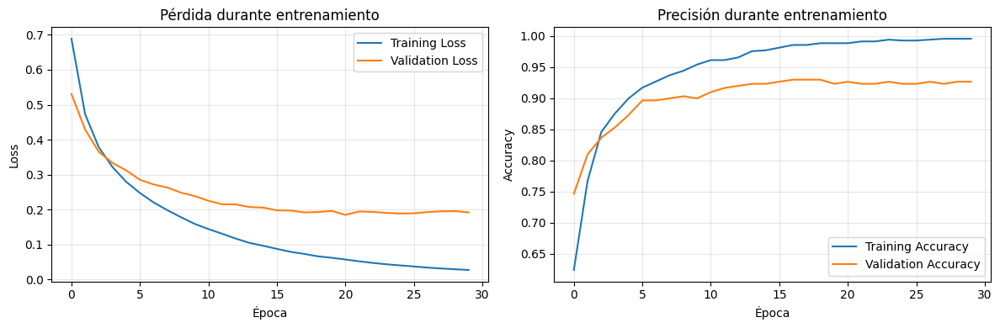

## **PyTorch Lightning (Bonus)**

🎯 PyTorch Lightning model created!
Input features: 20
Parameters: 3,490

## **Entrenar PyTorch Lightning**

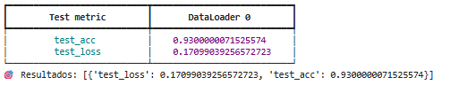

## **Visualización de Matriz de Confusión**

📈 ANÁLISIS DE MATRICES DE CONFUSIÓN:
✅ Diagonal principal (TN + TP) = predicciones correctas
❌ Diagonal secundaria (FP + FN) = errores

# **Preguntas de Reflexión**

**1. ¿Por qué AND, OR y NOT funcionaron pero XOR no?**

👉 Porque **XOR no es linealmente separable**. No podés trazar una sola línea recta en el plano que separe los ceros de los unos. AND, OR y NOT sí.

---

**2. Diferencia clave entre los pesos de AND vs OR**

👉 En **AND** el umbral es más alto: se necesitan *ambas entradas* activas para pasar.

👉 En **OR** el umbral es más bajo: con *una sola* entrada basta.

---

**3. Problemas reales como XOR**

👉 Situaciones de “esto o aquello, pero no ambos”:

- Un semáforo que debe estar verde *o* rojo, pero no los dos.
- Detectar si exactamente uno de dos sensores se activa.
- Sistemas de alarma donde debe sonar solo si un detector u otro, pero no ambos, disparan al mismo tiempo.

---

**4. ¿Por qué sklearn MLP resuelve XOR pero un perceptrón no?**

👉 Un perceptrón dibuja **una línea de decisión**.

👉 Un MLP puede combinar **varias líneas de decisión** en capas ocultas y así separar regiones no lineales como XOR.

---

**5. Diferencia principal entre TensorFlow/Keras y sklearn MLP**

👉 `sklearn` te da un **MLP sencillo y de alto nivel** para usar como cualquier otro modelo de scikit-learn.

👉 `TensorFlow/Keras` te da **control total** sobre arquitectura, optimización, callbacks, GPUs, etc.

---

**6. ¿Por qué TensorFlow usa `epochs` y `batch_size` mientras sklearn MLP no?**

👉 Porque **TensorFlow entrena en lotes (mini-batch gradient descent)** y permite configurar explícitamente las épocas.

👉 En `sklearn`, el MLP entrena internamente y abstrae esos detalles, tratándolo como un estimador más.

---

**7. ¿Cuándo usarías sigmoid vs relu como función de activación?**

👉 **Sigmoid**: salida binaria, porque produce valores entre 0 y 1 (probabilidades).

👉 **ReLU**: capas ocultas, porque evita saturación, acelera convergencia y maneja mejor gradientes.

---

**8. Ventaja de PyTorch Lightning sobre TensorFlow puro**

👉 PyTorch Lightning **reduce el boilerplate**: separa claramente entrenamiento, validación y test, dejando el código limpio y más fácil de mantener.

---

**9. ¿Por qué PyTorch Lightning separa `training_step` y `test_step`?**

👉 Porque en **entrenamiento** calculás gradientes y optimizás, mientras que en **test/validación** solo medís rendimiento sin actualizar pesos.

---

**10. Framework ideal en cada escenario**

- **Prototipo rápido:** `sklearn MLP` (simple y directo).
- **Modelo en producción:** `TensorFlow/Keras` (soporte industrial, despliegue en móviles/servidores).
- **Investigación avanzada:** `PyTorch Lightning` (flexible, limpio y usado en papers).

---

**11. Error “mat1 and mat2 shapes cannot be multiplied” en PyTorch**

👉 Aparece cuando las dimensiones de entrada **no coinciden con los pesos de la primera capa** (`input_features`). Tenés que asegurarte que `X.shape[1] == nn.Linear(input_size, ...)`.

---

**12. ¿Qué significa `deterministic=True` en PyTorch Lightning?**

👉 Que **los resultados son reproducibles**: fija semillas y desactiva operaciones aleatorias no deterministas, para que cada corrida dé los mismos números.

---

**13. ¿Por qué TensorFlow muestra curvas de `loss` y `val_loss` durante entrenamiento?**

👉 Para **detectar overfitting visualmente**: si la pérdida de entrenamiento sigue bajando pero la de validación sube, tu modelo se está sobreajustando.

---

**14. Diferencia entre `trainer.test()` y `trainer.predict()` en PyTorch Lightning**

👉 `trainer.test()`: evalúa el modelo y devuelve **métricas** (loss, accuracy, etc).

👉 `trainer.predict()`: solo devuelve **predicciones** (sin métricas).

---

**15. ¿Por qué sklearn MLP es más fácil pero menos flexible?**

👉 Porque abstrae todo en un **estimador de alto nivel** (fit, predict), pero **no te deja controlar** arquitectura detallada, optimizadores, callbacks o GPUs.

# 🚀 **DESAFÍOS ADICIONALES: ¡Ve Más Allá!**[¶](https://juanfkurucz.com/ucu-ia/ut2/07-mlp-activaciones/#desafios-adicionales-ve-mas-alla)

### 📊 **Datasets para Experimentar**[¶](https://juanfkurucz.com/ucu-ia/ut2/07-mlp-activaciones/#datasets-para-experimentar)

- **Círculos concéntricos**: `make_circles()` - visualizar limitaciones del perceptrón
- **Medias lunas**: `make_moons()` - comparar superficies de decisión
- **MNIST dígitos**: `load_digits()` - clasificación multi-clase (10 clases)
- **Vinos**: `load_wine()` - problema de 3 clases
- **Cáncer de mama**: `load_breast_cancer()` - problema médico real
- **Titanic**: [Kaggle](https://www.kaggle.com/c/titanic) - supervivencia
- **Fashion MNIST**: TensorFlow datasets - clasificar ropa
- **California Housing**: regresión de precios

### 🧪 **Experimentos Avanzados**[¶](https://juanfkurucz.com/ucu-ia/ut2/07-mlp-activaciones/#experimentos-avanzados)

- **Arquitecturas**: Comparar (4,), (10,), (4,4), (10,5), (64,32,16)
- **Activaciones**: Probar 'relu', 'tanh', 'logistic'
- **Regularización**: Agregar Dropout (0.2, 0.3, 0.5)
- **Optimizadores**: Comparar 'adam', 'sgd', 'rmsprop'
- **Métricas**: accuracy, precision, recall, F1-score

### 📚 **Recursos para Profundizar**[¶](https://juanfkurucz.com/ucu-ia/ut2/07-mlp-activaciones/#recursos-para-profundizar)

- **Documentación**: [Sklearn](https://scikit-learn.org/stable/), [TensorFlow](https://www.tensorflow.org/tutorials), [PyTorch Lightning](https://pytorch-lightning.readthedocs.io/)
- **Herramientas**: W&B, TensorBoard, MLflow
- **Interactivo**: [TensorFlow Playground](https://playground.tensorflow.org/)