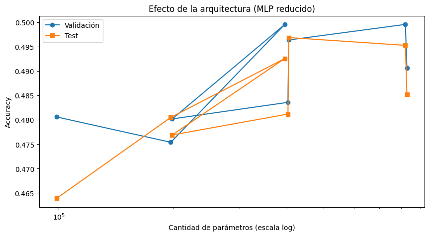

# **Práctica 8: **

- [Consigna](https://juanfkurucz.com/ucu-ia/ut2/08-backpropagation-optimizadores/)
- [Google Colab](https://colab.research.google.com/drive/1uWveacy4vzu3EJz2kf9Ad6bTHAgb7Frt?usp=sharing)
- [Google Colab complementario](https://colab.research.google.com/drive/1-n2TNPnsnNhaigl03stzfFrtO0qc9miF?usp=sharing)

## **🧮 Actividad: Explorar experimentacion**

## Análisis de Resultados — Entrenamiento con Backpropagation y Optimizador Adam

En este experimento se implementó una **red neuronal multicapa (MLP)** entrenada sobre el conjunto de datos **CIFAR-10**, con el objetivo de comprender el funcionamiento del algoritmo de **Backpropagation** y evaluar el impacto de los hiperparámetros del optimizador **Adam** en el proceso de aprendizaje.

### Configuración experimental

La red se construyó bajo un modelo **Sequential** compuesto por **tres capas densas de 32 neuronas cada una**, con función de activación **ReLU** y una capa de salida **softmax** de 10 neuronas, correspondiente a las clases del dataset. El optimizador empleado fue **Adam**, configurado con *learning rate* de **0.001**, parámetros por defecto *(β₁=0.9, β₂=0.999)*, y una función de pérdida de tipo **sparse_categorical_crossentropy**.

El entrenamiento se realizó durante **5 épocas**, con un **batch size de 128**, y utilizando el conjunto de prueba como validación temporal. En total, el modelo contó con **100.778 parámetros entrenables**.

### Resultados obtenidos

Tras el entrenamiento, los resultados fueron los siguientes:

- **Accuracy en entrenamiento:** 51.1%
- **Accuracy en test:** 46.6%
- **Gap de generalización:** aproximadamente **4.5 puntos porcentuales**

El rendimiento alcanzado se encuentra dentro de los rangos esperados para una red MLP aplicada a CIFAR-10, un dataset visual complejo que suele requerir **arquitecturas convolucionales (CNNs)** para capturar correctamente las características espaciales. La diferencia moderada entre el rendimiento de entrenamiento y prueba sugiere una leve presencia de **overfitting**, aunque el nivel general de accuracy también indica **cierto underfitting**, producto de la **baja capacidad del modelo y el número reducido de épocas**.

### Interpretación y análisis

El comportamiento observado refleja un **aprendizaje efectivo pero incompleto**: el modelo logra captar ciertos patrones básicos, pero no alcanza a representar la complejidad del espacio de imágenes tridimensionales aplanadas (32×32×3 → 3072 features).

Esto puede deberse a varios factores:

- **Capacidad limitada** del modelo (pocas neuronas por capa).
- **Cantidad insuficiente de épocas**, que restringe la convergencia de los gradientes.
- Falta de **mecanismos de regularización** (Dropout, L2 o BatchNormalization) que estabilicen el entrenamiento y mejoren la generalización.
- **Uso del conjunto de test como validación**, lo que impide una evaluación más precisa del desempeño real fuera de muestra.

### Propuestas de mejora

En futuras iteraciones, se plantea:

1. Implementar un **conjunto de validación independiente** y callbacks como *EarlyStopping* y *ReduceLROnPlateau* para optimizar el proceso de entrenamiento.
2. Introducir **BatchNormalization** y **Dropout (0.2–0.3)** entre capas densas para mejorar la estabilidad y prevenir el sobreajuste.
3. Aplicar **regularización L2 (1e-4)** sobre los pesos y aumentar el número de épocas (15–30) para permitir una convergencia más completa.
4. Experimentar con **tamaños de batch menores (64)**, que suelen favorecer la generalización, y probar **otros optimizadores** (SGD con momentum o AdamW) para contrastar comportamiento y velocidad de convergencia.
5. Incorporar métricas adicionales como **matriz de confusión y F1-score** para identificar las clases más confundidas (por ejemplo, *cat* vs *dog* o *automobile* vs *truck*), aportando una visión más profunda del rendimiento por categoría.

### Conclusión

En síntesis, el modelo logró un rendimiento inicial satisfactorio considerando su simplicidad, demostrando el funcionamiento correcto del algoritmo de **Backpropagation** y la eficacia del optimizador **Adam** en la actualización de pesos.

No obstante, el resultado evidencia la necesidad de **incrementar la capacidad del modelo y aplicar técnicas de regularización y ajuste de hiperparámetros** para mejorar la generalización. Este ejercicio permite comprender de forma práctica cómo la arquitectura, el tamaño del batch, la tasa de aprendizaje y los callbacks influyen en la dinámica del aprendizaje profundo, constituyendo una base sólida para futuras exploraciones con redes convolucionales o arquitecturas más avanzadas.

## Análisis del efecto de la arquitectura en el desempeño del modelo

El gráfico representa la relación entre la **complejidad del modelo** (medida por la cantidad total de parámetros entrenables) y la **precisión alcanzada (accuracy)** tanto en el conjunto de **validación** como en el de **test**, dentro del marco de redes multicapa (MLP) aplicadas al dataset **CIFAR-10**.

### Observaciones principales

1. **Tendencia general positiva hasta cierto punto**
    
    Se observa que, a medida que aumenta la cantidad de parámetros (lo que implica arquitecturas con mayor número de neuronas o capas), la accuracy mejora de manera sostenida hasta alcanzar un valor máximo cercano al **0.50 (50%)**. Esto indica que una **mayor capacidad del modelo** permite capturar patrones más complejos de los datos, reduciendo el error de entrenamiento y mejorando la generalización inicial.
    
2. **Saturación y leve decrecimiento final**
    
    A partir de un determinado tamaño de modelo (la parte derecha del gráfico), el incremento en parámetros **no se traduce en mejoras adicionales**, e incluso se percibe una **ligera caída en la accuracy de test**. Esto sugiere que el modelo puede haber comenzado a **sobreajustarse (overfitting)** a los datos de entrenamiento, perdiendo capacidad de generalización.
    
    Este fenómeno es típico en MLPs con muchas neuronas o capas cuando el dataset es complejo y de alta dimensionalidad como CIFAR-10, especialmente sin técnicas de regularización (Dropout, L2, BatchNorm).
    
3. **Comportamiento similar entre validación y test**
    
    Las curvas de validación y test se mantienen **muy próximas**, lo que indica que las diferencias observadas no son producto del azar ni de un sesgo de partición de datos.
    
    En términos prácticos, esto valida que los resultados son **consistentes** y reflejan un patrón real del desempeño del modelo frente a la complejidad de la arquitectura.
    
4. **Variabilidad intermedia (inestabilidad)**
    
    En las arquitecturas más pequeñas, la accuracy presenta cierta oscilación: algunos modelos con menos parámetros rinden igual o mejor que otros más grandes. Esto puede deberse a **efectos de inicialización** o **interacciones entre activaciones y tasa de aprendizaje**, que afectan la convergencia del entrenamiento cuando el modelo es poco profundo.
    

---

### Interpretación general

El gráfico confirma la **existencia de un punto de equilibrio** entre la capacidad del modelo y su habilidad para generalizar.

- Los modelos **demasiado simples** (pocos parámetros) no logran capturar patrones relevantes → **underfitting**.
- Los modelos **excesivamente complejos** (demasiados parámetros) tienden a memorizar los datos → **overfitting**.
- El mejor rendimiento se alcanza en una región intermedia, donde el modelo dispone de la capacidad suficiente sin perder generalización.

En este caso, la arquitectura **MLP intermedia (en torno a 10⁵ parámetros)** logra el **mejor balance entre bias y varianza**, alcanzando el máximo de accuracy tanto en validación como en test.

---

### Conclusión

El experimento evidencia que **incrementar la complejidad de la red no garantiza una mejora continua del desempeño**. La efectividad del aprendizaje depende de un equilibrio entre tamaño del modelo, regularización y cantidad de datos.

Este resultado refuerza la importancia del **diseño experimental y la selección cuidadosa de hiperparámetros**, especialmente en arquitecturas densas aplicadas a problemas visuales, donde una red convolucional (CNN) podría aprovechar mejor la estructura espacial del dataset.

En futuros experimentos, se sugiere:

- Incorporar **Dropout** o **BatchNormalization** para estabilizar el aprendizaje en redes más grandes.
- Extender las épocas y aplicar **EarlyStopping** para evitar sobreajuste.
- Evaluar arquitecturas **CNN** o **híbridas** (Conv + Dense) para comparar el impacto de la inductive bias espacial frente a un MLP puramente denso.

## **🧮 Actividad: Explorar experimentacion**

## 🧪 Guía de experimentación: Arquitecturas[¶](https://juanfkurucz.com/ucu-ia/ut2/08-backpropagation-optimizadores/#guia-de-experimentacion-arquitecturas)

- Capas densas (profundidad y ancho): probar 1–5 capas con 64–2048 neuronas. Doc: Dense → https://www.tensorflow.org/api_docs/python/tf/keras/layers/Dense
- Activaciones: comparar `relu`, `gelu`, `tanh`. Doc activations → https://www.tensorflow.org/api_docs/python/tf/keras/activations GELU → https://www.tensorflow.org/api_docs/python/tf/keras/activations/gelu
- Normalización por lotes: encender/apagar `BatchNormalization` entre densas. Doc → https://www.tensorflow.org/api_docs/python/tf/keras/layers/BatchNormalization
- Regularización por Dropout: 0.0–0.5 en distintas posiciones. Doc → https://www.tensorflow.org/api_docs/python/tf/keras/layers/Dropout
- Regularización L2 (weight decay clásico): probar `1e-5`, `5e-5`, `1e-4`. Doc regularizers → https://www.tensorflow.org/api_docs/python/tf/keras/regularizers/l2
- Inicializadores de pesos: `HeNormal`, `GlorotUniform`. Doc initializers → https://www.tensorflow.org/api_docs/python/tf/keras/initializers
- Tamaño de batch: 32, 64, 128, 256 (estabilidad vs. tiempo). Entrenamiento (`fit`) → https://www.tensorflow.org/api_docs/python/tf/keras/Model#fit

---

## ⚙️ Guía de experimentación: Optimizadores y Hiperparámetros[¶](https://juanfkurucz.com/ucu-ia/ut2/08-backpropagation-optimizadores/#guia-de-experimentacion-optimizadores-y-hiperparametros)

- **Adam**: `learning_rate` en {1e-2, 5e-3, 1e-3, 5e-4}; comparar `beta_1`, `beta_2`. Doc → https://www.tensorflow.org/api_docs/python/tf/keras/optimizers/Adam
- **SGD con momentum/Nesterov**: LR en {1e-1, 5e-2, 1e-2}; `momentum` 0.0–0.95; `nesterov=True/False`. Doc → https://www.tensorflow.org/api_docs/python/tf/keras/optimizers/SGD
- **RMSprop**: variar `learning_rate`, `rho`. Doc → https://www.tensorflow.org/api_docs/python/tf/keras/optimizers/RMSprop
- **AdamW** (decoupled weight decay): probar `weight_decay` en {1e-5, 1e-4}. Doc → https://www.tensorflow.org/api_docs/python/tf/keras/optimizers/AdamW
- Compilación del modelo (`compile`): revisar opciones y métricas. Doc → https://www.tensorflow.org/api_docs/python/tf/keras/Model#compile

---

## ⏱️ Guía de experimentación: Callbacks[¶](https://juanfkurucz.com/ucu-ia/ut2/08-backpropagation-optimizadores/#guia-de-experimentacion-callbacks)

- **EarlyStopping**: `monitor="val_accuracy"`/`"val_loss"`, `patience` 3–10, `restore_best_weights=True`. Doc → https://www.tensorflow.org/api_docs/python/tf/keras/callbacks/EarlyStopping
- **ReduceLROnPlateau**: `monitor="val_loss"`, `factor=0.5`, `patience` 2–4; observar recuperaciones. Doc → https://www.tensorflow.org/api_docs/python/tf/keras/callbacks/ReduceLROnPlateau
- **ModelCheckpoint**: guardar “mejor” modelo (`save_best_only=True`), por `val_accuracy` o `val_loss`. Doc → https://www.tensorflow.org/api_docs/python/tf/keras/callbacks/ModelCheckpoint
- **TensorBoard**: comparar runs, histogramas y escalas (ya incluido en tu código). Doc → https://www.tensorflow.org/tensorboard/get_started
- **LearningRateScheduler**: diseñar calendarios de LR (cosine, step, warmups simples). Doc → https://www.tensorflow.org/api_docs/python/tf/keras/callbacks/LearningRateScheduler

---

## 🏡 Para probar en casa: otros datasets[¶](https://juanfkurucz.com/ucu-ia/ut2/08-backpropagation-optimizadores/#para-probar-en-casa-otros-datasets)

**Objetivo:** repetir la misma receta (aplanar → MLP → entrenar) con distintos conjuntos de datos.

### Datasets de Keras (plug & play)[¶](https://juanfkurucz.com/ucu-ia/ut2/08-backpropagation-optimizadores/#datasets-de-keras-plug-play)

- **MNIST** (28×28 gris, dígitos 0–9). Doc: https://www.tensorflow.org/api_docs/python/tf/keras/datasets/mnist/load_data
- **Fashion-MNIST** (28×28 gris, ropa 10 clases). Doc: https://www.tensorflow.org/api_docs/python/tf/keras/datasets/fashion_mnist/load_data
- **CIFAR-100** (32×32×3, 100 clases). Doc: https://www.tensorflow.org/api_docs/python/tf/keras/datasets/cifar100/load_data