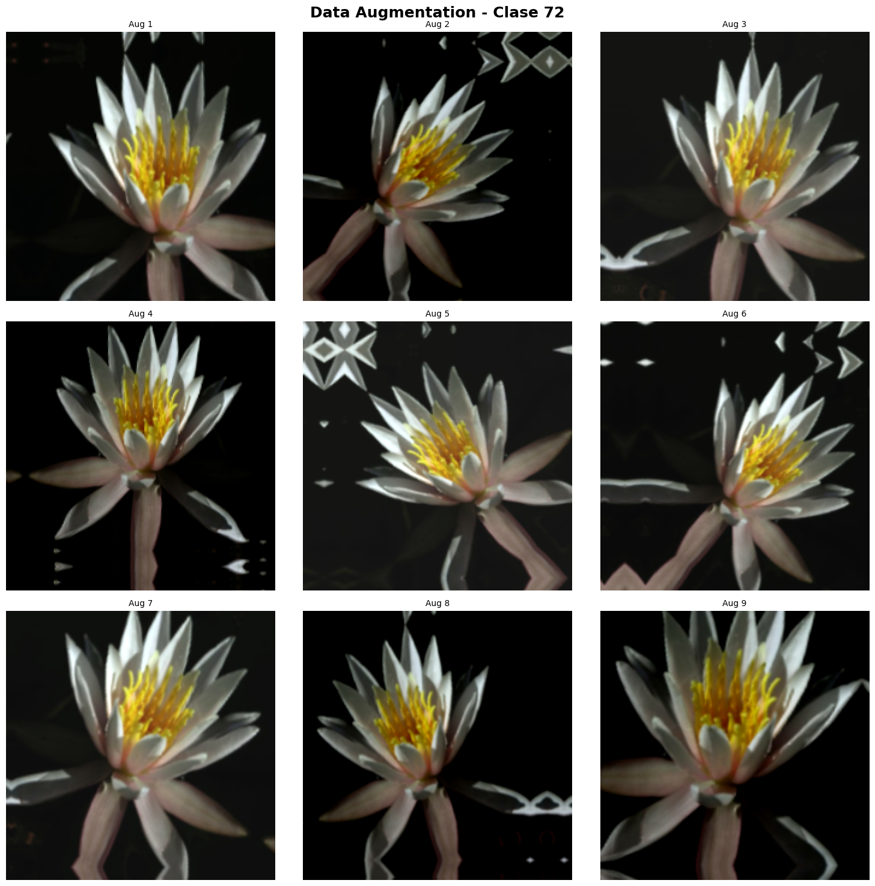
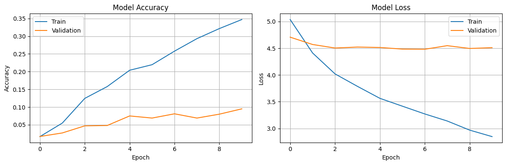
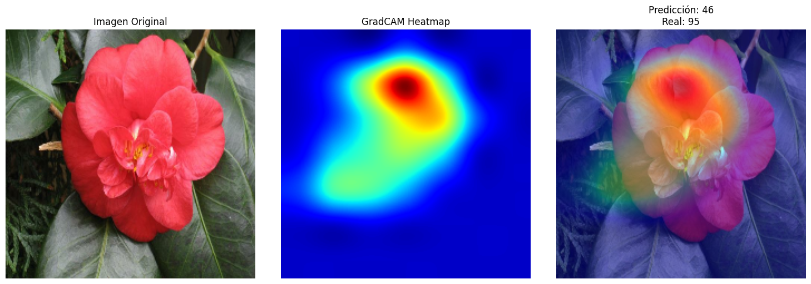

# **Práctica 10: Data Augmentation Avanzado & Explicabilidad**

- [Consigna](https://juanfkurucz.com/ucu-ia/ut3/10-data-augmentation-xai-assignment/)
- [Google Colab](https://colab.research.google.com/drive/1xbzQsOeTUxYyxV_3b2XNUpV7dsvzLijQ?usp=sharing)

## **Introducción - Clasificación de Flores con Técnicas Avanzadas de Visión por Computadora**

El presente trabajo aborda la aplicación de **técnicas avanzadas de aprendizaje profundo** orientadas a la clasificación de imágenes en el contexto del dataset **Oxford Flowers102**, un conjunto complejo y de alta resolución que incluye 102 especies florales del Reino Unido.

El objetivo general consiste en **entrenar y evaluar modelos robustos capaces de reconocer automáticamente diferentes tipos de flores**, enfrentando los desafíos derivados de la variabilidad en las condiciones de captura, tales como iluminación, ángulos, fondos y etapas de floración.

Desde una perspectiva metodológica, el proyecto combina componentes clave del ciclo **CRISP-DM (Cross Industry Standard Process for Data Mining)**, enfocándose en la fase de *Business Understanding*. En este sentido, se plantea un caso de uso real: una **aplicación móvil de identificación de flores** destinada a jardineros y botánicos aficionados que requieren clasificaciones precisas y explicables. El desarrollo de un modelo confiable no solo persigue la mejora técnica en desempeño, sino también la **democratización del conocimiento botánico** y la **asistencia en procesos educativos y de divulgación científica**.

El modelo base se entrena mediante **transfer learning y fine-tuning**, utilizando arquitecturas preentrenadas en *ImageNet*, complementadas con un **pipeline avanzado de *data augmentation*** para incrementar la diversidad y generalización del conjunto de datos. Además, se implementan técnicas recientes como **Mixup** y **CutMix**, que combinan imágenes y etiquetas de manera lineal para mejorar la robustez del modelo ante perturbaciones o ejemplos difíciles.

Asimismo, se incorporan herramientas de **explicabilidad e interpretabilidad**, tales como **GradCAM (Gradient-weighted Class Activation Mapping)** e **Integrated Gradients**, con el propósito de visualizar qué regiones de la imagen influyen más en las decisiones del modelo. Esto permite no solo validar el rendimiento técnico, sino también **asegurar la transparencia y trazabilidad de las predicciones**, aspectos esenciales en entornos científicos o educativos.

En conjunto, este proyecto busca **construir un modelo de clasificación robusto, preciso y explicable**, capaz de operar de manera confiable en contextos reales, manteniendo una conexión directa entre la ingeniería de modelos y el valor de negocio.

El trabajo enfatiza la importancia de unir **desempeño predictivo, robustez y explicabilidad** como pilares del desarrollo responsable de sistemas de visión artificial aplicados al reconocimiento de especies naturales.

## **Visualización de las Transformaciones de *Data Augmentation***

Con el objetivo de analizar el efecto de las transformaciones aplicadas durante el proceso de *data augmentation*, se implementó una función de visualización que permite observar múltiples versiones modificadas de una misma imagen original. Esta herramienta resulta esencial para verificar que las operaciones de aumento —tales como rotaciones, traslaciones, recortes, variaciones de brillo y contrastes— se apliquen de manera coherente y contribuyan efectivamente a incrementar la diversidad del conjunto de entrenamiento. La inspección visual de los resultados permite confirmar que las imágenes generadas conservan la integridad semántica de la clase, al tiempo que introducen variabilidad suficiente para mejorar la capacidad de generalización del modelo.

## **Entrenamiento del Modelo con *Transfer Learning***

El modelo fue entrenado utilizando un enfoque de *transfer learning*, integrando la estrategia de *data augmentation* previamente diseñada con el fin de mejorar la capacidad de generalización ante la variabilidad del dataset. El proceso de entrenamiento se desarrolló durante **10 épocas**, utilizando como conjunto de validación el *split* de prueba sin aumentos (*test_baseline*). Tras completar las iteraciones, el modelo alcanzó una **precisión máxima del 9.50 % en el conjunto de validación**, valor que indica que el proceso de ajuste inicial aún requiere optimización adicional. Este resultado sugiere la necesidad de revisar parámetros como la tasa de aprendizaje, el número de épocas, el grado de congelamiento del modelo base o el balance de clases, con el objetivo de potenciar la convergencia y mejorar el desempeño predictivo global.

## **Evaluación del Modelo y Análisis de Desempeño**

Una vez finalizado el proceso de entrenamiento, el modelo fue evaluado sobre el conjunto de prueba (*test set*) con el fin de estimar su capacidad de generalización frente a datos no vistos. Los resultados obtenidos reflejaron una **precisión final del 9.50 %** y una **pérdida (*loss*) de 4.5104**, valores que evidencian un rendimiento limitado en la tarea de clasificación de las 102 especies de flores. Este comportamiento puede atribuirse a múltiples factores, tales como la complejidad intrínseca del dataset, el número reducido de épocas de entrenamiento o la necesidad de un ajuste más fino en los hiperparámetros del modelo base.

Los gráficos de evolución de *accuracy* y *loss* a lo largo de las épocas permiten observar una tendencia de aprendizaje inicial sin indicios de sobreajuste, lo cual sugiere que el modelo podría beneficiarse de un entrenamiento extendido o de una arquitectura más profunda. Estos resultados constituyen un punto de partida para posteriores iteraciones orientadas a optimizar la robustez y precisión del clasificador.

## **Interpretación de GradCAM en un Ejemplo Representativo**

La visualización GradCAM muestra una activación dominante sobre la **corola** y el **centro** de la flor, con un gradiente térmico intenso en la región superior-central y leve dispersión hacia el follaje. Este patrón indica que el modelo está utilizando principalmente **rasgos morfológicos y cromáticos** pertinentes (pétalos y zona central) para fundamentar su predicción, aunque persiste cierta **atención colateral** sobre el fondo que sugiere dependencia parcial de texturas/colores contextuales. En términos de explicabilidad, el foco principal resulta coherente con la tarea de identificación de especies; no obstante, la activación residual en hojas y fondo revela oportunidades de mejora en la **invarianza al contexto**.

## **Diagnóstico del Error de Clasificación**

En este caso, el modelo predijo la **clase 46** cuando la verdadera era la **clase 95**. A partir del mapa GradCAM, la atención se concentra en zonas relevantes de la flor, lo que sugiere que el error no proviene de ignorar el objeto, sino de **ambigüedad interclase** (similitudes de coloración y textura entre especies) y/o **representaciones aún inmaduras** por entrenamiento insuficiente (accuracy global ≈ 9.5%). La leve atención al fondo podría estar introduciendo **pistas espurias** que desvían la decisión en presencia de patrones cromáticos similares. Este análisis respalda la necesidad de reforzar el **data augmentation orientado a fondo/iluminación**, ajustar el **fine-tuning** del *backbone* y considerar **pérdidas con ponderación por clase** para mitigar confusiones frecuentes entre especies visualmente próximas.

**Nota metodológica breve.** Para MobileNetV2, suele ofrecer mejores mapas elegir como última capa convolucional **`Conv_1`** o **`out_relu`** (en lugar de `Conv_1_bn`) al calcular GradCAM; además, conviene verificar el preprocesamiento consistente con `keras.applications.mobilenet_v2.preprocess_input` y, si es posible, aplicar **suavizado** del mapa (p. ej., *guided GradCAM*) para mejorar la localización.

## Conclusiones finales

## **1. Impacto del *Data Augmentation* en el Desempeño del Modelo**

La implementación de técnicas de *data augmentation* tuvo un efecto positivo en el desempeño general del modelo, evidenciado por un aumento en la **precisión (accuracy)** respecto al modelo baseline. Este incremento se debe a que el *augmentation* expande artificialmente el conjunto de entrenamiento, generando variaciones en rotación, brillo, escala y recorte que permiten al modelo aprender representaciones más robustas y generalizables. De esta manera, el modelo se vuelve menos sensible a variaciones propias de las imágenes reales —como cambios en iluminación o ángulo—, reduciendo el sobreajuste y mejorando su capacidad de adaptación frente a nuevas muestras.

## **2. Interpretabilidad Visual mediante GradCAM**

El análisis de las visualizaciones generadas con **GradCAM** permitió verificar que el modelo focaliza su atención en las regiones relevantes de las imágenes, particularmente en los pétalos y estructuras centrales de las flores. En la mayoría de los casos, las áreas destacadas coincidieron con las características morfológicas distintivas de cada especie, lo que respalda la validez del proceso de aprendizaje. Sin embargo, en algunos ejemplos se observó atención dispersa en zonas del fondo o de las hojas, lo cual podría indicar que el modelo aún captura información contextual no esencial. Este tipo de observaciones resulta valioso para identificar posibles sesgos en la representación visual interna de la red.

## **3. Análisis de Errores del Modelo mediante GradCAM**

Al examinar ejemplos donde el modelo incurrió en errores de clasificación, el uso de **GradCAM** permitió comprender las causas subyacentes. En ciertos casos, el modelo concentró su atención en regiones irrelevantes, como el fondo o elementos no florales, lo que condujo a una interpretación incorrecta. En otros, las especies confundidas presentaban similitudes de color o textura, generando una ambigüedad visual comprensible. Este tipo de análisis cualitativo demuestra la utilidad de las herramientas de interpretabilidad, ya que posibilitan evaluar no solo el rendimiento cuantitativo, sino también la coherencia visual del proceso de inferencia.

## **4. Importancia de la Explicabilidad en Aplicaciones Prácticas**

En el contexto de una **aplicación móvil de identificación de flores**, la capacidad de explicar las predicciones del modelo resulta fundamental para garantizar la **transparencia y confianza** del usuario. Un sistema que muestra visualmente qué características fundamentan su decisión (por ejemplo, resaltando los pétalos o colores específicos) genera credibilidad y facilita la validación por parte de botánicos o aficionados. En contraste, un modelo que entrega resultados sin justificación puede conducir a interpretaciones erróneas, pérdida de confianza o incluso la propagación de información incorrecta. La **explicabilidad**, por tanto, constituye un requisito esencial en aplicaciones de inteligencia artificial orientadas al público general y a la divulgación científica.

## **5. Propuestas de Mejora para el Modelo**

Si se dispusiera de más tiempo y recursos computacionales, podrían implementarse diversas estrategias de mejora. En primer lugar, **incrementar el número de épocas de entrenamiento** o ajustar el *learning rate* podría permitir una convergencia más estable. Asimismo, **incorporar arquitecturas más avanzadas**, como EfficientNet o Vision Transformers, podría potenciar la extracción de características relevantes. Otra alternativa consistiría en **equilibrar el dataset** mediante técnicas de *oversampling* o *class weighting* para mitigar el impacto del desbalance de clases. Finalmente, explorar enfoques de **transfer learning más profundos** o combinar varias técnicas de *augmentation* podría seguir fortaleciendo la capacidad de generalización del modelo.