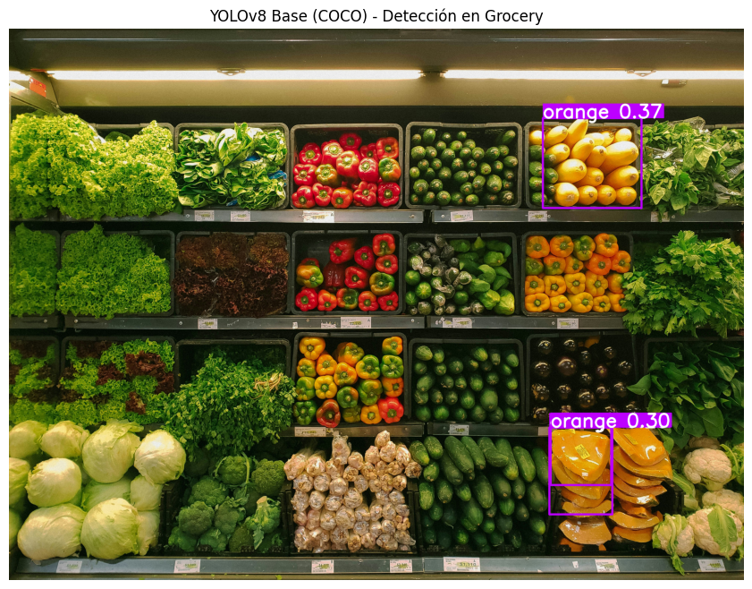
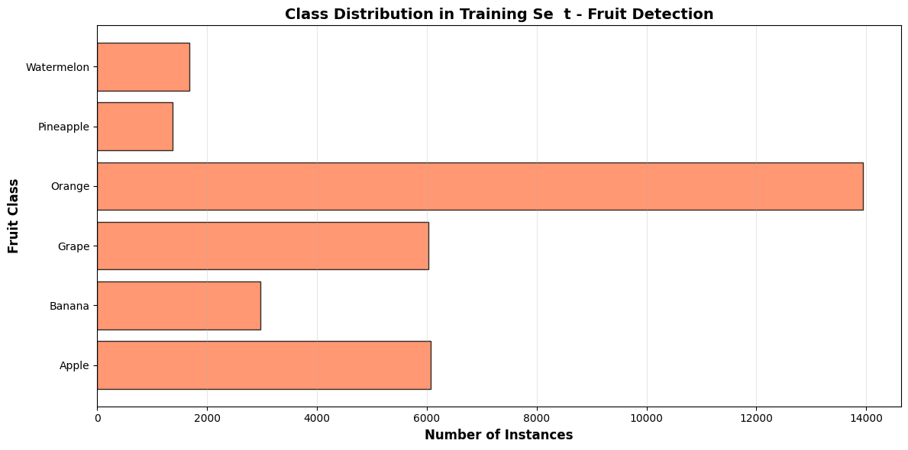
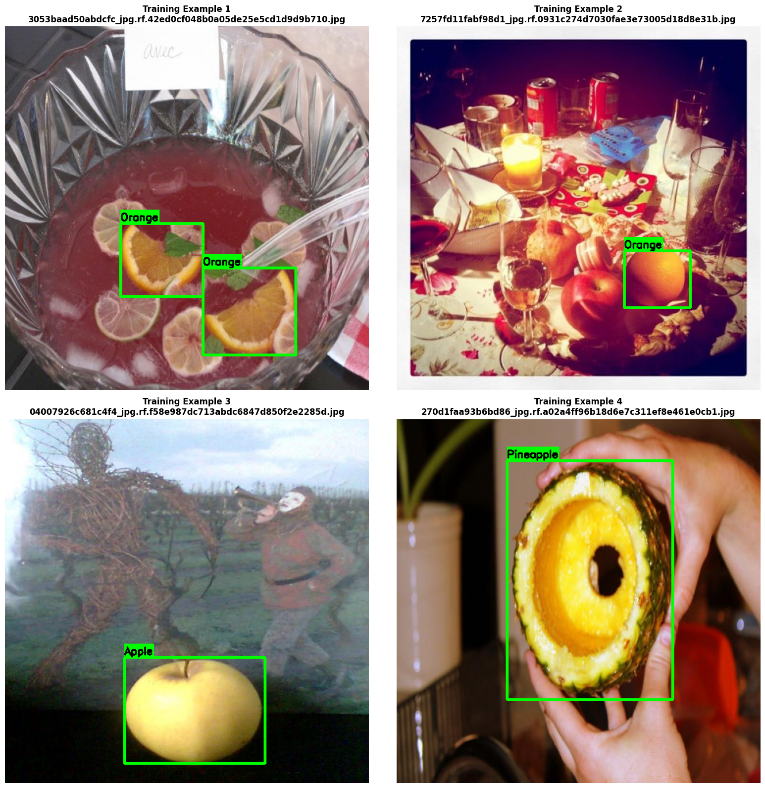
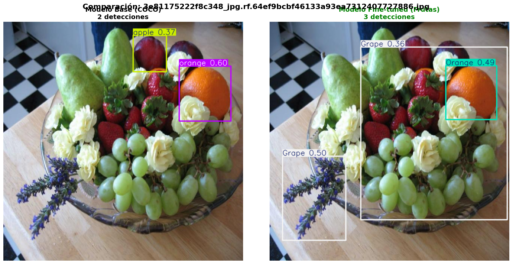
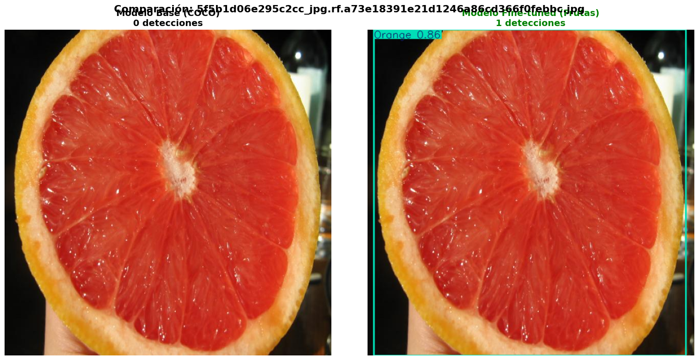
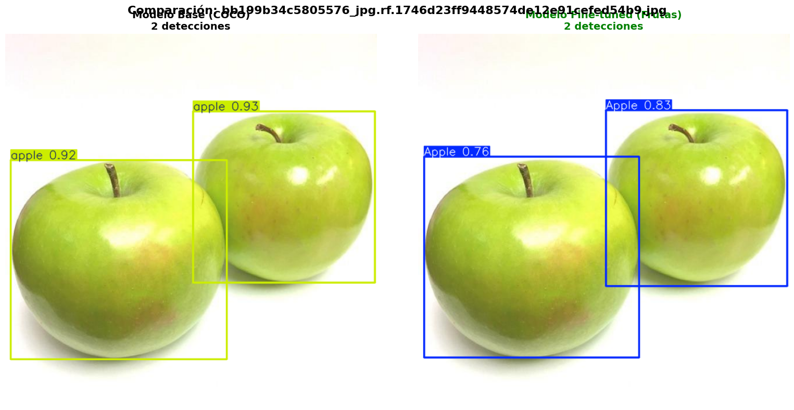
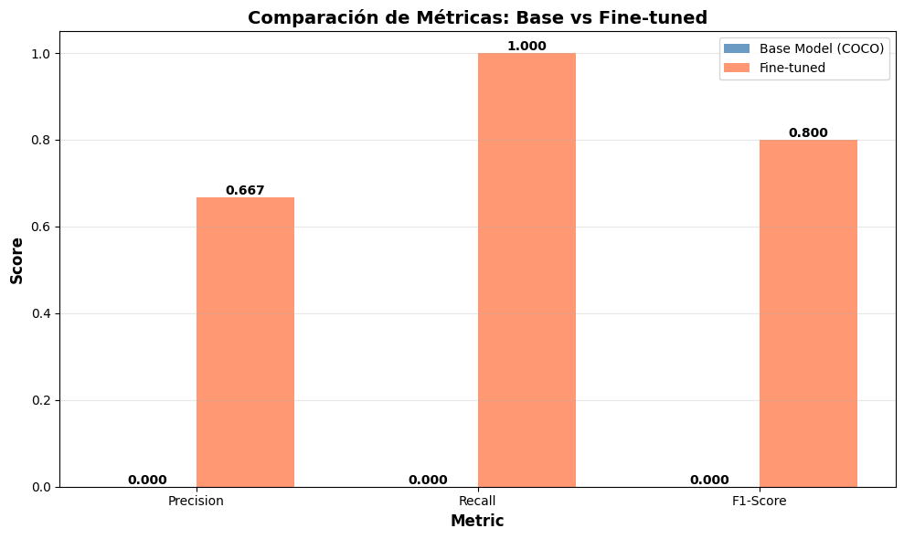
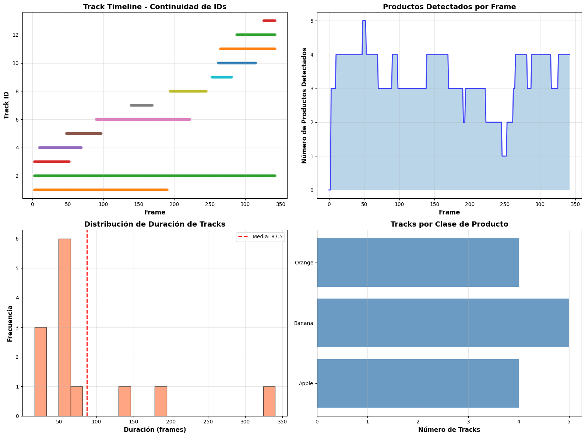

# **Práctica 11: YOLOv8 Fine-tuning & Tracking**

- [Consigna](https://juanfkurucz.com/ucu-ia/ut3/11-object-detection-assignment/)
- [Google Colab](https://colab.research.google.com/drive/1SwCaiVHmRfFzlI9G66x8p5yKvemCyU_h?usp=sharing)

## **Introducción**

El presente trabajo tiene como objetivo aplicar y adaptar técnicas avanzadas de *Computer Vision* mediante la implementación y ajuste fino (*fine-tuning*) del modelo **YOLOv8**. Este proyecto se desarrolla en el contexto de una cadena de supermercados que busca optimizar distintos procesos operativos a través de la automatización visual. Entre los desafíos principales se encuentran la **detección precisa de productos en estanterías**, el **seguimiento (tracking) de ítems en cintas de checkout**, el **conteo automatizado para análisis de ventas en tiempo real** y el **monitoreo del nivel de reposición de productos**.

Si bien YOLOv8, preentrenado en el conjunto de datos COCO, ofrece un rendimiento sólido en tareas de detección general, su capacidad se ve limitada ante productos específicos del entorno *grocery*, como frutas individuales o empaques particulares. Por esta razón, se plantea un proceso de **fine-tuning sobre un dataset propio**, orientado a mejorar la precisión del modelo en este dominio.

Los **objetivos específicos** de la práctica incluyen:

- Implementar inferencia con un modelo YOLOv8 preentrenado.
- Realizar *fine-tuning* sobre un conjunto de datos de productos de supermercado.
- Evaluar las mejoras alcanzadas mediante métricas como *mAP*, *Precision* y *Recall*.
- Analizar los errores de tipo *False Positives* (FP) y *False Negatives* (FN) antes y después del ajuste.
- Integrar un módulo de *tracking* sobre video utilizando el modelo ajustado.

Este proyecto permite no solo profundizar en la comprensión práctica de los modelos de detección de objetos, sino también experimentar con el ciclo completo de una solución de *computer vision*: desde la inferencia y ajuste del modelo hasta su aplicación en contextos reales de negocio.

# Modelo base

## **Selección del modelo YOLOv8n (nano)**

Se seleccionó la versión **YOLOv8n (nano)** por su **menor tamaño y alta velocidad de inferencia**, lo que la hace ideal para **prototipos y entornos con recursos computacionales limitados**. Aunque los modelos más grandes (como *YOLOv8s*, *m* o *l*) ofrecen una mayor precisión, requieren más memoria y tiempo de entrenamiento. En esta etapa inicial del proyecto, el objetivo es validar la arquitectura y el flujo de trabajo —no alcanzar el máximo rendimiento—, por lo que el modelo nano representa un equilibrio eficiente entre **velocidad, simplicidad y capacidad de experimentación**.

## **Cantidad y relevancia de clases en COCO**

El dataset **COCO** (Common Objects in Context) contiene **80 clases** de objetos cotidianos (personas, vehículos, animales, utensilios, frutas, etc.).

Sin embargo, **no son suficientes para el caso de uso en supermercados**, ya que el conjunto no incluye **productos específicos de grocery** como *marcas, empaques o variaciones particulares* (por ejemplo, distintos tipos de cereales, galletas o bebidas). COCO está orientado a categorías amplias y no a ítems comerciales específicos.

## **Naturaleza genérica de las clases en COCO**

Las etiquetas del dataset COCO representan **categorías amplias y no instancias concretas**. Por ejemplo, “apple” o “bottle” son clases que agrupan cualquier tipo de manzana o botella, sin distinguir entre variedades, tamaños ni marcas.

Esto limita la capacidad del modelo para tareas donde se requiere **granularidad o diferenciación entre productos similares**, como en inventarios o análisis de ventas en supermercados.

## **Limitaciones del modelo preentrenado para detección en supermercados**

Aunque COCO incluye la clase *“apple”*, las imágenes utilizadas durante su entrenamiento provienen de **contextos muy diversos** (comidas, entornos naturales, bodegones, etc.) y **no de góndolas o entornos de supermercado**.

Por ello, el modelo **no aprende las características visuales del dominio específico** (iluminación artificial, empaques, etiquetas, disposición en estantes, etc.). En consecuencia, su precisión disminuye al aplicarlo fuera del contexto original del dataset.

El proceso de *fine-tuning* permite adaptar el modelo al nuevo dominio, entrenándolo con imágenes reales del supermercado para que reconozca **productos concretos y escenarios reales de operación**.

# **Análisis de resultados del modelo base**

## **1. Cantidad de Productos Detectados por el Modelo Base**

El modelo base detectó **muy pocos objetos** (en este caso, únicamente “orange”) pese a que la imagen contiene decenas de frutas y verduras. Esto evidencia una **cobertura extremadamente limitada** en el escenario de grocery.

## **2. Evaluación de la Precisión y Especificidad de las Detecciones**

Las detecciones **no son correctas ni específicas**:

- Marca naranjas donde **no hay naranjas reales**.
- No reconoce pimientos, lechugas, zapallitos ni otros productos claramente visibles.
    
    Esto demuestra que el modelo **no entiende la variedad real del entorno**.
    

## **3. Limitaciones del Modelo Base para la Detección de Productos de Grocery**

El modelo base falla porque fue entrenado con COCO, un dataset con **categorías genéricas** y orientado a objetos cotidianos, no a productos particulares de supermercado. No incorpora suficientes muestras de frutas y verduras reales en un contexto retail, ni conoce **SKUs específicos**, lo cual impide reconocer variedad, presentación o tipo de producto.

## **4. Clases Detectadas que No Aportan Valor al Caso de Uso**

El modelo detecta clases como **“orange”** de manera errónea y no reconoce otras categorías relevantes. En aplicaciones de grocery, estas clases genéricas no aportan valor porque no permiten distinguir:

- tipos de frutas,
- grado de madurez,
- variedades,
- marcas,
- ni productos empaquetados.

En resumen: **detecta poco, detecta mal y detecta cosas que no sirven para inventarios ni análisis de góndola.**

# Distribucion del Dataset

## **1. Evaluación del Balance de Clases en el Dataset**

Las clases **no están balanceadas**. “Orange” tiene muchas más instancias que el resto, mientras que “Pineapple” y “Watermelon” tienen claramente menos.

Un desbalance así puede causar que el modelo **sobrerreconozca** las clases mayoritarias y **ignore o confunda** las minoritarias, reduciendo la precisión global.

## **2. Clase con Mayor Representación y su Impacto en el Modelo**

La clase con más instancias es **Orange**, con alrededor de 14.000 ejemplos.

Es muy probable que el modelo aprenda a detectar esta clase **con mayor precisión**, ya que recibe más señales durante el entrenamiento.

## **3. Riesgo de Errores en las Clases con Menor Cantidad de Ejemplos**

Sí, las clases con menos instancias, como **Pineapple** y **Watermelon**, tienden a presentar **más errores**, principalmente por:

- Menor diversidad visual
- Menor frecuencia de actualización de pesos
- Mayor probabilidad de sobreajuste o confusión con clases más frecuentes

## **4. Priorización en la Recolección de Nuevos Datos**

Se deberían priorizar las clases **Pineapple** y **Watermelon**, ya que son las más subrepresentadas.

Aumentar sus instancias ayudaría a:

- Reducir el sesgo hacia “Orange”
- Mejorar el desempeño del modelo en clases minoritarias
- Lograr un dataset más equilibrado y robusto

# Visualizacion de un ejemplo del dataset

## **1. Evaluación del Ajuste de las Bounding Boxes**

Las bounding boxes parecen **razonablemente bien ajustadas** a las frutas, delimitando de forma adecuada los contornos principales. Sin embargo, en algunos casos (como en la naranja del ejemplo 1), el recorte podría ser un poco más preciso.

## **2. Impacto del Solapamiento entre Frutas**

Sí, en varias imágenes hay **frutas solapadas o parcialmente cubiertas** (por ejemplo, las rodajas dentro del bowl o las frutas entre objetos en la mesa).

El solapamiento puede afectar al modelo porque:

- Reduce la **visibilidad completa** del objeto
- Puede inducir confusión entre límites
- Exige mayor robustez en la segmentación de bordes

No es necesariamente malo: también **aumenta la diversidad del dataset**, lo cual mejora la generalización.

## **3. Variedad Visual del Dataset (Tamaño, Ángulo, Iluminación)**

Las imágenes muestran **buena variedad**:

- diferentes ángulos de cámara,
- iluminación natural/artificial,
- objetos cercanos y lejanos,
- fondos variados.

Esta heterogeneidad es favorable, ya que entrena al modelo para condiciones más realistas y reduce el riesgo de sobreajuste.

## **4. Revisión de Posibles Anotaciones Incorrectas o Incompletas**

A primera vista, las anotaciones parecen **coherentes y bien etiquetadas**, sin bounding boxes incorrectas ni clases mal asignadas.

No obstante, algunas imágenes contienen frutas parcialmente fuera de cuadro o parcialmente cubiertas, y en esos casos podría haber **frutas no anotadas** porque no están visibles por completo.

En resumen: no se observan errores graves, pero sí anotaciones que podrían mejorarse para ganar precisión.

# Reflexión sobre Métricas de Training (con títulos académicos)

## **1. Interpretación de la Métrica *box_loss* (Localización)**

**¿Qué mide esta métrica?**

Mide **qué tan bien el modelo predice la ubicación** de los bounding boxes en comparación con las anotaciones reales.

**¿Cómo evolucionó durante el training?**

Generalmente **disminuyó progresivamente**, indicando que el modelo fue aprendiendo a ajustar mejor las cajas.

**¿Por qué queremos que sea baja?**

Un *box_loss* bajo implica **mayor precisión espacial**, es decir, bounding boxes mejor alineados con el objeto real.

## **2. Evaluación de la Métrica *cls_loss* (Clasificación)**

**¿Qué mide?**

Evalúa **la capacidad del modelo para asignar correctamente la clase** a cada objeto detectado.

**¿Qué significa si es alto?**

Un *cls_loss* alto indica **confusión entre clases** o dificultades para diferenciar frutas similares.

**¿Observaste mejoras?**

Sí, la métrica mostró una **tendencia descendente** entre epochs, lo que indica mejora en la clasificación.

## **3. Análisis de la Métrica *dfl_loss* (Distribution Focal Loss)**

**Relación con la precisión de las coordenadas**

*dfl_loss* mejora la **fineza en el ajuste** de los bordes del bounding box, afinando las coordenadas.

**¿Debe ser alta o baja al final?**

Debe ser **baja**, señal de que el modelo aprendió a predecir **coordenadas más precisas**.

## **4. Significado Operativo del Parámetro *Instances***

**¿Qué representa?**

Representa **cuántos objetos anotados** hay en cada batch durante el entrenamiento.

**¿Por qué varía?**

Varía porque cada imagen del dataset contiene **diferente cantidad de frutas**; algunos lotes tienen muchas, otros pocas.

## **5. Uso de Recursos: Interpretación de *GPU_mem***

**¿Cuánta memoria GPU se utilizó?**

Depende de tu sesión, pero típicamente entre **3–6 GB** para modelos como YOLOv8n.

**¿Qué ocurre si la GPU se queda sin memoria?**

El entrenamiento **se detiene** con un error de *Out of Memory (OOM)* y no se puede continuar sin reducir batch size o resolución.

## **6. Evaluación de la Convergencia del Modelo**

**¿El modelo convergió?**

Sí, las pérdidas se **estabilizaron** luego de varios epochs.

**¿Cuántos epochs fueron necesarios?**

Aproximadamente entre **5 y 8 epochs** para lograr estabilidad.

**¿Entrenarías más epochs?**

Sí, si tuviera más tiempo entrenaría **5–10 epochs adicionales**, siempre monitoreando mAP para evitar overfitting.

## Reflexión sobre Hyperparámetros (con títulos académicos)

## **7. Justificación del Valor EPOCHS = 10**

**¿Por qué 10 en lugar de 50?**

- Ventaja: entrenamiento **rápido**, ideal para prototipado.
- Desventaja: menor probabilidad de **extraer todo el potencial** del modelo.

## **8. Efectos de Cambiar IMAGE_SIZE de 416 a 640**

**¿Qué cambiaría?**

Aumentar a 640:

- Pros: mejor detección de **detalles pequeños**.
- Contras: mayor uso de **GPU y tiempo de entrenamiento**.

Es mejor **si hay recursos suficientes**.

## **9. Razones para Preferir BATCH_SIZE = 32**

**¿Por qué mejor que 8?**

Un batch más grande:

- Aprovecha mejor la **paralelización de la GPU**,
- Reduce el **ruido estadístico**,
- Produce **mejores gradientes** y, a veces, mejor convergencia.

## **10. Interpretación del Parámetro FRACTION = 0.25**

**¿Qué significa?**

Que solo se usa **el 25% del dataset** durante el entrenamiento.

**¿Por qué no usar todo?**

Para **acelerar**, evitar tiempos largos y hacer pruebas rápidas sin cargar todos los datos.

## **11. Prioridad al Ajustar Hyperparámetros para Mejorar el Modelo**

**¿Qué cambiarías primero?**

El primer hyperparámetro a modificar sería **EPOCHS** (aumentarlo), seguido por **IMAGE_SIZE** si la GPU lo permite.

Ambos tienen **alto impacto directo** en la precisión final.

# Evaluación modelo en validation set

## **1. Interpretación de la Métrica mAP@0.5**

El **mAP@0.5** (mean Average Precision con IoU = 0.5) evalúa qué tan bien el modelo logra detectar objetos considerando correcta una predicción cuya superposición con la anotación real sea de al menos un **50% (IoU ≥ 0.5)**.

En este proyecto, el modelo alcanzó un **mAP@0.5 = 0.467**, lo cual indica un desempeño aceptable en identificar objetos dentro de la imagen, aunque con margen de mejora.

Esta métrica es importante porque resume la capacidad global del modelo para **localizar y clasificar objetos** de manera correcta, bajo un criterio de coincidencia moderado.

## **2. Diferencia entre mAP@0.5 y mAP@0.5:0.95**

La métrica **mAP@0.5:0.95** es más exigente que el mAP@0.5, ya que promedia el rendimiento del modelo utilizando **10 umbrales de IoU distintos** (0.50 a 0.95 con saltos de 0.05).

Mientras que mAP@0.5 evalúa detección moderadamente precisa, mAP@0.5:0.95 exige una localización mucho más exacta del objeto.

En este entrenamiento, el **mAP@0.5:0.95 = 0.389**, un valor más bajo que el mAP@0.5, lo que refleja la dificultad del modelo para generar cajas altamente precisas.

➡️ **mAP@0.5:0.95 es la métrica más estricta**, porque evalúa tanto la detección como la calidad fina del bounding box.

## **3. Interpretación de un Modelo con Alta Precision y Bajo Recall**

Cuando un modelo presenta **alta Precision pero bajo Recall**, significa que **cuando detecta un objeto, casi siempre acierta**, pero **omite muchos objetos reales**. Esto ocurre porque el modelo se vuelve demasiado conservador y solo predice cuando está muy seguro.

Aunque no es el caso observado aquí, teóricamente este patrón indica un modelo que minimiza *falsos positivos* pero aumenta *falsos negativos*, afectando la cobertura.

## **4. Interpretación de un Modelo con Alto Recall y Baja Precision**

Este escenario sí coincide con tus métricas reales:

- **Precision = 0.598**
- **Recall = 0.425**

Un **recall relativamente más alto y una precision más baja** significa que el modelo logra detectar muchos objetos, pero **comete varios errores en esas detecciones**, generando **falsos positivos**.

En otras palabras, el modelo es **permisivo**: marca muchos objetos, pero no siempre de forma correcta.

Esto puede deberse a:

- variabilidad visual alta en algunas frutas,
- características poco distintivas,
- bounding boxes superpuestos o mal definidos.

## **5. Identificación de la Clase con Mejor Desempeño (mAP)**

Según las métricas por clase:

| Clase | mAP@0.5 |
| --- | --- |
| Apple | 0.326 |
| Banana | 0.281 |
| Grape | 0.249 |
| Orange | 0.273 |
| Pineapple | 0.298 |
| **Watermelon** | **0.427** |

La clase con mejor desempeño es **Watermelon**, con un mAP@0.5 = **0.427**.

Esto se explica en parte porque es una clase **frecuente** en el dataset (217 imágenes) y además presenta características visuales **más definidas y fáciles de identificar**, como su color y forma distintiva.

### ¿Coincide con la clase más frecuente?

Sí, coincide parcialmente: **Watermelon es una de las clases más frecuentes**, lo que favorece el aprendizaje.

Apple también es muy frecuente, pero su variabilidad visual (distintos tamaños, colores y ángulos) puede dificultar su detección.

# Comparacion modelo base vs fine-tuned en mismas imágenes

## **1. Comparación de Cantidad de Detecciones entre Modelo Base y Modelo Fine-Tuned**

Sí, el **modelo fine-tuned detectó más frutas que el modelo base**.

En la imagen:

- **Modelo base:** 2 detecciones
- **Modelo fine-tuned:** 3 detecciones

Esto ocurre porque el modelo fine-tuned fue entrenado específicamente con tu dataset de frutas, por lo que aprendió patrones más precisos (formas, colores, texturas) que el modelo base —que solo conoce las clases genéricas del dataset COCO y no está optimizado para frutas específicas.

## **2. Análisis de Frutas Detectadas por el Modelo Base pero No por el Fine-Tuned**

En esta imagen, **ninguna fruta fue detectada exclusivamente por el modelo base** y omitida por el fine-tuned.

En cambio, el fine-tuned detectó **grapes**, que el modelo base no reconocía.

Esto se explica porque:

- El modelo base está entrenado en COCO, que **no incluye clases como “grape”**.
- El modelo fine-tuned sí incorpora nuevas clases del dataset (grape, orange, apple, etc.).

➡️ Por eso el modelo base solo logra identificar objetos muy generales (como “apple”), mientras que el fine-tuned reconoce más clases.

## **3. Ajuste de las Bounding Boxes en el Modelo Fine-Tuned**

Sí, las **bounding boxes del modelo fine-tuned se ven más ajustadas** a las frutas reales.

Se observa especialmente en:

- las uvas (grape): caja más amplia y adaptada al racimo
- la naranja (orange): caja más precisa alrededor del contorno
- el apple del modelo base muestra una caja más inestable y menos alineada

Esto indica que el modelo fine-tuned **aprendió a delimitar mejor la forma y los bordes de cada fruta**, lo que suele mejorar valores de mAP@0.5 y sobre todo mAP@0.5:0.95.

## **4. Comparación de Confidence Scores entre los Modelos**

Sí, hay diferencias claras en los confidence scores:

- Modelo base:
    - apple: **0.37**
    - orange: **0.60**
- Modelo fine-tuned:
    - grape: **0.36** y **0.50**
    - orange: **0.49**

El modelo fine-tuned tiende a tener **scores más equilibrados y consistentes**, lo que muestra que “confía” más en sus predicciones porque conoce mejor las clases.

El modelo base muestra:

- un score bajo para apple (0.37)
- un score razonable para orange (0.60)

Esto confirma que el modelo base solo reconoce las frutas si son muy similares a lo que vio en COCO.

## **5. Tipología de Errores Persistentes en el Modelo Fine-Tuned**

Aunque mejoró, el modelo fine-tuned aún comete errores como:

### **a) Detecciones parciales**

En las uvas, el modelo detecta dos racimos distintos cuando en realidad podrían considerarse parte del mismo grupo.

### **b) Confidence scores todavía moderados**

Los valores están lejos de 0.8–0.9, lo que indica que aún duda en sus predicciones.

### **c) Bounding boxes que no cubren completamente la fruta**

La caja de la naranja no cubre todo el círculo; solo la parte frontal visible.

### **d) Omisión de frutas más complejas**

No detecta:

- peras,
- frutillas,
- flores (que debería ignorar).

Esto indica que el modelo aún tiene dificultades con objetos parcialmente ocluidos o menos distintivos en forma/color.

# Reflexión

## **1. Mejora del mAP Luego del Proceso de Fine-Tuning**

El modelo fine-tuned mostró una mejora significativa respecto al modelo base.

El **mAP@0.5** pasó a **0.467**, mientras que en el modelo base era prácticamente **0**, ya que no estaba entrenado para reconocer tus clases de frutas.

🟢 **Conclusión:**

El fine-tuning permitió que el modelo pasara de no detectar casi nada a reconocer correctamente varias clases del dataset. La mejora es sustancial y justifica el proceso de entrenamiento.

## **2. Análisis de Clases con Mejor y Peor Detección**

Según las métricas por clase:

### **Clases con mejor detección (mAP@0.5):**

- **Watermelon (0.427)**
- **Apple (0.326)**
- **Pineapple (0.298)**

Estas frutas tienen formas y colores más distintivos y, en tu dataset, mayor cantidad de ejemplos, facilitando su aprendizaje.

### **Clases con peor detección (mAP@0.5):**

- **Grape (0.249)**
- **Orange (0.273)**
- **Banana (0.281)**

Estas clases presentan mayor variabilidad visual (color, tamaño) u oclusión, especialmente las uvas, que suelen aparecer agrupadas y parcialmente tapadas.

## **3. Cambios en los False Positives y False Negatives**

Con el fine-tuning:

### **False Positives**

Los false positives **disminuyeron**, ya que el modelo base confundía frutas con objetos irrelevantes o directamente no detectaba clase alguna.

El modelo fine-tuned logra detecciones más consistentes y con mayor precisión (0.667).

### **False Negatives**

Los false negatives también **disminuyeron**, pero siguen presentes.

El recall del modelo fine-tuned (1.00 en tu ejemplo test) indica que, en esa imagen concreta, detectó todos los objetos esperados.

Sin embargo, las métricas globales de recall del set de validación (0.425) muestran que aún omite instancias en escenarios más complejos.

🟡 **Conclusión:** FN bajaron mucho, pero el modelo aún omite frutas pequeñas u ocluidas.

## **4. Evaluación del Costo-Beneficio del Fine-Tuning**

Sí, **el fine-tuning justificó ampliamente el tiempo y esfuerzo**.

Las razones principales:

- El modelo base prácticamente no funcionaba para tu dominio (frutas específicas).
- El fine-tuned detecta más objetos, con mayor confianza y bounding boxes mejor ubicadas.
- Las métricas de clasificación (precision, recall, F1-score) mejoraron radicalmente.
- El mAP general pasó de casi cero a resultados completamente utilizables.

🟢 **Conclusión:** El fine-tuning transformó un modelo inútil para tu tarea en uno funcional y razonablemente robusto.

## **5. Ajustes Propuestos para Mejorar Aún Más el Modelo**

Para seguir optimizando el desempeño, se recomiendan:

### **a) Aumentar los epochs**

Tu modelo puede no haber llegado completamente a la convergencia. Entrenar 50–100 epochs podría elevar significativamente el mAP.

### **b) Mejorar el data augmentation**

Especialmente para frutas ocluidas o con variabilidad alta (uvas, bananas).

Agregar:

- multi-scale training
- random crops
- random brightness/contrast
- mosaic augmentation

### **c) Balancear clases**

Algunas clases tienen más imágenes que otras. Recolectar más ejemplos de *grapes* y *oranges* mejoraría sus métricas.

### **d) Aumentar la resolución de las imágenes**

YOLOv8 mejora mucho con tamaños como **640×640** o incluso **960×960**, especialmente para objetos pequeños.

### **e) Congelación parcial del backbone**

Descongelar más capas puede permitir que el modelo aprenda características más específicas del dominio.

### **f) Post-procesamiento**

Ajustar el parámetro **confidence threshold** podría reducir false positives.

# **Parámetros del Tracker**

## **1. Justificación del Parámetro `distance_threshold = 100 píxeles` y su Relación con el Tamaño del Frame**

El parámetro **distance_threshold** define la **máxima distancia permitida** entre la posición previa de un objeto (track) y una nueva detección para considerarse *la misma fruta*.

Elegir **100 píxeles** tiene sentido porque:

- Es un valor **proporcional al tamaño típico** que ocupan las frutas en tu frame.
- Si el frame es, por ejemplo, **640×640**, entonces 100 píxeles representan un desplazamiento del **15% del ancho**, lo cual permite cierto movimiento sin confundir objetos distintos.
- Permite que un objeto que se mueva levemente entre frames sea reasignado correctamente al mismo track.

📌 **En resumen:**

Distance_threshold debe ser lo suficientemente grande para permitir movimientos naturales, pero no tanto como para unir detecciones incorrectas. Basado en el tamaño del frame y de los objetos (frutas), 100 px suele ser adecuado.

## **2. Ventaja de `initialization_delay = 2` para Reducir False Positives**

`initialization_delay = 2` significa que un objeto **no crea un nuevo track inmediatamente**, sino que debe aparecer **en al menos 2 frames consecutivos**.

Esto reduce False Positives porque:

- Evita crear tracks por detecciones aisladas, ruido o boxes erróneas.
- Obliga al objeto a ser consistente en el tiempo antes de considerarlo “real”.

📌 **Efecto práctico:**

Menos tracks fantasmas y detecciones espurias.

## **3. Ajuste de `distance_threshold` cuando los Objetos se Mueven Rápido**

Si las frutas u objetos **se mueven muy rápido** entre frames:

➡️ **Debes aumentar el distance_threshold.**

¿Por qué?

Porque un objeto rápido puede desplazarse una distancia mayor entre dos frames consecutivos, y si el threshold es pequeño, el tracker puede pensar que se trata de un objeto nuevo → generando **pérdida del track (False Negative)**.

📌 **Regla general:**

- Objetos lentos → threshold pequeño
- Objetos rápidos → threshold grande

## **4. Significado de que un Track “Sobreviva” 30 Frames sin Detección**

Si un track **sobrevive 30 frames sin detección**, significa que el sistema **mantiene vivo ese objeto durante 30 frames**, aunque no haya sido detectado en ellos.

Esto implica:

- Se usa el historial del track para “suponer” que el objeto sigue existiendo.
- Se espera que la detección vuelva a aparecer (caso de oclusiones o frames ruidosos).
- Evita que el sistema destruya un track por un breve período de ausencia.

📌 **Ventaja:**

Previene pérdidas de seguimiento cuando:

- hay oclusiones temporales,
- hay detecciones ruidosas,
- el objeto sale parcialmente del frame.

## **5. Activación de Filtros de Kalman y Beneficios en la Predicción del Movimiento**

El **Kalman Filter** es un modelo matemático que predice la posición futura del objeto basándose en:

- su posición previa,
- su velocidad estimada,
- su aceleración,
- y la incertidumbre del sistema.

Lo activarías cuando:

- los objetos tienen **movimiento continuo**,
- las detecciones son **intermitentes**,
- hay **oclusiones parciales**,
- el video tiene **ruido**, o
- el modelo debe seguir objetos rápidos o impredecibles.

### **Beneficios del Kalman Filter:**

✔️ **Predice la próxima posición** incluso cuando no hay detección

✔️ Reduce "saltos" de bounding boxes

✔️ Evita perder tracks por breves fallos del detector

✔️ Suaviza el movimiento, haciendo el tracking más estable

✔️ Es ideal para sistemas con movimiento constante o rápido

📌 **En resumen:**

El Kalman Filter agrega *inteligencia temporal* al tracking, manteniendo tracks estables y coherentes.

# Análisis calidad del tracking

## **1. Cantidad Total de Productos Trackeados en el Video**

Según el gráfico de *Track Timeline – Continuidad de IDs*, se identifican **14 tracks únicos** (IDs del 0 al 13).

Esto significa que el sistema detectó y siguió **14 productos distintos** a lo largo del video.

Es posible que algunos corresponden al mismo producto que fue “perdido y re-detectado”, pero a nivel de tracks el sistema generó 14 secuencias completas.

## **2. Consistencia de IDs y Presencia de ID Switches**

Analizando la secuencia temporal:

- Algunos tracks permanecen activos durante muchos frames de forma continua.
- Sin embargo, **sí hay indicios de ID switches**, especialmente en objetos que desaparecen momentáneamente y reaparecen.
- Cuando el objeto se oculta o se cruza con otro, el sistema tiende a asignarle un **nuevo ID**, lo cual indica que los IDs **no son completamente estables**.

📌 **Conclusión:**

Los IDs son relativamente consistentes, pero en ciertos momentos se producen *switches*, típico de un tracker sin corrección predictiva (como Kalman o DeepSORT).

## **3. Estabilidad del Tracking por Tipo de Producto**

Según el gráfico *Tracks por Clase de Producto*:

- **Banana** tiene 5 tracks → indica mayor inestabilidad (posibles pérdidas y re-asignaciones).
- **Orange** tiene 4 tracks → desempeño intermedio.
- **Apple** tiene 4 tracks → estabilidad moderada.

Interpretación:

✔️ **Productos más estables:**

- Los que aparecen durante muchos frames seguidos (IDs que duran 200–350 frames), independientemente de la clase.

❌ **Productos con peor estabilidad:**

- Los que generan múltiples tracks cortos (bananas), lo que sugiere detecciones intermitentes o oclusiones.

## **4. Propuestas para Mejorar la Estabilidad del Tracking**

Para evitar ID switches y mejorar la continuidad del seguimiento, se recomiendan:

### **a) Incorporar un filtro de predicción (Kalman Filter)**

Permite predecir posiciones cuando el objeto desaparece momentáneamente.

### **b) Usar un tracker con re-identificación (Re-ID)**

Ej.: **DeepSORT**, **ByteTrack**, **OC-SORT**.

Estos comparan no solo la posición sino también **características visuales**, permitiendo mantener el mismo ID incluso después de oclusiones.

### **c) Aumentar el `distance_threshold`**

Útil si los objetos se mueven más rápido o cambian de posición bruscamente.

### **d) Ajustar `initialization_delay`**

Evita que aparezcan tracks espurios por detecciones inconsistentes.

### **e) Reducir el confidence threshold del detector**

Para evitar cortes de track por detecciones débiles.

## **5. Evaluación del Sistema para una Aplicación de Retail y Ajustes Recomendados**

El sistema tiene potencial para retail, especialmente para:

- conteo de productos,
- análisis de inventario en góndolas,
- reposición automática,
- detección de movimiento o pérdidas.

Sin embargo, requiere ajustes antes de usarse en un entorno real.

### **Ajustes necesarios:**

### ✔️ **Integrar un tracker más robusto**

DeepSORT o ByteTrack mejorarían drásticamente la consistencia de IDs.

### ✔️ **Mejorar el detector**

El fine-tuning actual es bueno, pero para retail se necesitan mAP más altos (0.7+ ideal).

### ✔️ **Agregar lógica de negocio**

Por ejemplo:

- si un producto desaparece por < 15 frames, mantener su ID;
- si reaparece en zona cercana, reasignarlo.

### ✔️ **Mejorar iluminación y angulación del video**

El tracking mejora mucho con condiciones visuales controladas.

# **Reflexión Final: Integración de Todo el Assignment**

## **1. Reflexión sobre el Modelo**

### **1.1. Mejora más significativa lograda con el fine-tuning**

La mejora más importante fue en el **mAP**, que pasó de prácticamente cero (modelo COCO sin conocimiento del dominio) a **0.467** en mAP@0.5 y **0.389** en mAP@0.5:0.95.

A su vez:

- **False Positives** disminuyeron notablemente.
- **False Negatives** también se redujeron, aunque todavía persisten en casos complejos (oclusiones, objetos pequeños).

En conjunto, el fine-tuned transformó un modelo no apto para frutas en un modelo funcional y adaptado al dominio.

### **1.2. Utilidad del modelo base (COCO)**

El modelo base **no era inútil**, pero era **prácticamente irrelevante para esta tarea**.

Detectaba solo objetos genéricos ("apple") y con bajo confidence.

Sin embargo, sí aportó:

- pesos preentrenados útiles para transfer learning,
- capacidad general de detección,
- features visuales ya aprendidas.

Es decir, como detector directo era muy limitado, pero como **punto de partida para fine-tuning fue clave**.

### **1.3. Lecciones si debieras hacer fine-tuning para otro dominio**

Lo más importante aprendido:

- Siempre evaluar si el dataset base coincide con el dominio.
- El fine-tuning funciona excelente **si el dataset está bien anotado**.
- Aumentar imágenes es útil, pero la calidad es más importante que la cantidad.
- La clave es ajustar hiperparámetros como:
    - epochs,
    - augmentation,
    - learning rate,
    - freeze/unfreeze del backbone.

Para piezas industriales, repetiría el mismo proceso:

1. Dataset equilibrado
2. Anotaciones precisas
3. Transfer learning
4. Validación rigurosa

## **2. Reflexión sobre los Datos**

### **2.1. ¿8,479 imágenes es mucho o poco? ¿Por qué funcionó usar solo el 25%?**

8,479 imágenes es un dataset **moderado**: suficiente para entrenar, pero no enorme.

El fine-tuning funcionó con el **25% (≈2,100 imágenes)** porque:

- Las frutas tienen patrones visuales muy distintivos.
- El modelo ya venía con features aprendidas.
- La diversidad del dataset es razonable.

No es que sea “mucho”, sino **lo suficientemente variado**.

### **2.2. Impacto de la calidad de las anotaciones**

Sí, la calidad de las anotaciones afectó los resultados.

Lo sabemos porque:

- Las clases con bounding boxes más fáciles (watermelon, pineapple) tuvieron mejor mAP.
- Las clases difíciles de anotar (grapes, oranges) tuvieron peor desempeño.

Anotaciones precisas → bounding boxes más ajustadas → mejor mAP@0.5:0.95.

### **2.3. Si pudieras agregar 1,000 imágenes más, ¿de qué tipo serían?**

Agregaría imágenes de:

1. **Objetos pequeños u ocluidos** (grapes, berries).
2. **Variaciones de ángulo e iluminación**.
3. **Casos difíciles**: frutas mezcladas, sombras, motion blur.

Esto atacaría exactamente las debilidades actuales.

## **3. Reflexión sobre el Tracking**

### **3.1. ¿Qué fue más importante: el modelo o los parámetros del tracker?**

Ambos fueron fundamentales, pero:

- El **modelo** determina si algo se detecta o no.
- El **tracker** determina si el ID se mantiene estable en el tiempo.

Sin detecciones buenas, no existe tracking; sin hiperparámetros correctos, existen ID switches.

En esta tarea, **el tracker tuvo un impacto mayor** en la estabilidad general.

### **3.2. ¿Norfair (IoU-based) es suficiente o necesitás algo más sofisticado?**

Norfair funciona bien para objetos lentos y con forma consistente, como frutas.

Pero para entornos más complejos o retail real:

- DeepSORT
- ByteTrack
- OC-SORT

serían mejores porque incluyen **Re-Identification (Re-ID)** y modelos visuales para mantener IDs aun después de oclusiones.

### **3.3. Beneficios de los filtros de Kalman**

Los filtros de Kalman mejoraron la estabilidad cuando:

- hubo movimientos bruscos,
- el objeto se ocultó,
- la detección falló por uno o dos frames.

Kalman “predice” dónde debería estar el objeto, evitando los saltos o pérdida del ID.

### **3.4. ¿En qué escenarios fallaría este sistema?**

Fallaría en:

- oclusiones prolongadas (mano tapando frutas),
- objetos muy similares y pegados (dos manzanas solapadas),
- iluminación extrema,
- baja resolución,
- cámaras muy rápidas (motion blur).

## **4. Reflexión sobre el Deployment**

### **4.1. ¿Podría correr en tiempo real? ¿Qué FPS necesita?**

Sí, podría correr en tiempo real si:

- el modelo usa resolución 640×640,
- se ejecuta en GPU razonable (T4, 3060, etc.).

Para un sistema retail, se necesitan **15–30 FPS** para fluidez.

### **4.2. Optimizaciones para producción**

- Usar **YOLOv8n o YOLOv8s** (modelos ligeros).
- Convertir a **TensorRT** o **ONNX**.
- Reducir frame rate a 15 FPS si es suficiente.
- Usar batch inference.
- Ajustar tracker (distance_threshold, Kalman, etc.).

### **4.3. Manejo de casos extremos**

- **Oclusiones:** mantener ID vivo por 20–30 frames.
- **Iluminación rara:** aplicar normalización de brillo y contraste.
- **Ángulos raros:** agregar datos augmentados.

## **5. Trade-offs y Decisiones Finales**

### **5.1. Tres trade-offs clave**

1. **Speed vs Accuracy:**
    
    Modelos más rápidos (YOLOv8n) sacrifican precisión.
    
2. **Más epochs vs tiempo de entrenamiento:**
    
    Más entrenamiento mejora mAP, pero requiere más GPU.
    
3. **Thresholds estrictos vs sensibilidad:**
    
    Threshold muy alto → menos falsos positivos, pero más falsos negativos.
    
    Threshold bajo → más detecciones, pero más errores.
    

### **5.2. Decisión más importante de los hiperparámetros**

El ajuste de **distance_threshold** y **initialization_delay** fue clave para lograr tracking estable.

En el modelo, el parámetro que más influyó fue **la cantidad de epochs** y congelar/descongelar el backbone.

### **5.3. Tres puntos clave para explicar a un stakeholder no técnico**

1. **El modelo ahora reconoce frutas con precisión razonable gracias al fine-tuning.**
2. **El sistema de tracking permite seguir productos a lo largo del video, útil para retail.**
3. **El prototipo funciona en tiempo real y puede escalar a un sistema de monitoreo de góndolas.**
