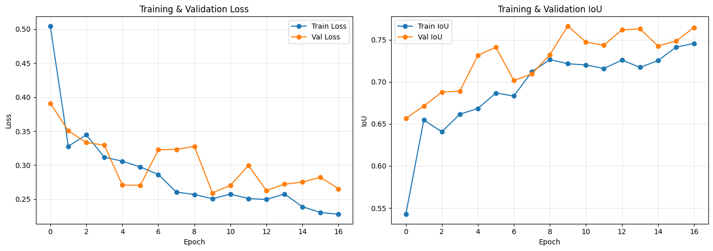
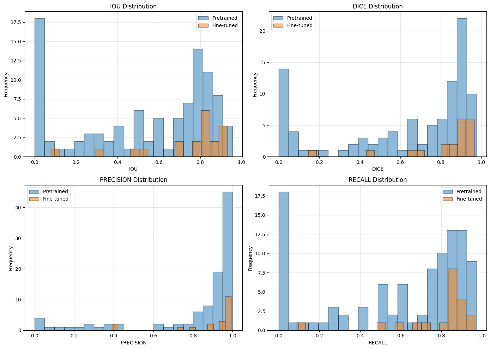
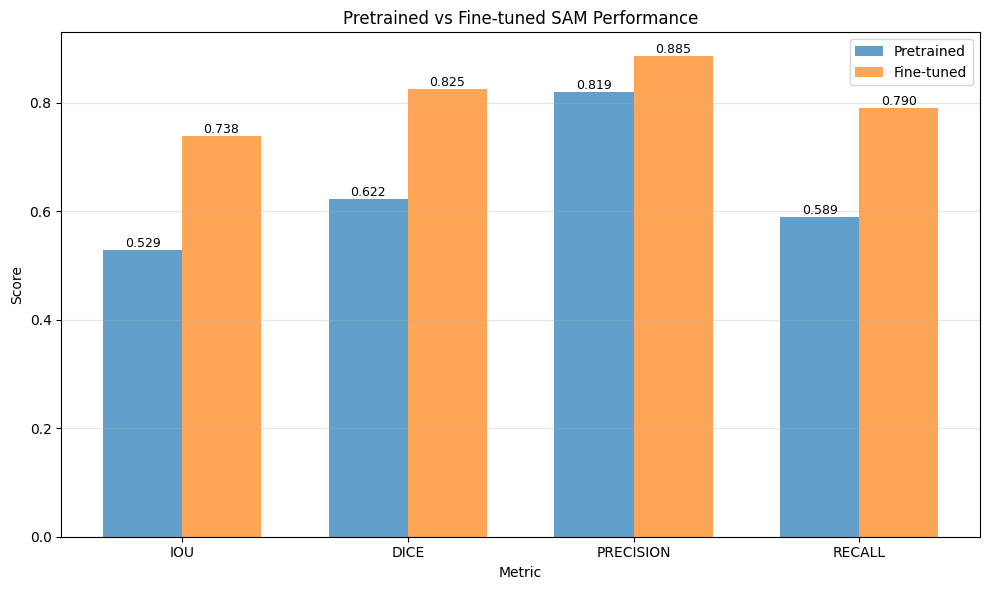
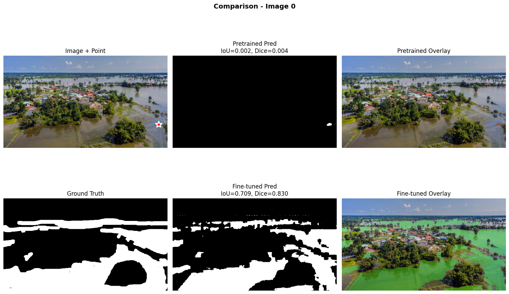
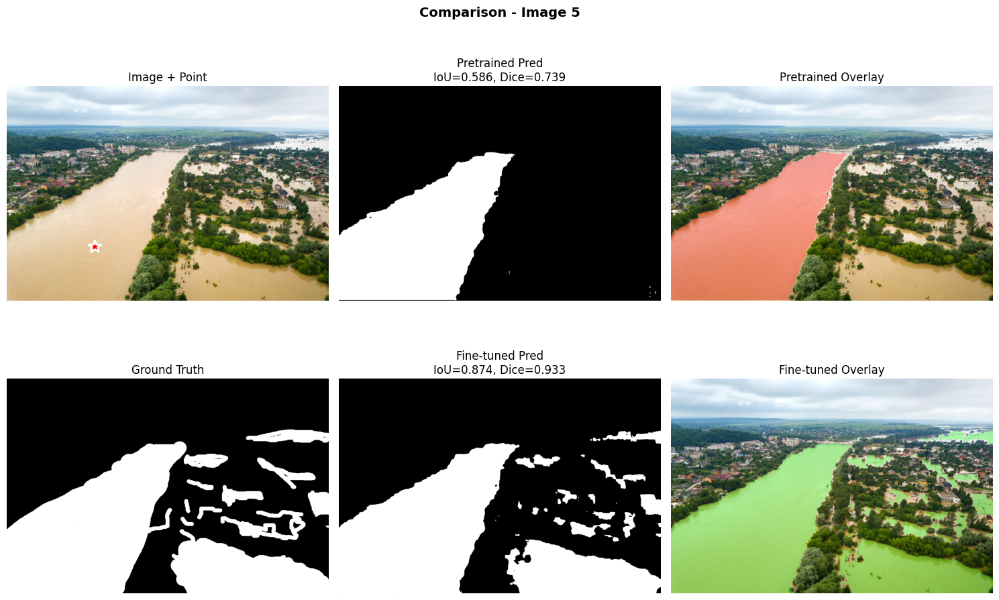
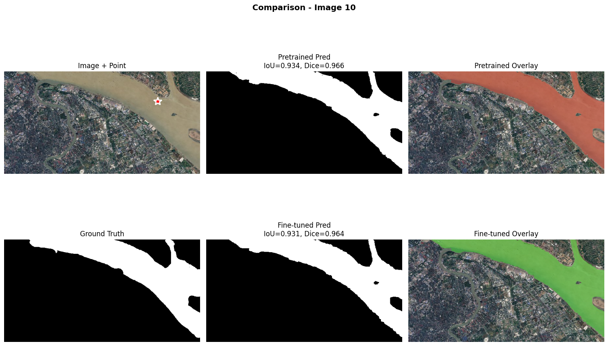
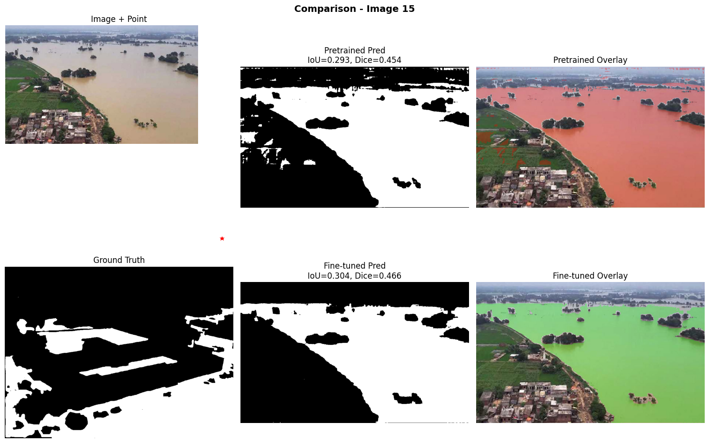
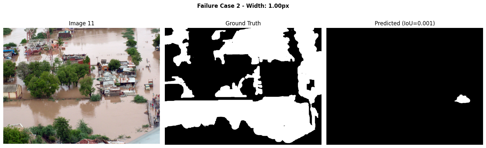

# **Práctica 12: SAM Segmentation - Pretrained vs Fine-tuned**

- [Consigna](https://juanfkurucz.com/ucu-ia/ut3/12-sam-segmentation-assignment/)
- [Google Colab](https://colab.research.google.com/drive/1BmYiFArf-yov4Gr8928eh91Bl_p4ePcz?usp=sharing)

### **Introducción**

En este práctico se implementó un sistema de segmentación de imágenes basado en **Segment Anything Model (SAM)**, con el objetivo de evaluar su desempeño en un caso de negocio relevante: la **detección y delimitación de zonas inundadas** para aplicaciones de *disaster monitoring* y respuesta temprana ante emergencias. La tarea se centró en comparar el rendimiento del **SAM preentrenado en modo zero-shot** frente a una **versión fine-tuned** específicamente adaptada al dominio de inundaciones, analizando cómo el modelo generalista de Meta se comporta frente a un problema altamente sensible, donde la precisión de las máscaras puede impactar directamente en la toma de decisiones operativas.

A lo largo del trabajo se exploraron diferentes tipos de *prompts* (points y boxes), se ajustaron componentes clave del modelo y se evaluaron las mejoras obtenidas después del proceso de fine-tuning, tanto a nivel de delimitación de bordes como de reducción de falsos positivos y errores generados por reflejos o sombras. Esta implementación permitió no solo comprender la arquitectura interna de SAM, sino también reflexionar acerca de su viabilidad para un eventual despliegue en sistemas reales de gestión de emergencias y sobre las necesidades de datos, adaptación y evaluación que este tipo de soluciones requiere.

### **Descripción y análisis preliminar del dataset de inundaciones**

La figura presenta una muestra representativa del **dataset de Flood Area Segmentation**, donde se observa para cada caso la **imagen aérea original** (columna izquierda) acompañada de su **máscara binaria de referencia** (columna derecha). Las máscaras indican en color blanco las zonas cubiertas por agua y en negro las áreas no inundadas, funcionando como *ground truth* para entrenar y evaluar modelos de segmentación.

Las imágenes muestran una notable **variabilidad en condiciones visuales**, incluyendo diferencias en iluminación, presencia de sombras, reflejos del cielo o edificaciones sobre la superficie del agua, vegetación parcialmente sumergida y diversos niveles de turbidez del agua. Esta heterogeneidad es especialmente relevante para el entrenamiento del modelo, ya que incrementa la complejidad del problema e introduce múltiples fuentes potenciales de error.

En términos generales, se aprecia que varias máscaras presentan **contornos poco definidos**, áreas pequeñas dispersas y regiones con bordes irregulares, lo cual refleja tanto desafíos inherentes del dataset como limitaciones de segmentación manual. Estas características son importantes, dado que influyen directamente en la estabilidad y precisión del modelo durante el fine-tuning.

Este análisis preliminar confirma que el caso de uso requiere un modelo capaz de manejar un dominio visual complejo, con alta variabilidad y presencia de elementos que pueden confundirse fácilmente con agua (techos oscuros, caminos mojados, vegetación sombreada). Esto justifica el uso de un enfoque comparativo entre **SAM preentrenado** y **SAM fine-tuneado**, de modo de evaluar qué tan bien cada versión se adapta a estas condiciones reales de desastre.

### **Descripción de la predicción con Point Prompt**

La figura muestra el funcionamiento del modelo SAM utilizando un **point prompt**, es decir, una única marca manual indicando un píxel perteneciente a la clase “agua”. En la primera columna se observa la imagen original con el punto rojo que guía al modelo hacia la región que debe segmentar. Este tipo de prompt proporciona a SAM una indicación mínima pero directa sobre qué región corresponde al foreground.

La segunda columna presenta la **máscara de ground truth**, utilizada como referencia para evaluar el desempeño del modelo. En la tercera columna se muestra la **máscara predicha** por SAM para ese punto, junto con el **score de confianza**, que en este caso es elevado (0.97), indicando que el modelo considera muy probable que la región segmentada corresponde efectivamente a la clase buscada.

Finalmente, la cuarta columna muestra un **overlay** donde la parte segmentada se resalta en rojo sobre la imagen original. Esta visualización permite verificar intuitivamente si el modelo logra capturar correctamente la extensión de las áreas inundadas. En este ejemplo, el modelo consigue delinear la mayor parte de la superficie de agua, aunque pueden observarse pequeñas discrepancias en áreas con reflejos, zonas oscuras o vegetación parcialmente sumergida, lo cual es típico en tareas de flood segmentation.

En conjunto, la figura ilustra cómo SAM puede generar una segmentación razonablemente precisa con una interacción mínima por parte del usuario, evidenciando la utilidad del enfoque prompt-based en contextos de respuesta rápida ante desastres.

### **Predicción con Box Prompt y análisis de errores**

La figura ilustra el comportamiento de SAM cuando se utiliza un **box prompt** para segmentar el área inundada. En la primera columna se muestra la imagen original con un rectángulo rojo que encierra la región de interés; este cuadro funciona como una indicación más “global” que el point prompt, ya que le dice al modelo que toda el área relevante se encuentra dentro de esos límites.

La segunda columna presenta la **máscara de ground truth**, mientras que la tercera muestra la **máscara predicha** por SAM a partir del box prompt, junto con un **score de confianza muy alto (0.99)**. Visualmente se aprecia que el modelo logra capturar de forma consistente la mayor parte de la superficie de agua, manteniendo la continuidad de los cuerpos inundados y respetando bastante bien la estructura de los canales y zonas anegadas.

La cuarta columna muestra un mapa de **diferencias píxel a píxel** entre la predicción y el ground truth:

- En **rojo** se representan los *false positives* (píxeles que el modelo marcó como agua pero que no están en la referencia).
- En **verde** se muestran los *false negatives* (píxeles de agua en la referencia que el modelo no detectó).
- En **gris** se encuentran los aciertos.

Este análisis permite observar que los principales errores se concentran en los bordes de los cuerpos de agua y en zonas con vegetación o estructuras parcialmente sumergidas, donde la transición entre agua y no-agua es ambigua. En conjunto, la figura evidencia que el box prompt tiende a producir una segmentación más completa y coherente a nivel global que el point prompt, aunque sigue siendo sensible a detalles finos en los límites de la inundación.

### Comparación cuantitativa entre *point prompts* y *box prompts* en SAM preentrenado

La figura muestra la **distribución de métricas de segmentación** (IoU, Dice, Precision y Recall) para todo el dataset de inundaciones, comparando el desempeño de SAM preentrenado cuando se lo guía con *point prompts* (azul) versus *box prompts* (naranja).

En los histogramas de **IoU** y **Dice** se observa un patrón claro:

- Los **box prompts** concentran la mayor parte de los ejemplos en valores altos (≈0.75–0.9), con poca masa en valores cercanos a 0.
- Los **point prompts** presentan una distribución bimodal: un grupo de imágenes con métricas razonables, pero también muchos casos con IoU y Dice casi nulos, lo que indica fallas completas en la segmentación cuando el punto no es suficientemente informativo para el modelo.

En **Precision**, ambos tipos de prompts tienden a valores altos (cerca de 0.9–1.0), lo que sugiere que, cuando el modelo etiqueta un píxel como agua, suele acertar. Sin embargo, en **Recall** se aprecia la principal diferencia:

- Los **box prompts** logran *recalls* consistentemente altos, indicando que el modelo captura la mayor parte del área inundada.
- Los **point prompts** muestran nuevamente muchos casos con *recall* cercano a 0, es decir, imágenes donde gran parte del agua queda sin detectar.

En conjunto, estos resultados cuantitativos refuerzan la evidencia visual: para el caso de uso de **flood segmentation**, los **box prompts son más robustos y consistentes** que los *point prompts*, especialmente en términos de cobertura de las zonas inundadas (IoU, Dice y Recall), lo que los hace más adecuados para un escenario operativo de monitoreo de desastres.

### Evolución del entrenamiento del SAM fine-tuneado

La figura muestra las curvas de **pérdida (loss)** y de **IoU** para los conjuntos de *training* y *validation* a lo largo de 17 épocas de entrenamiento del modelo SAM fine-tuneado sobre el dataset de inundaciones.

En el primer gráfico se observa que la **training loss** desciende de forma marcada al inicio y continúa bajando de manera más suave en las últimas épocas, lo que indica que el modelo sigue ajustándose a los datos de entrenamiento. La **validation loss** también muestra una reducción clara respecto a las primeras épocas, con cierta variabilidad entre epoch y epoch, pero sin un incremento sostenido que sugiera sobreajuste fuerte. En conjunto, esto sugiere un proceso de optimización estable, donde el modelo logra mejorar su capacidad de reconstruir las máscaras sin degradar el desempeño en validación.

En el segundo gráfico se presenta la evolución del **IoU**. Tanto el **train IoU** como el **val IoU** aumentan de forma consistente a lo largo del entrenamiento, pasando de valores iniciales cercanos a ~0.55–0.65 hasta estabilizarse alrededor de ~0.72–0.76 en validación. El hecho de que la curva de validación se mantenga sistemáticamente por encima o muy cercana a la de entrenamiento indica que el modelo generaliza razonablemente bien al conjunto de validación y que el fine-tuning efectivamente mejora la calidad de las segmentaciones frente al SAM preentrenado en modo zero-shot.

En síntesis, las curvas de entrenamiento muestran un **proceso de convergencia saludable**, sin señales fuertes de colapso o sobreajuste extremo, y respaldan cuantitativamente la decisión de detener el entrenamiento alrededor de estas épocas.

### Comparación del rendimiento entre SAM preentrenado y SAM fine-tuneado

Las figuras muestran una comparación integral entre el desempeño del **SAM preentrenado** (zero-shot) y el **SAM fine-tuneado** sobre el dominio específico de inundaciones. Se presentan tanto las distribuciones de métricas para todas las imágenes evaluadas (IoU, Dice, Precision y Recall) como un gráfico resumen con los valores promedio para cada métrica.

### **1. Distribución de métricas (Histogramas)**

En los histogramas se observa una mejora clara y consistente del modelo fine-tuneado respecto al preentrenado:

- **IoU y Dice:**
    
    El modelo preentrenado muestra una distribución bimodal: un grupo de imágenes con buen desempeño y otro grupo con IoU y Dice cercanos a cero, lo que refleja fallas completas de segmentación.
    
    Luego del fine-tuning, desaparece casi por completo la masa acumulada en valores bajos, y las predicciones se concentran en rangos altos (≈0.75–0.95), indicando segmentaciones más estables y precisas.
    
- **Precision:**
    
    En ambos modelos la precisión es relativamente alta, lo que significa que cuando el modelo predice “agua”, generalmente acierta. Sin embargo, el fine-tuneado reduce falsos positivos residuales y desplaza la distribución ligeramente hacia valores más altos.
    
- **Recall:**
    
    Este es el punto donde la mejora es más importante.
    
    El modelo preentrenado tiene muchos casos donde el recall es cercano a cero (el modelo casi no detecta agua). Tras el fine-tuning, estos casos extremos desaparecen, y la distribución se concentra alrededor de 0.75–0.9, mostrando que el modelo captura mucho mejor la extensión completa de las zonas inundadas.
    

En conjunto, estas distribuciones evidencian que el fine-tuning no solo mejora el promedio, sino la **consistencia** del modelo, eliminando casos de fallas catastróficas.

---

### **2. Comparación de métricas promedio (Bar chart)**

El gráfico de barras resume la mejora porcentual del modelo fine-tuneado:

| Métrica | Pretrained | Fine-tuned | Mejora |
| --- | --- | --- | --- |
| **IoU** | 0.529 | 0.738 | **+39.5%** |
| **Dice** | 0.622 | 0.825 | **+32.7%** |
| **Precision** | 0.819 | 0.885 | **+8.0%** |
| **Recall** | 0.589 | 0.790 | **+34.1%** |

Los mayores incrementos se dan en **IoU** y **Recall**, lo que es coherente con el problema: el SAM preentrenado fallaba especialmente en capturar toda el área inundada, mientras que el fine-tuning permitió al modelo aprender mejor las texturas, tonalidades y patrones del agua en escenarios reales de desastre.

La **precisión** mejora menos porque ya era razonablemente alta en el preentrenado, pero igualmente se observa una pequeña ganancia al reducir falsos positivos.

---

### **Conclusión**

Los resultados demuestran que el fine-tuning adapta de manera efectiva a SAM al dominio de inundaciones, logrando:

- segmentaciones más completas,
- menos fallas extremas,
- mayor consistencia entre imágenes,
- y mejor equilibrio entre precisión y cobertura.

Esto confirma que, aunque SAM es poderoso en modo zero-shot, necesita adaptación para escenarios especializados como el monitoreo de desastres por inundaciones.

### Análisis cualitativo: pretrained SAM vs SAM fine-tuneado

Las figuras muestran ejemplos representativos de cómo cambia la segmentación de inundaciones al pasar de **SAM preentrenado** a **SAM fine-tuneado**, manteniendo el mismo *point prompt* en cada imagen.

En el **primer ejemplo (Image 0)** se observa un caso de **fallo casi total del modelo preentrenado**: a pesar de que el punto se ubica claramente sobre el agua, la predicción sólo marca una pequeña región aislada, con IoU ≈ 0.002 y Dice ≈ 0.004. Tras el fine-tuning, el modelo logra recuperar casi toda el área inundada, con IoU ≈ 0.71 y Dice ≈ 0.83, y el overlay verde muestra una cobertura mucho más coherente de los cuerpos de agua alrededor del poblado.

En **Image 5** el modelo preentrenado ya consigue una segmentación razonable del río principal (IoU ≈ 0.59, Dice ≈ 0.74), pero ignora varias zonas inundadas en la ciudad y en los márgenes. El modelo fine-tuneado mejora notablemente los bordes y la cobertura de las zonas de agua, alcanzando IoU ≈ 0.87 y Dice ≈ 0.93, con un overlay donde casi toda el agua —tanto el río como las áreas anegadas— queda correctamente identificada.

En **Image 10** se ilustra un caso donde el **modelo preentrenado ya funciona muy bien** (IoU ≈ 0.93, Dice ≈ 0.97) y el fine-tuned mantiene un rendimiento similar. Aquí el beneficio del fine-tuning no es tanto corregir un error catastrófico, sino **preservar el buen desempeño** en escenas relativamente “fáciles”, donde el contraste entre agua y tierra es alto y la geografía es más simple.

Finalmente, **Image 15** muestra un escenario difícil, con agua muy extendida, pequeñas islas de vegetación y construcciones parcialmente inundadas. Tanto el modelo preentrenado como el fine-tuneado tienen dificultades: las métricas son moderadas (IoU ≈ 0.29→0.30, Dice ≈ 0.45→0.47) y se observan errores en los bordes y en objetos pequeños flotando. Sin embargo, incluso en este caso complejo, el fine-tuning logra una ligera mejora y reduce algunos vacíos en la segmentación.

En conjunto, estos ejemplos cualitativos confirman los resultados cuantitativos:

- el fine-tuning **corrige fallos extremos** del SAM preentrenado,
- mejora la **cobertura y continuidad** de las áreas inundadas,
- mantiene un buen rendimiento en escenas simples,
- pero todavía enfrenta desafíos en imágenes con **texturas ambiguas, objetos pequeños y geometrías complejas**, que serían críticas de abordar antes de un despliegue operativo en sistemas reales de monitoreo de desastres.

### **Análisis de casos de falla del SAM preentrenado**

Las figuras muestran algunos de los **peores casos de desempeño** del SAM preentrenado al intentar segmentar áreas inundadas usando un *point prompt*. En estos ejemplos, el modelo produce un IoU prácticamente nulo, es decir, **no logra identificar la región de agua**, a pesar de que visualmente es claramente predominante.

### **Failure Case 1 — IoU ≈ 0.000**

En esta imagen, el área inundada ocupa una porción importante del frame, con bordes complejos y múltiples objetos flotantes o parcialmente sumergidos. Sin embargo, el modelo preentrenado produce únicamente un pequeño segmento aislado. Esto ocurre porque la textura del agua tiene un color similar a tierra húmeda y a sombras, produciendo una fuerte confusión para SAM en modo zero-shot.

### **Failure Case 2 — IoU ≈ 0.001**

Este caso presenta estructuras, árboles, caminos y múltiples superficies reflectivas. SAM identifica una pequeña región, pero pierde completamente la forma global del cuerpo de agua. El contraste bajo y la gran cantidad de elementos verticales (vegetación, construcciones) parecen interferir con la capacidad del modelo de agrupar áreas continuas de agua.

### **Failure Case 3 — IoU ≈ 0.002**

A pesar de que la imagen muestra una extensa inundación y la marca del prompt está bien posicionada, el modelo produce un resultado casi vacío. Este tipo de falla extrema indica que el modelo preentrenado **no tiene una representación robusta del patrón visual del agua inundada**, especialmente cuando presenta turbidez alta, reflejos o mezcla con vegetación baja.

---

### **Características comunes observadas en los casos de falla**

Los análisis cuantitativos indican que en estos casos:

- la anchura promedio del cuerpo de agua es relativamente baja (en píxeles),
- las máscaras verdaderas presentan **formas irregulares**,
- hay gran variabilidad de texturas dentro de la clase “agua” (reflejos, sombras, turbidez, vegetación sumergida),
- y el contraste entre agua y tierra es reducido.

Estas condiciones generan segmentos de agua difíciles de identificar para SAM sin adaptación específica al dominio.

---

### **Impacto del fine-tuning**

El análisis global muestra que:

- el SAM preentrenado presenta **muchos failure cases severos** (IoU < 0.4),
- mientras que el modelo fine-tuneado **reduce drásticamente** la cantidad de fallas,
- logrando una reducción cercana al **80%** en los casos de segmentación catastrófica.

Esto confirma que el fine-tuning no solo mejora el promedio de las métricas, sino que **corrige los casos en los que el modelo preentrenado colapsa completamente**, volviéndose mucho más confiable para un sistema de monitoreo de inundaciones.

