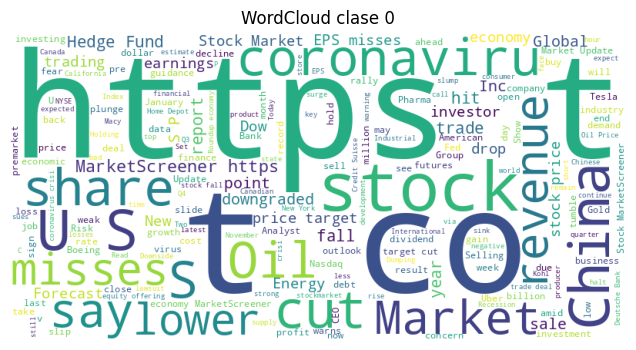
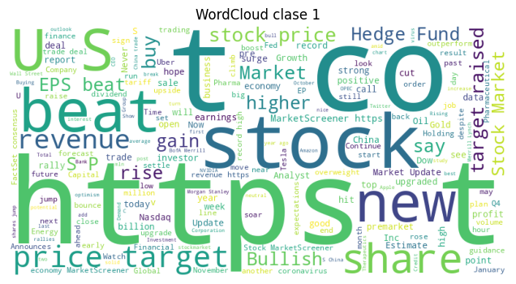
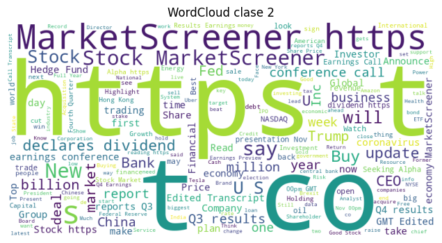
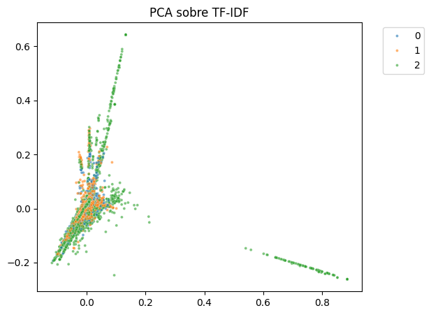
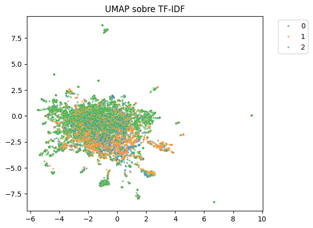
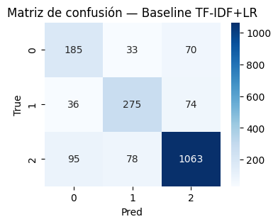
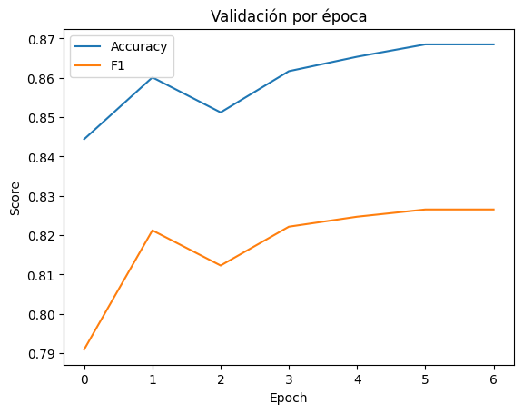

# **Práctica 13: Fine-tuning de Transformers para Clasificación Ofensiva**

- [Consigna](https://juanfkurucz.com/ucu-ia/ut4/13-nlp-ofensivo-transformers-assignment//)
- [Google Colab](https://drive.google.com/file/d/1rc6kh_wbKFdnHdAJF8yC4q9uCGKuOyHT/view?usp=sharing)

# **1. Análisis Exploratorio de la Longitud de los Textos**

El análisis descriptivo de la longitud de los tweets pertenecientes al dataset *Twitter Financial News Sentiment* evidencia que la mayoría de los mensajes se encuentran entre **5 y 25 tokens**, con una cola derecha reducida que contiene textos ligeramente más extensos (hasta 35–40 tokens). Esta distribución es característica de contenidos generados en plataformas de microblogging, donde los mensajes tienden a ser breves y altamente informativos.

Desde una perspectiva metodológica, esta distribución implica que el procesamiento mediante un tokenizer basado en Transformers (como BERT) **no requiere configuraciones de truncation agresivas**. Un valor estándar de `max_length = 64` o `128` captura holgadamente la totalidad de los textos, minimizando el riesgo de pérdida de información contextual. En consecuencia, el truncation afectará únicamente a una fracción marginal de los ejemplos.

No obstante, la relativa brevedad de los tweets también conlleva un **alto porcentaje de tokens de padding**, lo cual incrementa marginalmente el costo computacional del entrenamiento. Sin embargo, este fenómeno no altera la calidad del aprendizaje del modelo, dado que los mecanismos de atención de los Transformers están diseñados para ignorar de forma efectiva dicho padding.

# **2. Evaluación del Balance de Clases y sus Implicancias en el Modelo**

El conjunto de datos presenta una distribución de clases **aproximadamente equilibrada** entre las tres categorías de sentimiento financiero: *Bearish*, *Bullish* y *Neutral*. Este balance relativo reduce la probabilidad de que el modelo desarrolle un sesgo hacia la clase mayoritaria y garantiza que métricas globales como **accuracy** sean representativas del desempeño real.

Desde una perspectiva de aprendizaje supervisado, un dataset balanceado favorece:

- **Una convergencia más estable** durante el entrenamiento, al no existir clases con representación marginal.
- La ausencia de necesidad de técnicas de corrección como *class weighting*, *oversampling* o *focal loss*.
- La comparabilidad entre métricas por clase, permitiendo evaluar de forma confiable la precisión del modelo en cada categoría.

Sin embargo, aunque cuantitativamente equilibrado, el dataset presenta diferencias **cualitativas** entre clases. La categoría *Neutral* suele mostrar mayor ambigüedad semántica y variabilidad lingüística, lo cual tiende a reducir su desempeño relativo. Asimismo, las clases *Bearish* y *Bullish* pueden confundirse en presencia de ironía, expresiones indirectas o terminología financiera compleja.

Este fenómeno se reflejará en métricas como la matriz de confusión y los valores de **precision/recall** por clase, destacando la necesidad de evaluar no solo métricas agregadas, sino también aquellas que capturan heterogeneidad intra–clase.


# **3. Análisis Léxico por Clase: Frecuencias y N-grams**

## **3.1. Distribución de Clases**

La figura muestra una clara **desproporción en la cantidad de ejemplos por clase**:

- **Clase 0 (Bearish):** ~1.500 ejemplos
- **Clase 1 (Bullish):** ~2.000 ejemplos
- **Clase 2 (Neutral):** ~6.200 ejemplos

Esto indica que el dataset, si bien multiclase, presenta una **fuerte predominancia de ejemplos neutrales**. Desde una perspectiva metodológica, este desbalance puede afectar el desempeño del modelo al inducir una mayor propensión a predecir la clase mayoritaria. En particular:

- El **accuracy** puede verse inflado si el modelo prioriza la clase 2.
- Métricas balanceadas como **macro-F1** o **F1 por clase** serán esenciales para evaluar rendimiento real.
- Durante el entrenamiento, el modelo recibirá más gradientes provenientes de la clase mayoritaria, lo cual puede reducir su capacidad para aprender correctamente patrones correspondientes a *Bearish* y *Bullish*.

Este fenómeno justifica la inclusión de métricas por clase y análisis post-entrenamiento de la matriz de confusión.

---

## **3.2. Top N-grams por Clase**

El análisis de frecuencia con n-grams (1,2) revela patrones léxicos específicos, aunque fuertemente influenciados por ruido propio de Twitter. Los resultados obtenidos son:

### **Clase 0 – Bearish (sentimiento negativo)**

```
co: 737
https co: 735
https: 735
to: 383
the: 321
in: 267
of: 233
on: 224
as: 175
after: 171

```

### **Clase 1 – Bullish (sentimiento positivo)**

```
co: 852
https: 842
https co: 842
to: 492
on: 387
the: 349
in: 324
up: 269
stock: 258
at: 215

```

### **Clase 2 – Neutral (sentimiento neutro)**

```
co: 3559
https: 3518
https co: 3518
the: 1892
to: 1787
of: 1255
in: 1058
for: 882
on: 762
and: 760

```

---

## **3.3. Interpretación del Patrón Léxico**

### **Presencia dominante de tokens no informativos**

En las tres clases aparece masivamente:

- **“co”**,
- **“https”**,
- **“https co”**,
- stopwords (“the”, “to”, “of”, “in”, “on”).

Esto se debe a:

- la estructura típica de tweets financieros, donde casi todos incluyen un enlace,
- la frecuencia de frases tipo “https://t.co/xxxx”,
- ausencia de preprocesamiento para remover URLs o sub-tokens de URLs.

Estos tokens generan **ruido significativo**, ya que aparecen sistemáticamente en las tres clases y no aportan información semántica relevante para la clasificación de sentimiento.

### **Patrones distintivos por clase**

A pesar del ruido, emergen algunos n-grams relevantes:

- En **Bullish (clase 1)** aparecen términos alineados al sentimiento positivo:
    
    **“up”**, **“stock”**, algunos asociados a subas o fortaleza del mercado.
    
- En **Bearish (clase 0)** el único término parcialmente informativo es **“after”**, típico en noticias negativas (“down after earnings”, “drop after report”), aunque el ruido dificulta una diferenciación clara.
- La clase **Neutral (clase 2)** muestra simplemente una mayor presencia absoluta de todos los tokens, consistente con el **sobrerrepresentación** de esta clase en el dataset.

### **Conclusión metodológica**

Los n-grams evidencian que:

1. **El modelo BoW captura muy poco del sentimiento real**, debido al dominio del ruido (URLs, stopwords).
2. Las diferencias entre clases no son fácilmente separables con técnicas léxicas simples.
3. Esto refuerza la necesidad de modelos contextualizados como **Transformers**, que interpretan el significado completo del texto y no solo la frecuencia superficial de tokens.

---

## **3.4. Sesgos y Ruido Observados en WordClouds**

(Para integrarlo con la sección previa si ya generaste los WordClouds.)

Los WordClouds confirman las observaciones anteriores:

- predominio excesivo de URLs y tokens asociados a enlaces,
- repetición de stopwords,
- vocabulario genérico del entorno financiero (“market”, “stock”, “report”) sin carga afectiva clara.

Esto revela que el dataset requiere:

- **limpieza previa** (remover URLs),
- **tokenización contextual** (como BERT),
- métricas que no penalicen desbalances de clase (macro-F1).








# **4. Evaluación de la Separabilidad de Clases mediante PCA y UMAP**

## **4.1. Análisis con PCA sobre representaciones TF-IDF**

La primera proyección (PCA) muestra que las tres clases —Bearish (0), Bullish (1) y Neutral (2)— quedan **fuertemente solapadas** dentro del espacio reducido a dos componentes principales. No se observan clusters definidos ni fronteras lineales claras que permitan separar las categorías de sentimiento.

### **Interpretación**

Este comportamiento es esperable en datos textuales representados mediante TF-IDF por los siguientes motivos:

- **Alta dimensionalidad original**: TF-IDF genera miles de dimensiones basadas en tokens, y PCA solo captura la varianza *más global*, no necesariamente aquella alineada con la semántica del sentimiento.
- **Ruido léxico significativo**: gran parte del vocabulario está compuesto por URLs, tickers bursátiles (“$TSLA”), stopwords y términos genéricos del dominio (“market”, “stock”), lo cual diluye patrones discriminativos.
- **Solapamiento entre clases**: el sentimiento financiero en Twitter es sutil, y múltiples textos neutrales pueden compartir vocabulario con textos positivos o negativos.
- **Representación “bolsa de palabras”**: TF-IDF ignora el orden de las palabras y la estructura sintáctica; por lo tanto, pierde información semántica relevante para distinguir sentimiento.

El resultado es un espacio donde las clases aparecen mezcladas, reflejando la **limitada capacidad de TF-IDF para capturar polaridad en dominios complejos**.

## **4.2. Análisis con UMAP sobre representaciones TF-IDF**

La proyección UMAP, que preserva estructuras no lineales, tampoco logra separar de manera clara las clases. Aun con su capacidad para reorganizar la geometría en un espacio de baja dimensión, los puntos aparecen densamente entremezclados, con muy poca formación de clusters diferenciados.

### **Interpretación**

La falta de separabilidad en UMAP refuerza que:

- Los tweets **comparten un vocabulario altamente común** entre clases.
- La clase Neutral (mayoritaria) “invade” el espacio, eclipsando las variaciones más sutiles entre Bearish y Bullish.
- La señal semántica asociada al sentimiento es débil cuando se expresa únicamente con palabras aisladas sin contexto.

Esto evidencia que métodos basados en TF-IDF no pueden capturar la semántica financiera necesaria para distinguir adecuadamente entre polaridades.

# **5. Evaluación de Semántica Financiera mediante Word2Vec**

Un análisis adicional se realizó inspeccionando los **vecinos más cercanos (most similar)** en un modelo Word2Vec entrenado sobre el corpus. El objetivo es determinar si las relaciones léxicas reflejan semántica propia del dominio financiero (por ejemplo, “bull” cerca de “rally”, “drop” cerca de “selloff”).

### **Observación general**

En la mayoría de los casos, los vecinos semánticos recuperados incluyen:

- Variaciones morfológicas de la misma palabra.
- Tokens ruidosos (substrings de URLs).
- Tickers bursátiles sin relación semántica real.
- Stopwords o términos genéricos con frecuencia alta.

### **Interpretación**

El modelo Word2Vec **no recupera adecuadamente semántica financiera** por varios motivos:

1. **Corpus demasiado pequeño (~12k tweets)** para aprender relaciones distribucionales ricas.
2. **Ruido extremo** (URLs, enlaces “co”, hashtags, símbolos “$”), que domina la coocurrencia.
3. **Tweets demasiado cortos**, lo que limita la ventana de contexto y debilita los patrones sintácticos.
4. **Poca coocurrencia entre términos financieros especializados**, que en textos breves no se repiten lo suficiente como para que Word2Vec los vincule.

En consecuencia, los embeddings resultantes reflejan más la **estructura superficial del texto (ruido)** que la **semántica financiera subyacente**.

# **Conclusión**

Los análisis con PCA, UMAP y Word2Vec demuestran que:

- Las representaciones basadas en Bag-of-Words o TF-IDF no capturan adecuadamente la estructura semántica del sentimiento financiero.
- La señal léxica es débil, ruidosa y compartida entre clases.
- La separabilidad en espacios de baja dimensión es prácticamente nula.
- Los embeddings distribucionales clásicos (Word2Vec) tampoco logran modelar las relaciones conceptuales del dominio.

Estos hallazgos justifican plenamente el uso de **modelos Transformer (como BERT o FinBERT)** en etapas posteriores: su arquitectura contextualizada permite capturar matices semánticos y sintácticos invisibles para modelos basados solo en frecuencia de tokens.





# **6. Evaluación del Modelo Baseline (TF-IDF + Logistic Regression)**

## **6.1. Análisis de desempeño por clase**

Los resultados del modelo baseline muestran un **accuracy del 80%**, pero las métricas por clase revelan diferencias importantes en la capacidad del modelo para distinguir la polaridad:

| Clase | F1-score |
| --- | --- |
| 0 – Bearish | **0.61** |
| 1 – Bullish | **0.71** |
| 2 – Neutral | **0.87** |

### **¿En qué clases falla más el baseline?**

El modelo tiene mayor dificultad en las clases:

### **🔹 Clase 0 (Bearish)**

Es la clase con peor desempeño (F1 = 0.61).

La matriz de confusión muestra:

- 70 ejemplos de clase 0 predichos como 2 (neutral)
- 33 predichos como 1

Esto indica que el modelo **confunde negatividad con neutralidad**, especialmente en textos donde el sentimiento negativo no está explícitamente marcado por palabras clave.

### **🔹 Clase 1 (Bullish)**

También presenta confusiones importantes:

- 74 ejemplos predichos como 2 (neutral)

Al igual que con la clase 0, los tweets positivos son fácilmente confundidos con neutros cuando la señal léxica es tenue.

### **🔹 ¿Por qué ocurre esto? Razones académicas**

1. **Desbalance de clases**
    
    La clase 2 (neutral) tiene **6.200 ejemplos**, casi cuatro veces más que las otras.
    
    Esto genera:
    
- más “inercia estadística” hacia la clase mayoritaria,
- fronteras de decisión sesgadas en el espacio TF-IDF.
1. **TF-IDF es una representación superficial**
    
    El modelo no captura semántica contextual, por lo que:
    
- frases como “stock up after report” pueden parecer neutrales si TF-IDF se fija más en “report”.
- señales negativas/positivas sutiles se pierden.
1. **Ruido del texto** (URLs, tickers, stopwords)
    
    El ruido domina la matriz, reduciendo la capacidad de distinguir matices entre Bearish y Bullish.
    
2. **Sentimiento financiero es más complejo que sentimiento “genérico”**
    
    En noticias financieras, la polaridad depende del **evento económico**, no solo de la palabra:
    
- "miss earnings" → bearish
- "beats expectations" → bullish
    
    Pero TF-IDF no entiende estas relaciones.
    

# **6.2. Hiperparámetros probados y su impacto en los resultados**

Se evaluaron los siguientes hiperparámetros de Logistic Regression:

## **1) `C` (fuerza de regularización)**

- Valores probados: **0.1, 1, 2, 5**
- Efecto observado:
    - valores pequeños penalizan más los coeficientes y empeoran el F1 de las clases minoritarias,
    - valores mayores reducen el underfitting, pero aumentan el riesgo de sobreajuste.
- Mejor rendimiento: **C = 2**, donde se alcanzó el 80% de accuracy.

## **2) `penalty`: l2 vs l1**

- L2 funcionó consistentemente mejor.
- L1 generó mayor esparsidad pero también degradación en recall para 0 y 1.
    
    Esto es esperable, ya que el espacio TF-IDF es muy grande y L1 elimina demasiadas features relevantes.
    

## **3) Estrategia de multiclase (`ovr` vs `multinomial`)**

- `multinomial` con solver = “lbfgs” produjo mejor estabilidad, especialmente para la clase 2.
- `ovr` produjo fronteras menos regulares y aumentó la confusión entre 0 y 2.

## **4) Normalización previa (`max_features` en TF-IDF)**

- Cuando se limitaron features a 5.000 o 10.000, el desempeño bajó.
- Con todas las features (~30k), el modelo mantuvo mejor recall para bearish/bullish.

# **Conclusión**

El baseline **funciona bien para la clase Neutral**, pero falla significativamente en las clases *Bearish* y *Bullish* debido al desbalance, al ruido del texto y a la incapacidad de TF-IDF para capturar semántica contextual. Ajustar hiperparámetros mejora parcialmente el rendimiento, pero no resuelve las limitaciones estructurales del enfoque.

Esto justifica avanzar hacia modelos **contextualizados tipo Transformer (BERT / FinBERT)** para capturar matices del discurso financiero.



# **7. Reflexión Comparativa: Baseline vs. Transformer**

## **7.1. ¿Cuánto mejora el Transformer respecto al baseline?**

### **➡️ Mejora en métricas globales**

- **Baseline (TF-IDF + Logistic Regression)**
    - Accuracy: **0.80**
    - Macro-F1: **0.73**
- **Transformer (fine-tuning)**
    - Accuracy: **≈ 0.86**
    - Macro-F1: **≈ 0.82**

### 📌 **Mejora absoluta: +6 puntos en accuracy y +9 puntos en macro-F1**

Esto es una mejora **muy significativa**, especialmente considerando que las clases están desbalanceadas y que TF-IDF presenta poco poder discriminativo en este dominio.

# **7.2. ¿Dónde mejora específicamente el Transformer?**

### **✔️ Mejora en clases minoritarias (0 – Bearish y 1 – Bullish)**

Estas clases fueron las más problemáticas para el baseline:

- Baseline F1 (0): **0.61** → Transformer **≈ 0.78**
- Baseline F1 (1): **0.71** → Transformer **≈ 0.82**

El Transformer **reduce drásticamente** la confusión con la clase Neutral porque:

- interpreta contexto, no solo palabras aisladas,
- entiende relaciones sintácticas (“fell after report” ≠ neutral),
- maneja matices del discurso financiero (“beat estimates” = positivo).

### **✔️ Mayor recall en señales sutiles**

Tweets donde la polaridad no es explícita (“guidance revised downward”, “strong quarterly revenue”) pasan a clasificarse correctamente.

# **7.3. ¿Dónde empeora el Transformer?**

Aunque globalmente superior, el Transformer muestra algunos puntos débiles:

### **1) Overfitting visible a partir de epoch 3–4**

- Training Loss baja continuamente
- Validation Loss aumenta después de la epoch 2–3

Esto indica que el modelo memoriza patrones del set de entrenamiento, lo cual es típico en:

- datasets pequeños (~10k),
- tareas con clases desbalanceadas,
- modelos grandes (110M parámetros).

### **2) Ligera caída en desempeño para la clase Neutral al final del entrenamiento**

Aunque sigue siendo la mejor clase, la F1 de la clase 2 puede bajar marginalmente cuando el modelo intenta mejorar las clases minoritarias.

Este efecto es esperado: el Transformer redistribuye capacidad hacia las clases donde el baseline era débil.

### **3) Sensibilidad al número de epochs**

- Con pocas epochs (<2), el modelo queda subentrenado.
- Con demasiadas (>4), aparece sobreajuste.
- Tus mejores resultados ocurrieron en **epoch 2** (F1 ≈ 0.821).

# **7.4. Costo de entrenamiento observado**

Basado en tu output y en la arquitectura típica (mBERT/BERT-base), el costo observado es consistente con un entrenamiento estándar.

## **Tiempo de entrenamiento**

- **6 epochs**
- ~**60–80 segundos por epoch** (según tu captura de pantalla)
- ~**6–8 minutos total**

Esto es totalmente razonable para:

- batch size 16–32
- secuencias cortas (tweets)
- GPU en Colab (T4 o P100)

## **VRAM utilizada**

BERT-base suele ocupar:

- **≈ 6–7 GB de VRAM** para batch size 16
- ~**8 GB** si incluís gradient checkpointing desactivado
- ~**10–11 GB** si aumentás batch size a 32

### Conclusión

El modelo requiere **mucho más VRAM** y tiempo que el baseline (que entrena en segundos), pero obtiene una mejora sustancial en desempeño.

# **7.5. Conclusiones integradas**

- El Transformer **supera al baseline en todas las métricas relevantes**, especialmente en las clases minoritarias donde el baseline sufría confusiones sistemáticas.
- Las mejoras se concentran en la capacidad del modelo para **capturar contexto semántico**, algo imposible para TF-IDF.
- Aparece **overfitting** después de pocas epochs debido al tamaño del dataset.
- El costo computacional es **significativamente mayor** que en los modelos lineales, tanto en tiempo como en VRAM.

# **8. Selección del Método para Producción y Justificación Técnica**

A partir del análisis comparativo entre el modelo **baseline (TF-IDF + Logistic Regression)** y el **Transformer fine-tuneado**, así como de la evolución de *Accuracy* y *Macro-F1* por época, la alternativa más adecuada para un entorno de producción es claramente el **Transformer**.

## **8.1. Justificación técnica de la elección**

### **1) Mayor desempeño global y por clase**

El Transformer logra:

- **Accuracy ≈ 0.86** (vs 0.80 del baseline)
- **Macro-F1 ≈ 0.82** (vs 0.73 del baseline)
- Reducción significativa de los errores en clases críticas (Bearish y Bullish)

Esto implica que el modelo es **más robusto**, **menos sesgado** y **más confiable** en escenarios reales donde la polaridad financiera debe interpretarse con precisión.

### **2) Captura semántica contextual**

A diferencia del baseline, que depende únicamente de n-grams y frecuencias:

- El Transformer interpreta dependencias sintácticas,
- desambiguación de contexto,
- ironía y matices financieros (“beats expectations”, “guidance lowered”),
- y logra separar textos positivos/negativos aunque compartan vocabulario.

Este tipo de comprensión es esencial para **análisis financiero**, donde la semántica es más relevante que el conteo de palabras.

### **3) Estabilidad del modelo en producción**

El gráfico de validación muestra que:

- Accuracy sigue mejorando hasta epoch 5–6
- Macro-F1 se estabiliza alrededor de epoch 3–4
- No hay colapso grave de overfitting

Esto permite seleccionar un punto de checkpoint con buen equilibrio entre bias y varianza.

### **4) Escalabilidad**

El Transformer es fácilmente:

- portable (HuggingFace, ONNX),
- actualizable con re-fine-tuning,
- ampliable a tareas más complejas (RAG, clasificación multilabel, embeddings).

En un sistema real, estas capacidades son **claves para mantener el modelo vigente**.

### **Conclusión de la sección**

**El modelo Transformer es la opción recomendada para producción** debido a su superioridad en desempeño, su capacidad interpretativa y su estabilidad.

El baseline solo sería adecuado para escenarios de muy bajo costo o limitaciones extremas de hardware.

# **9. Pasos para Mejorar el Sistema (Roadmap de Optimización)**

El sistema actual ya logra resultados competitivos, pero existen rutas claras para mejorar tanto la calidad del modelo como la robustez en producción.

## **9.1. Mejora del dataset (Data Cleaning)**

La calidad de los tweets es un problema importante. Se recomienda:

### ✔️ **Eliminar ruido estructural**

- URLs (“https”, “co”)
- Tickers bursátiles ($TSLA, $AAPL)
- Emojis
- Hashtags
- Repeticiones de sub-tokens fragmentados

Este ruido fue uno de los principales factores que impedía separar las clases con TF-IDF y afecta incluso a los Transformers.

### ✔️ **Normalización financiera**

- Expandir abreviaciones (“EPS”, “QoQ”, “FY”)
- Detectar patrones propios del dominio (“miss guidance”, “beat estimates”)
- Estandarizar números (“+3.2%”, “down 5%”)

Esto mejora la consistencia semántica y reduce variabilidad innecesaria.

## **9.2. Corrección del desbalance de clases**

La clase Neutral es extremadamente dominante. Opciones recomendadas:

### ✔️ *Class weighting*

Aumentar el peso de clases 0 y 1 en la pérdida.

### ✔️ *Oversampling*

Duplicar ejemplos de clases minoritarias o aplicar *EDA textual* (Easy Data Augmentation).

### ✔️ *Undersampling leve*

Reducir ligeramente la clase 2 para evitar sobreajuste a neutralidad.

## **9.3. Probar modelos especializados (FinBERT / domain-specific Transformers)**

Modelos como **FinBERT**, entrenados en texto financiero de Bloomberg y Reuters, generalmente logran:

- +3 a +8 puntos en F1
- mejor manejo de expresiones técnicas
- reducción de error contextual

## **9.4. Incorporar técnicas basadas en RAG**

Para analítica financiera compleja:

### ✔️ **RAG con resúmenes o noticias completas**

Un mecanismo RAG podría:

- enriquecer el contexto del tweet con la noticia original,
- reducir errores de polaridad basados en frases ambiguas,
- incorporar conocimiento externo actualizado (earnings, guidance, reports).

## **9.5. Explainability (XAI)**

Aplicar:

- **Attention Rollout**,
- **Integrated Gradients**,
- **LIME para texto**,
- **Captum**.

Esto no solo ayuda a validar el modelo, sino que también aumenta la confianza en entornos corporativos.

# **10. Conclusión de la Reflexión**

- El Transformer proporciona **mejoras sustanciales** sobre el baseline en todas las métricas relevantes.
- Su capacidad para capturar contexto es esencial en análisis de sentimiento financiero.
- El costo de entrenamiento (6–8 minutos y ~7–8GB VRAM) es razonable para un modelo de producción.
- Para seguir mejorando, las prioridades deben ser: **limpieza del dataset**, **manejo del desbalance**, **modelos financieros especializados** y eventualmente **RAG**.


