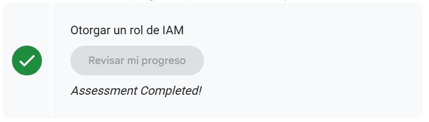
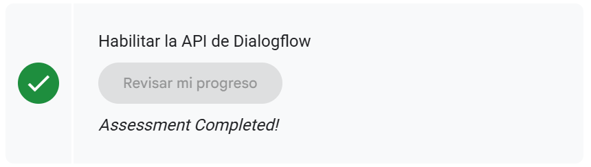

# **UT5-16: Explorando GcloudURL**

- [Lab](https://www.skills.google/focuses/2794?catalog_rank=%7B%22rank%22%3A3%2C%22num_filters%22%3A2%2C%22has_search%22%3Atrue%7D&parent=catalog&search_id=60924676)

## **Recorrido por los labs prácticos de Google Cloud**

## **Introducción a los Laboratorios de Google Cloud**

Como parte de la Unidad 5 del portafolio, incorporé una serie de laboratorios prácticos realizados en **Google Cloud Skills Boost**, la plataforma oficial de Google para adquirir competencias en computación en la nube, infraestructura, seguridad y MLOps. Estos labs se ejecutan mediante **Qwiklabs**, un entorno controlado con credenciales temporales que replica escenarios reales de trabajo en la nube sin requerir una cuenta personal. Esto garantiza prácticas seguras, reproducibles y alineadas con los estándares profesionales utilizados en entornos productivos.

Google Cloud proporciona un ecosistema completo de servicios: desde cómputo, almacenamiento y redes hasta análisis de datos, inteligencia artificial, APIs administradas y herramientas de DevOps/MLOps. En este contexto, los laboratorios introductorios cumplen un rol clave: permiten familiarizarse con la **consola de Google Cloud**, comprender cómo se organizan los recursos dentro de un proyecto, navegar entre servicios y practicar conceptos esenciales como **gestión de roles y permisos (IAM)**, habilitación de APIs y exploración de los distintos servicios disponibles.

El laboratorio inicial, de carácter introductorio, estuvo orientado a dar mis primeros pasos dentro del entorno cloud. Incluyó actividades como acceder con credenciales específicas del lab, explorar la estructura de proyectos, identificar conceptos erróneos comunes sobre la organización de los recursos, navegar el menú de servicios de Google Cloud e inspeccionar la configuración de permisos y roles básicos. También trabajé con la biblioteca de APIs para entender cómo se habilitan o consultan servicios dentro de un proyecto.

Esta etapa es fundamental para cualquiera que vaya a trabajar con sistemas de machine learning en producción: antes de hablar de modelos, pipelines o automatización, es necesario comprender la infraestructura que sustenta todo un sistema en la nube. En mi caso, estos laboratorios me aportaron una base sólida para avanzar hacia prácticas más complejas de MLOps, permitiéndome integrar conceptos técnicos con una mirada de gobernanza, control y buenas prácticas, coherentes con mi formación en Dirección de Empresas, auditoría y sistemas inteligentes.

