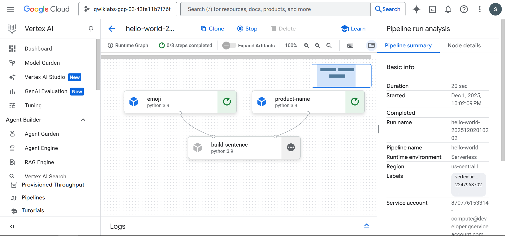
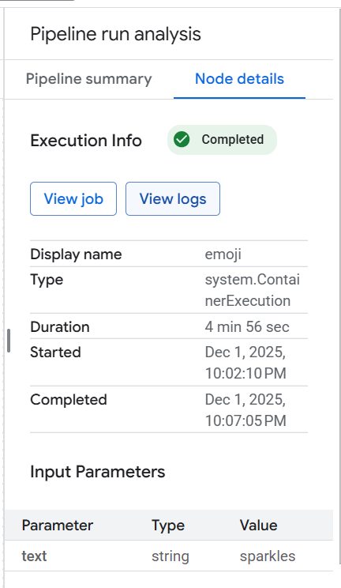
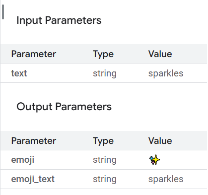
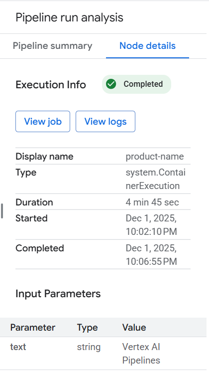
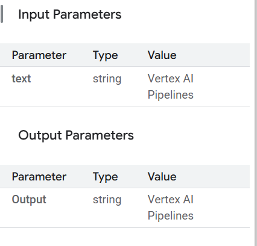
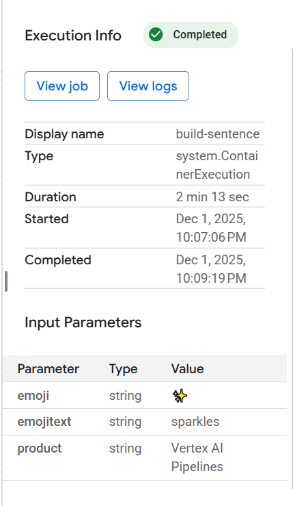
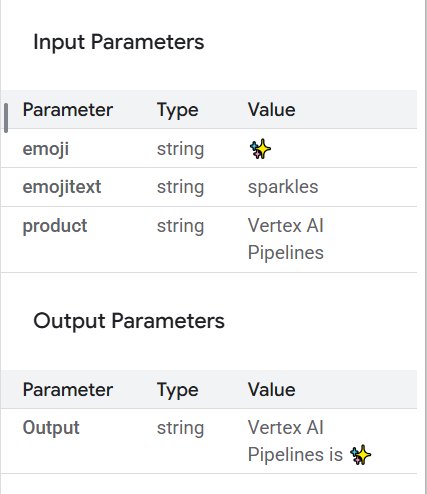

# **UT5-17: Vertex**

- [Lab](https://www.skills.google/focuses/21234?catalog_rank=%7B%22rank%22%3A1%2C%22num_filters%22%3A1%2C%22has_search%22%3Atrue%7D&parent=catalog&search_id=60909255)

## **Introducción al laboratorio: Vertex AI Pipelines – Qwik Start**

Este laboratorio intermedio (GSP965) forma parte del entorno de autoaprendizaje de Google Cloud y me permitió introducirme en el uso de **Vertex AI Pipelines**, una de las herramientas principales de MLOps dentro de Google Cloud. Vertex AI unifica las capacidades de aprendizaje automático de la plataforma —modelos personalizados, AutoML, entrenamientos, deploys y servicios de orquestación— en una única API integrada. Dentro de este ecosistema, las **canalizaciones de AA (ML Pipelines)** cumplen un rol fundamental: permiten automatizar, estandarizar y reproducir flujos de trabajo complejos de machine learning en un entorno totalmente gestionado.

Antes de construir una canalización, es importante entender por qué son necesarias. En cualquier proyecto real de aprendizaje automático, el flujo de trabajo suele incluir múltiples pasos: procesamiento de datos, entrenamiento, tuning, evaluación, deployment y validaciones. Cada uno de estos componentes tiene dependencias distintas y, si se manejan como un bloque monolítico, el sistema se vuelve frágil, difícil de escalar y casi imposible de reproducir. Vertex AI Pipelines resuelve este problema al encapsular cada paso en un contenedor independiente, lo que permite desarrollar, ejecutar y versionar cada etapa de forma modular. Esto facilita el trabajo colaborativo, habilita la automatización y permite activar ejecuciones cuando ocurren eventos relevantes en la nube (por ejemplo, la llegada de nuevos datos).

Durante el lab, trabajé con el **SDK de Pipelines de Kubeflow** para construir canalizaciones escalables y ejecutarlas dentro de Vertex AI. Implementé una canalización introductoria de tres pasos basada en entradas de texto y luego una canalización completa que entrena, evalúa e implementa un modelo de clasificación utilizando AutoML. También utilicé componentes predefinidos de la librería `google_cloud_pipeline_components` para interactuar de manera declarativa con servicios de Vertex AI, y finalmente aprendí a programar la ejecución automática de una pipeline mediante **Cloud Scheduler**, alineando el lab con prácticas reales de automatización en MLOps.

Este ejercicio no solo refuerza conceptos técnicos, sino que profundiza en la lógica de **sistemas ML en producción**, donde la reproducibilidad, el versionado, la modularidad y la automatización son tan importantes como el propio modelo. Para mi portafolio, este lab refleja el pasaje desde el desarrollo experimental de modelos hacia una visión más madura y operativa del ciclo de vida del machine learning.

